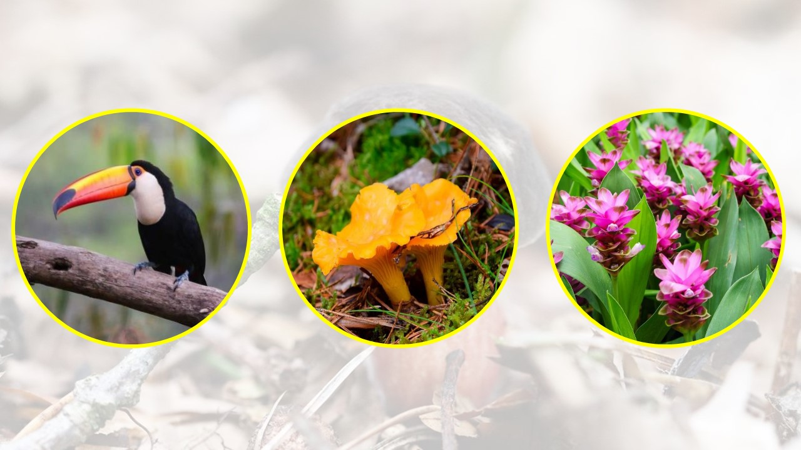
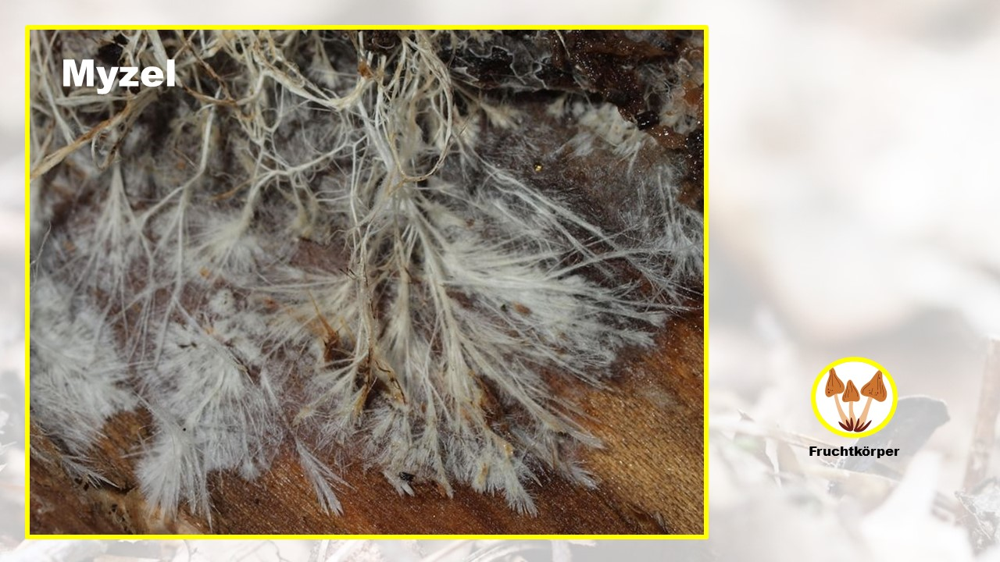
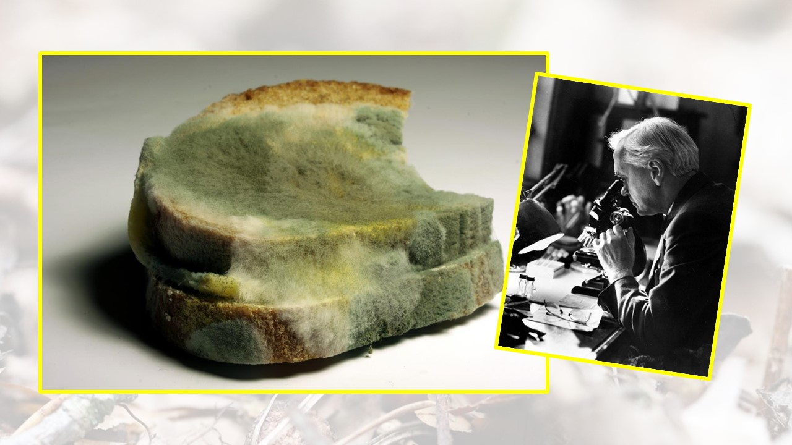
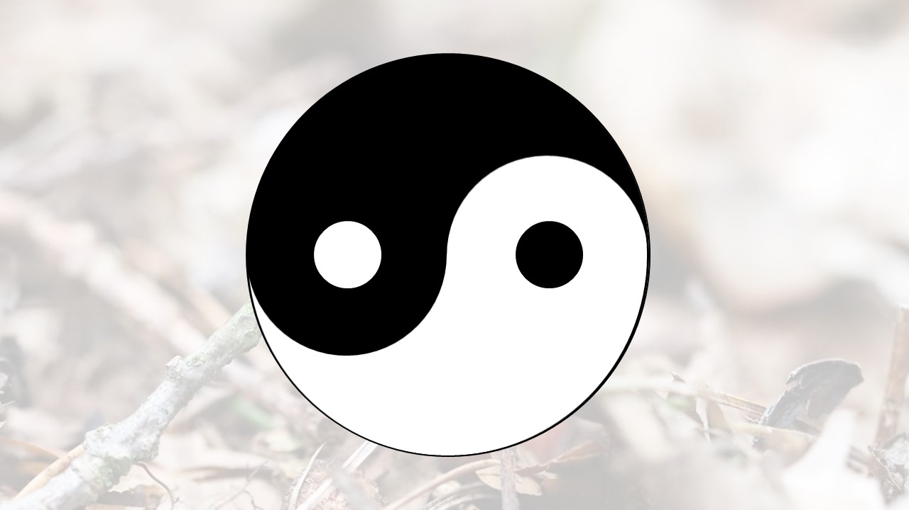
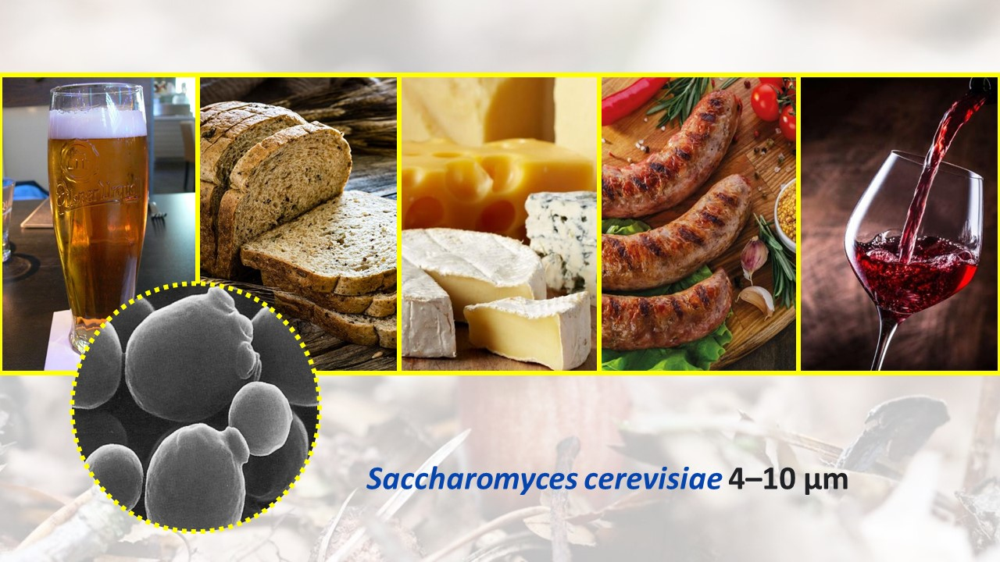
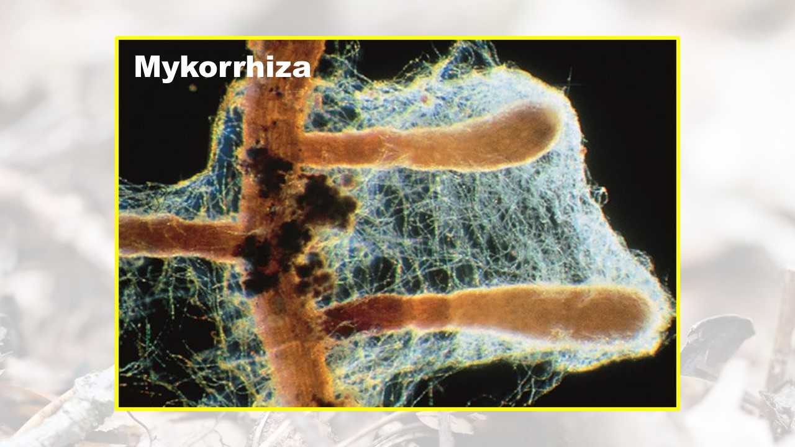
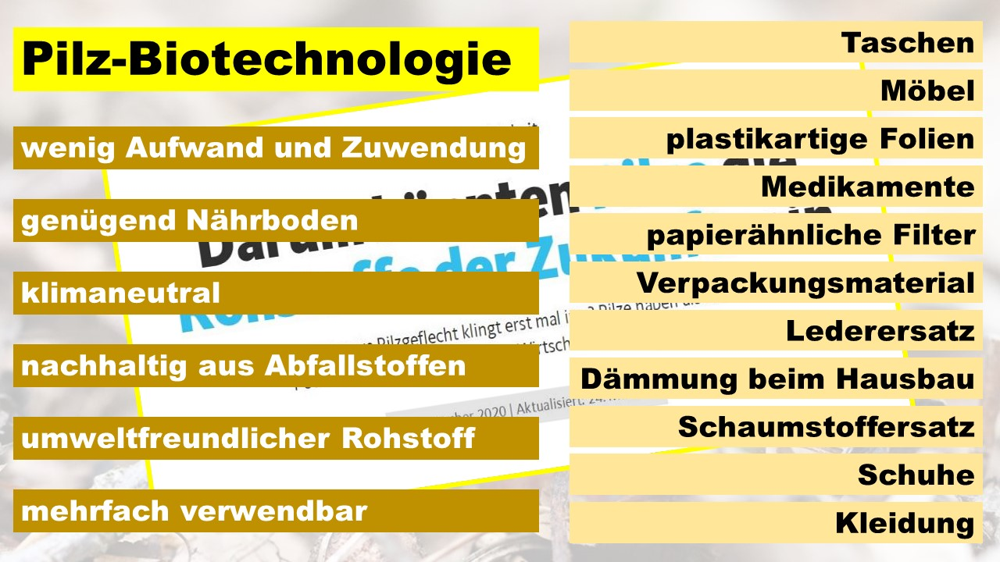
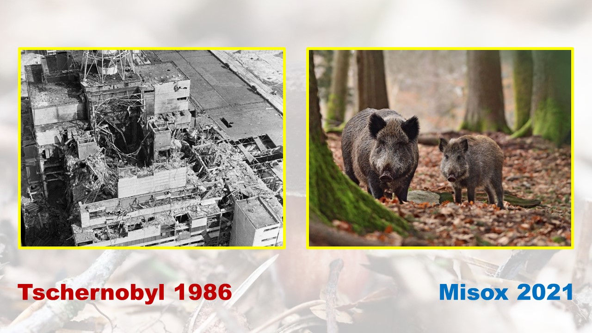
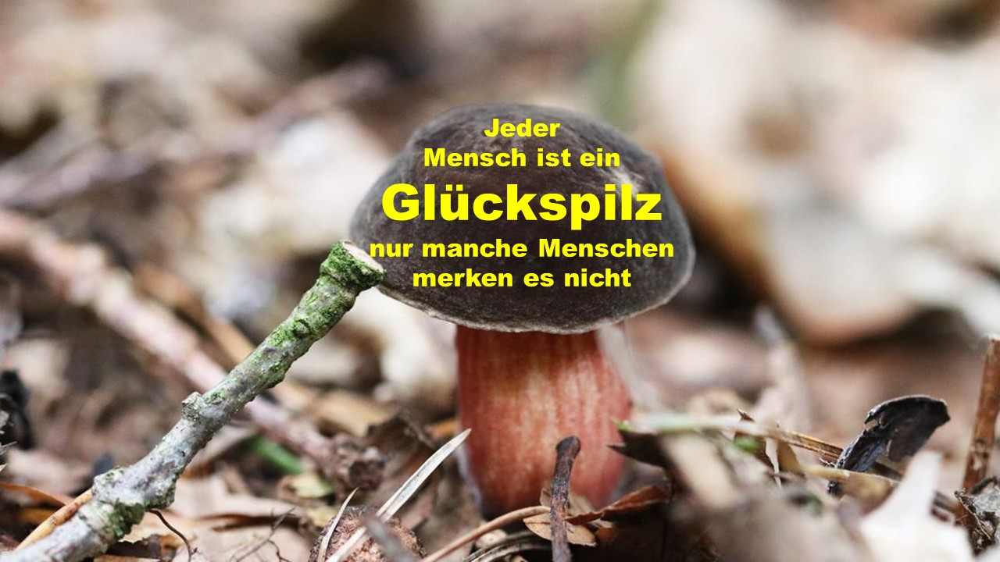

+++
title = "Auf den Pilz gekommen"
date = "2021-12-22"
draft = true
pinned = false
image = "pp-pilzprinzip-für-weihnachtsapéro-21.jpg"
description = "Am letzten Schatzhebungstreffen des Colearning Bern, an dem wir unsere Lernschätze und Perlen vorstellen habe ich meine Erkenntnisse aus dem Lernunternehmen \"Pilzfarm\" präsentiert. Ich habe versucht, mein neues Wissen über Pilze mit Bildungsgrundsätzen im Colearning zu verknüpfen.  "
+++
Ich liebe Pilze, ich liebe bildliche Vergleiche und ich verknüpfe gerne meine Erkenntnisse zu einem Thema mit grundsätzlichen Anliegen zu meinem Bild von Bildung. So auch in unserem neusten Projekt im Colearning Bern. 

Mit unserem Lernunternehmen "Pilzfarm" starten wir ein nachhaltiges Projekt. Die Idee: Mit dem Kaffeesatz aus der Effinger Kaffeebar züchten wir im Keller des Effingers Edelpilze und verkaufen unsere Produkte anschliessend wieder in der Kaffeebar. Wir lernen Pilze züchten und reflektieren begleitend unseren Lernprozess. Ich versuche mit diesem Blog ein paar Fakten über Pilze mit meinem Bild von Bildung zu verknüpfen. Fragend, behauptend und mit einem Lächeln stelle ich mein "Pilzsystem" vor.

Pilze erfüllen eine wichtige Funktionen im Ökosystem. Sie zersetzen totes organisches Material wie Holz, Laub, Tierkadaver und halten so den Nährstoffkreislauf in Gang. Das feucht-warme Klima am Waldboden ist eine gute Ausgangslage für die Vermehrung. Pilze machen 40% der Biomasse der Erde aus. Pilze haben keine echten Wurzeln, keine Blätter und noch entscheidender, Pilze haben kein Blattgrün. Sie sind keine Pflanzen, keine Tiere, keine Bakterien, sondern bilden das eingeständige Reich der Pilze.

> Wer bin ich?
> Was bin ich?
> Was kann ich?
> Wohin gehöre ich?

Als Myzel wird die Gesamtheit der fadenförmigen Zellen eines Pilzes bezeichnet. Meistens wird nur der Fruchtkörper als Pilz bezeichnet, wobei der eigentliche Pilz dieses unterirdische Geflecht aus Zellen ist. Sie können keine Energie aus Sonnenlicht gewinnen sondern sind auf organische Nährstoffe angewiesen. Sie nehmen die Nahrung durch die Zellwand auf. Dazu geben sie bestimmte Proteine oder Säuren an die Umgebung ab, zum Beispiel auf das Stück Holz, auf dem sie wachsen. So wird das organische Material zersetzt und der Pilz nimmt die dabei entstehenden Nährstoffe wieder auf.

> Und immer wieder die Frage: Was steckt dahinter? darunter? 
> So vieles ist nicht bekannt. Das erfüllt mich mit DeMUT und Ehrfurcht
> Wir sind miteinander verbunden
> Zeig dich! 
> Mach dich sichtbar!

Die Zellfäden, die Hyphen sind der eigentliche Pilz. Alexander Fleming bemerkte 1928 zufällig im Labor, wie Schimmelpilze der Gattung Penicillium, die in eine seiner Staphylokokken-Kulturen hineingeraten waren, eine wachstumshemmende Wirkung auf die Bakterien hatten. Weitere Untersuchungen führten später zum Antibiotikum Penicillin. Die Entdeckung des Penicillins war ein Durchbruch in der Medizin. Plötzlich gab es einen Stoff, der Bakterien abtöten konnte und so wurde vielen Menschen das Leben gerettet.

> Unser Lernweg geht oft Umwege und man trifft auf viel Unbekanntes, Neues, Unerwartetes.
> Misserfolge fordern heraus und führen zu ganz neuen entscheidenden Erkenntnissen.
> Fehler machen gehört zum Forschen und Lernen und Denken.

Die 350 essbaren Pilzsorten, die es weltweit gibt, bilden nur einen Bruchteil der Artenvielfalt ab. Schätzungen gehen von 3,5 bis sechs Millionen aus. Wissenschaftlich beschrieben sind aktuell etwa 150.000. Davon sind vergleichsweise nur wenige überhaupt für das bloße Auge sichtbar und bilden den typischen Fruchtkörper aus, den wir aus dem Wald kennen. Viele Pilze sind giftig, ungeniessbar und können Krankheiten auslösen. Die Substanzen, welche die Pilze abgeben, sind aber hochinteressant als Pharmazeutika und Chemikalien. Dazu zählen zum Beispiel Statine, eingesetzt als Blutdrucksenker, Cyclosporin, wichtig bei Organtransplantationen oder Drospirenone, die bei der Herstellung der Antibabypille verwendet werden. Um sie herzustellen, werden die Pilze in riesigen Bioreaktoren gezüchtet.

> Für mich heisst das, es gibt nicht nur das Gute oder das Böse. Es gibt auch das Gute im Bösen oder das Böse im Guten. Es ist nicht immer schwarz oder weiss. Es gilt auch in der Bildung die Balance zu suchen und zu finden. Wir brauchen Ambiguitätstoleranz: Wir lernen mit dem Nichtwissen tanzen und dem Unbekannten jonglieren.

Die Fähigkeit der Hefepilze, Kohlenhydrate zu Kohlendioxid und Alkohol umzusetzen, wird bei der Lebensmittelherstellung genutzt. Den Prozess nennt man Gärung. Bereits im antiken Ägypten wurde beim Brotbacken und Bierbrauen Hefe verwendet. Aber erst 1857 konnte der französische Mikrobiologe Louis Pasteur zeigen, dass ein kleines, einzelliges Lebewesen für den Gärungsprozess verantwortlich ist.

> In der beziehungsorientierten Bildung gilt: Kleine Dinge haben oft grosse Wirkung. Ein Lächeln, eine freundliche Stimme, ein lobendes Zunicken, ein interessiertes Zuhören oder ein Danke bewirken, dass sich im Gegenüber etwas entwickelt und wandelt.

Mykorrhizapilze zum Beispiel leben in Symbiose mit den Wurzeln höherer Pflanzen und versorgen unsere Waldbäume mit Wasser und Nährstoffen. Dabei erfüllen Pilze in der Natur enorm wichtige Funktionen: Über 90 % unserer Landpflanzen leben in enger Verbindung mit Pilzen, die bei deren Nährstoffaufnahme, Stressresistenz und Humusbildung eine zentrale Rolle spielen.

sjhdjshjsakdadlajsk

,awdghsdhkdshh

> kjkjkkkkjkjk

kdfjkjkjkjk