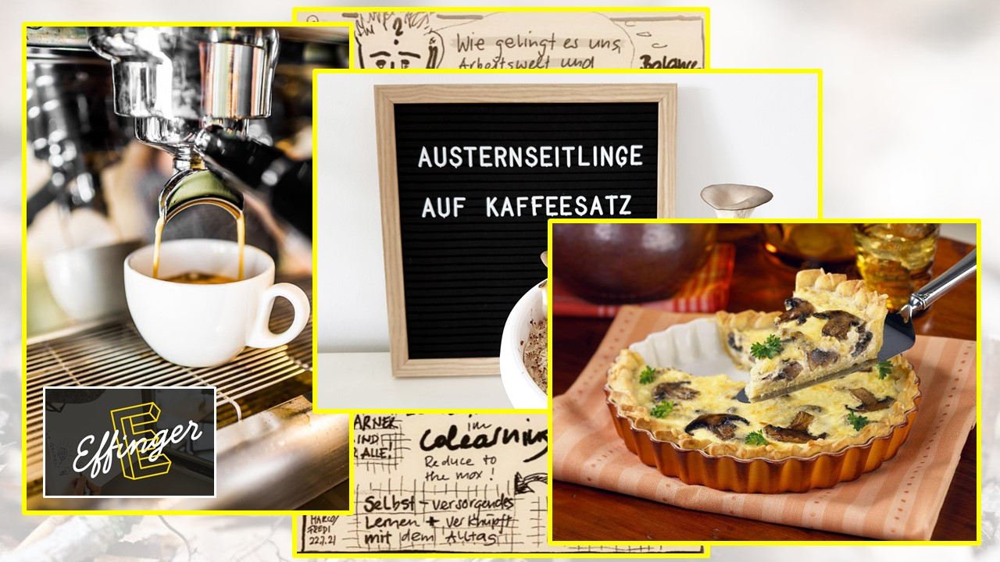

+++
title = "Auf den Pilz gekommen"
date = "2021-12-22"
draft = true
pinned = false
image = "pp-pilzprinzip-für-weihnachtsapéro-21.jpg"
description = "Am letzten Schatzhebungstreffen des Colearning Bern, an dem wir unsere Lernschätze und Perlen vorstellen habe ich meine Erkenntnisse aus dem Lernunternehmen \"Pilzfarm\" präsentiert. Ich habe versucht, mein neues Wissen über Pilze mit Bildungsgrundsätzen im Colearning zu verknüpfen.  "
+++
n

kskkfkkkkfkkf

skhkskcjskjksjksjk

<!--StartFragment-->

Wer bin ich?
Was bin ich?
Was kann ich?
Wohin gehöre ich?

<!--EndFragment-->

kskdskjksjdksj

kkjksdjkjkdjksj

ksjdkjskdjskdjk

skjsjjkjjkjkjkll

hjshjhj

sjhdjshjsakdadlajsk

,awdghsdhkdshh

> kjkjkkkkjkjk

kdfjkjkjkjk