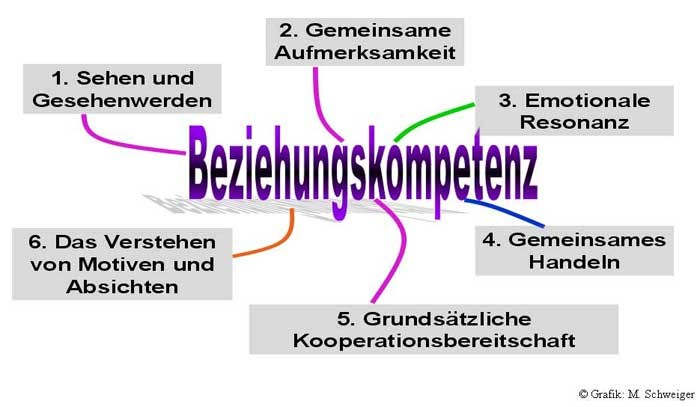

+++
title = "Beziehungen machen klug"
date = "2021-06-29"
draft = false
pinned = false
image = "perlen-2.jpg"
description = "Wir sollten uns bewusst machen und verinnerlichen, dass die Gestaltung guter Beziehungen eine zentrale Lebensaufgabe ist. Die betrifft nicht nur das private Umfeld, sondern auch die Schulen.\nBildung kann nur gelingen, wenn zwischen Lehrenden und Lernenden eine kooperative Atmosphäre hergestellt werden kann.\nAus *Gute Beziehungen machen klug* von Prof. Dr. Joachim Bauer"
footnotes = "Joachim Bauer, ist als Universitätsprofessor und Oberarzt an der Abteilung Psychosomatische Medizin der Uni-Klinik Freiburg tätig. Bauer hat über viele Jahre als Neurobiologe geforscht. Er ist Facharzt für Innere Medizin, Psychiater und Psychotherapeut. Für seine neurobiologischen Forschungen erhielt er 1996 den renommierten Organon-Preis der Deutschen Gesellschaft für Biologische Psychiatrie.\n\nVerwendete Quellen:\nLeicht verändert und mit Beispielen aus der Schule ergänzt nach: Joachim Bauer, Prinzip Menschlichkeit, Hamburg 20075\nJ. Bauer, Warum ich fühle, was du fühlst, Heyne 2006"
+++
**Gerade die kleinen Dinge machen unser Leben so besonders. Überall finden sich Perlen.** 
Ich habe in meiner Lehrertätigkeit immer besser verstanden, den Blick auf das Gelingende, auf das Positive zu richten und gemerkt, dass ich an jedem Tag, nach getaner Arbeit trotz Müdigkeit ein Gefühl der Bereicherung mit nach Hause nahm. Ich konnte jeden Tag grössere und vor allem kleinere Perlen einsammeln. Und das waren nicht nur Projekte, tolle Arbeiten, sondern es waren Entwicklungen, die die Jugendlichen machten, bei ihrem Umgang mit sich, mit den anderen und mit ihrer Umwelt: Ein kurzes Gespräch, eine neue Erkenntnis, ein überraschendes Dankeschön, eine wertvolle Erfahrung, ein tieferes Verständnis, eine neue Beziehung, ein kleines Erfolgserlebnis.

Zu Beginn der Herbstferien fand ich einen Brief in meinem Briefkasten. Wer oder was kann das sein? Eine selbst gestaltete Briefmarke. Ein schöner handgeschriebener Text. Ein paar Formulare.

*Aarwangen, 26. 9. 02*

*Lieber Herr Flükiger*

*Ich wäre Ihnen sehr dankbar, wenn Sie mir das beiliegende Blatt ausfüllen. Sie wissen ja, dass ich unbedingt ein Jahr in Amerika zur Schule gehen will, deshalb habe ich am Samstag, dem 19. Oktober ein Aufnahmegespräch. Es ist von Vorteil, wenn ich alle Formulare mitbringen kann. in einem Brief habe ich Frau Freudiger (Anmerkung: Die Englischlehrerin) gebeten meine ausgefüllten Papiere zu korrigieren. Natürlich waren dies nur Kopien, weil ich alles fehlerfrei übergeben will.*
*Die Formulare sollten in schwarz und gut lesbar ausgefüllt werden. Zur Sicherheit, das heisst wenn Sie wirklich Probleme im Englisch haben, habe ich Ihnen eine Kopie dazu gelegt. Sie können ja Frau Freudiger bitten Ihre Papiere auch zu korrigieren. Sonst hätten wir noch ein Wörterbuch, das Sie gerne gerne ausleihen können. Sie wissen ja, wo ich wohne. Vielleicht bekommen Sie auch einen Kaffee.*

*Mit freundlichen Grüssen* 
*Natascha*

*PS. Noch einmal vielen herzlichen Dank und im übrigen, das Briefschreiben hat meiner Mutter und mir viel Freude bereitet.*

Wieder eine Perle für meine Sammlung. Ein Beispiel einer guten Beziehung auf Augenhöhe, angereichert mit einer Prise Humor. Für mich waren das Gestalten zwischenmenschlicher Beziehungen, Anerkennung, Zuwendung und Vertrauen wichtige Voraussetzungen für ein gutes Miteinander in der Schule. 

**Beziehungen machen klug.**
Joachim Bauer hat für das Gelingen die folgenden Komponenten beschrieben und sie auch als neurologischen Treibstoff für die Motivation bezeichnet: 

> Sehen und Gesehen werden

> Gemeinsame Aufmerksamkeit
 
> Emotionale Resonanz

> Gemeinsames Handeln

> Grundsätzliche Kooperationsbereitschaft

> Das Verstehen von Motiven und Absichten

**Sehen und Gesehen werden**
Er hat mir ein Lächeln geschenkt. Jugendliche haben – aufgrund ihres noch großen Bedürfnisses nach Spiegelungsprozessen mit Erwachsenen – ein sehr sensibles Wahrnehmungsvermögen, ob sie den Erwachsenen einen Blick wert sind, ob sie wahrgenommen werden. Oft genügt ein wohlwollender Blick
* Lass mich spüren, dass ich da bin
* Zeig mir, durch die Art, wie du auf mich reagierst, wo ich gut bin und wo ich mich verbessern muss. 
* Zeig mir, wer ich bin.
* Zeig mir, was ich werden kann, was meine Potentiale sind, was du mir zutraust
* Ermutige mich

**Gemeinsame Aufmerksamkeit**
Sich dem zuzuwenden, wofür sich eine andere Person interessiert, ist die einfachste Form der Anteilnahme und hat ein erhebliches Potential, Verbindung herzustellen. Das Selbstwertgefühl wird gesteigert: Ich bin jemand, Ich kann etwas, ich hinterlasse Spuren.

**Emotionale Resonanz**
Gemeint ist die Fähigkeit, sich zu einem gewissen Grade auf die Stimmung eines anderen einzuschwingen oder andere mit der eigenen Stimmung anzustecken. Alles, was zwischenmenschliche Resonanz und soziale Verbundenheit erzeugt, scheint für die Bildung gut zu sein: Menschen, mit denen wir gute Erfahrungen machen, aktivieren unsere Motivationssysteme. Sie rufen Sehnsucht nach mehr hervor: Die stärkste und beste Droge für den Menschen ist der Mensch.

**Gemeinsames Handeln**
Etwas ganz konkret miteinander zu machen, ist ein meist völlig unterschätzter, tatsächlich aber in hohem Maße Beziehung stiftender Aspekt. Erziehung braucht – dies wird an diesem Punkt sehr deutlich – ein großes Engagement. Gemeinsame Anlässe, gemeinsame Projekte, wo sich jedes, auch die Lehrpersonen mit ihren Fähigkeiten und Fertigkeiten eingeben können sind in hohem Masse beziehungsstiftend.

**Grundsätzliche Kooperationsbereitschaft**
Gerade im Umbruch befindliche Jugendliche brauchen Partner, die jugendliche Suchbewegungen nicht als persönliche Provokation empfinden, sondern verstehen, dass der Heranwachsende verlässliche Partner braucht, die ihm durch ihr Verhalten spiegeln, welches Wege und welches die Irrwege sind. 
Da diese Begleitung dem Lehrer enorm viel Kraft abverlangt, müssen Lehrpersonen Lehrer auch für ihre physische und psychische Gesunderhaltung sensibilisiert werden. Andererseits trägt eine gut entwickelte Beziehungskompetenz bereits dazu bei, den Stress, der aus belasteten Beziehungen erwächst, zu vermindern oder gar nicht erst aufkommen zu lassen. 

**Das Verstehen von Motiven und Absichten**
Motive, Absichten oder Abneigungen richtig zu erkennen und anzusprechen, ist entscheidende Voraussetzung dafür, bei anderen Potentiale zu entfalten. Um jemanden zu verstehen, bedarf es nicht nur einer guten Beobachtungsgabe und intuitiver Fähigkeiten, sondern vor allem auch des Gesprächs. 

**Für alle sechs Komponenten gilt:** 
Wechselseitigkeit bzw. Komplementarität sind unverzichtbar. Jede Beziehung sollte ein zweispuriger Weg sein. Die Gegenspur im Auge zu behalten heißt, den anderen zu sehen, ihm dies auch zu zeigen, ein Stück weit seine Befindlichkeit zu erkennen und sich auf ihn einzulassen. Auf der eigenen Spur des Weges sollte sich aber – dies ist durchaus nicht immer der Fall! – ebenfalls jemand befinden: man selbst. Auch man selbst sollte darauf achten, gesehen, d.h. als Person erkannt zu werden.

Übrigens: Natascha hat ihr 10. Schuljahr erfolgreich in Amerika verbracht.