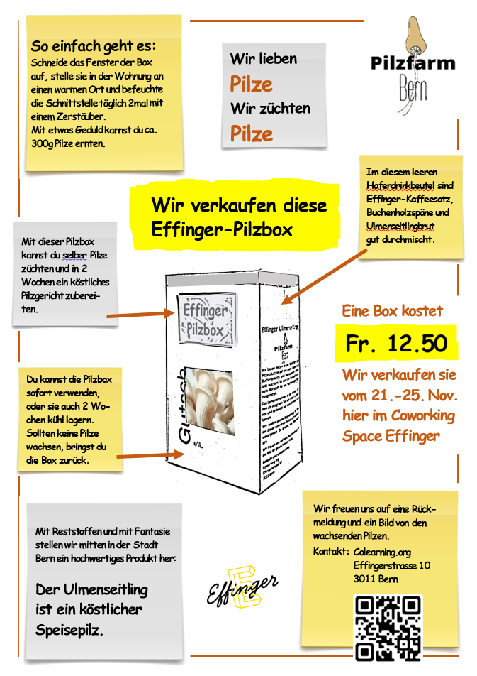

+++
title = "Das Pilzbox-Experiment"
date = "2022-11-13"
draft = false
pinned = false
image = "pilzbox-als-werbung.jpg"
description = "Mit einer Effinger-Pilzbox kannst du selber Pilze züchten. Mit etwas Licht, Zimmertemperatur, 2mal täglichem Befeuchten und ein bisschen Geduld kannst du in 2 Wochen ein köstliches Pilzgericht mit Ulmenseitlingen zubereiten. "
+++
Seit einer Woche durchwächst das Myzel in unseren Effinger-Pilzboxen unser Effinger-Kaffeesatz-Buchenholz-Substrat. Es riecht im Keller erdig feucht und nach Kaffee. Im Fenster der Boxen bilden sich weisse Flecken. feine Wassertropfen beweisen, dass das Substrat genug durchfeuchtet ist. Wir sind gewiss, dass unser Experiment gelingt und wir sind überzeugt, dass wir unsere 90 Pilzboxen verkaufen können. 

Im Blog "Vom Geld und anderen Werten" <https://hermann.netlify.app/von-geld-und-anderen-werten/> habe ich von den Schwierigkeiten geschrieben, einen Preis zu bestimmen. Jetzt habe ich mich überzeugen lassen, mehr zu verlangen. 

Der Preis beträgt Fr. 12.50 pro Box.

So steht es auf dem Flyer, den wir im Coworking Space zusammen mit einer Musterbox hinlegen wollen. Auch auf den Slack-Channels, den Webseiten und den sozialen Medien wollen wir auf unser Produkt aufmerksam machen.

Die grösste Herausforderung bei der Gestaltung des Flyers war für mich das Beschränken. Wie viel Information braucht es? Was ist für das Verständnis nötig? Was spricht an? Was interessiert? Da ist das Resultat:

Es war wieder eine dieser Herausforderungen, die so einfach aussehen, rückblickend sich als sehr zeitaufwändig herausstellten. Am meisten Zeit verbringe ich bei der konkreten Umsetzung der Ideen am PC. Ich arbeite nur mit einem Word-Programm. Es ist aber nicht das "Herausfinden" von Möglichkeiten - es ist mein latent vorhandener Anspruch etwas perfekt zu machen, der mir am meisten zu schaffen macht. Ich könnte stundenlang ausprobieren, verwerfen, wieder neu anfangen, andere Farben und Sujets wählen ... es ist verlockend, es gibt so viele Möglichkeiten.

Ich muss mich entscheiden. 

Entscheiden? Darin kommt doch auch das Scheiden vor, das Trennen, das Verabschieden. 

Darum tue ich mich schwer. Kann ich doch nicht so leicht loslassen?

Ich muss weglassen, kann nicht alles, muss mich bescheiden.

Bescheidenheit?

Ich habe es gegoogelt: 

> Die **Bescheidenheit** ist eine Charaktereigenschaft, die ein geringes Streben oder Verlangen nach Ansprüchen beschreibt, selbst wenn daraus ein Vorteil oder Gewinn resultieren würde. Zudem beschreibt es ein Bewusstsein für Wertschätzung von Dingen und das bewusste Nichtverlangen von besonders Wertvollem.

So komme ich von der Gestaltung eines einfachen Flyers für unsere Pilzbox zu ganz grundsätzlichen Überlegungen und Gedanken über mich und mein Leben. 

Ein weiterer Grund sich Herausforderungen zu stellen. 

Es ergeben sich plötzlich ganz neue Wege, neue Denkrichtungen. Ich lasse mich gerne ablenken und merke, dass das Begehen von Nebenpfaden mir noch neue Horizonte eröffnet. 

**Fazit:** Ich habe einen Flyer gestaltet und nebenbei einen wunderbaren Gedankengang zu mir gemacht.