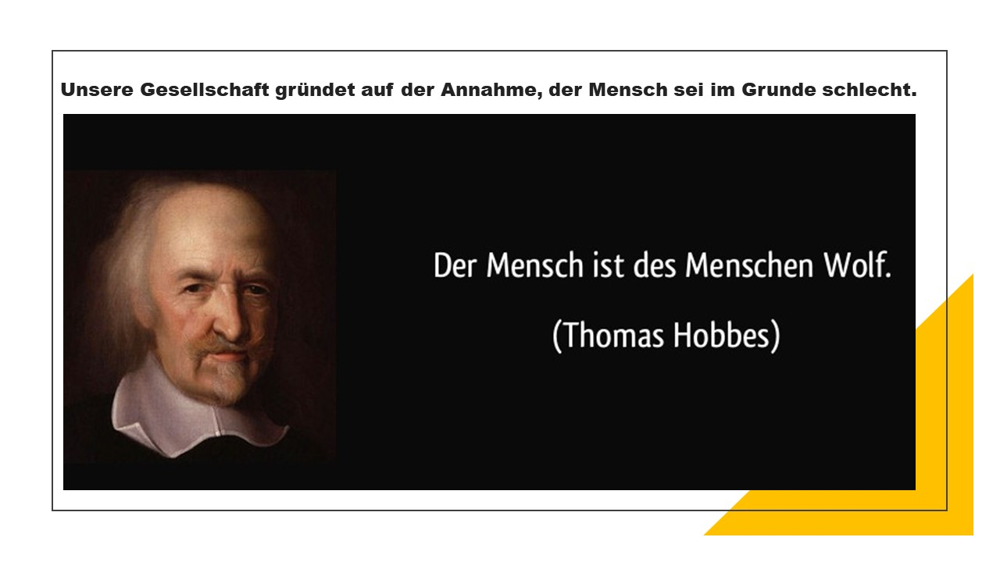
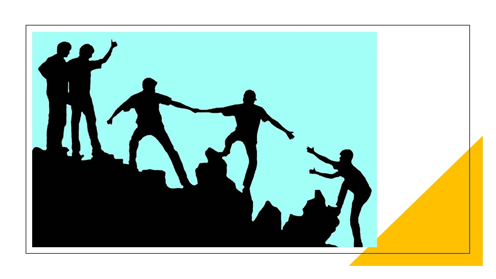
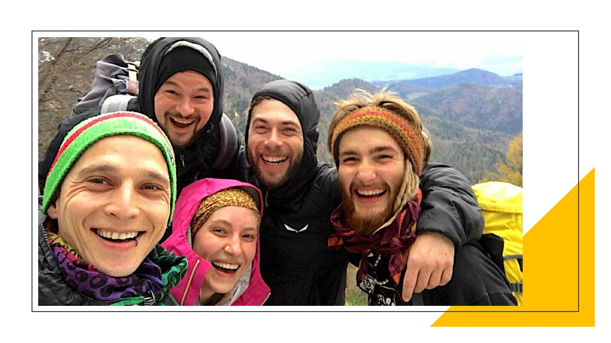

+++
title = "Dieses Buch hat mit gut getan"
date = "2022-01-18"
draft = true
pinned = false
image = "im-grunde-gut.jpg"
description = "Letztlich gibt es nur wenige Vorstellungen, die die Welt so sehr beeinflussen wie unser Menschenbild. Was wir voneinander annehmen, ist das, was wir hervorrufen, schreibt Rutger Bregmann in seinem neuen Buch, IM GRUNDE GUT. Die Herausforderungen unserer Zeit könnten laut ihm nur mit der Entwicklung eines anderen Menschenbildes bewältigt werden."
+++
Rutger Bregmann appelliert an seine Leser*innen, sich zurückzubesinnen auf das, was uns ausmacht: unsere Fähigkeit zu Empathie und sozialem Handeln. Er rät aufeinander zuzugehen und sich gegenseitig zuzuhören. Zuviel schlechte Nachrichten zu meiden und stattdessen die guten zu suchen. Dann können wir gemeinsam nach und nach unser Menschenbild umkrempeln. **Eine wichtige Erkenntnis, die mir aus dem Buch bleibt, ist, dass vieles mit meiner Sicht auf die Welt zu tun hat.** Der Historiker und Journalist legt sich in seiner Sicht der Geschichte vor allem mit dieser These von Thomas Hobbes an:

Der Mensch ist nach dem Philosophen Thomas Hobbes eine nur oberflächlich zivilisierte Bestie. Sie muss durch Zwang und Ordnung unter Kontrolle gehalten werden. Sonst würde ein Kampf aller gegen alle ausbrechen. Machthaber aller Zeiten leiten aus dieser Annahme ihren Herrschaftsanspruch ab: Wenn wir es nicht verhindern, herrscht Chaos.
Rutger Bregmans beginnt mit dieser so genannten "Fassadentheorie" aufzuräumen, zufolge derer die Zivilisation uns Menschen lediglich als dünne Schicht, als Fassade umgibt, um dann bei der erstbesten Gelegenheit zu zerbrechen und unsere wahre Natur zu offenbaren: Der wilde Barbaren, der sich um jeden Preis, aggressiv und gewalttätig, durchsetzen möchte.
Bregman hat unzählige Studien zum menschlichen Verhalten kritisch überprüft und kommt in vielen Fällen zu einem ganz anderen Schluss. Menschen meiden Gewalt. Selbst im Krieg weigern sich Soldaten, gegen feindliche Soldaten Gewalt anzuwenden. Die wenigsten kämpfen von allein. In Schützengräben des Ersten Weltkriegs kam es an Heiligabend zu Verbrüderungsszenen der feindlichen Truppen – bis Generäle eingriffen. Moderne Armeen umgehen das Problem, indem sie etwa mithilfe von Fernwaffen die Distanz zum Gegner vergrößern.

Die Nachrichten sind voll von Gewalt und Katastrophen. Laut Rutger Bregman sei das ein Grund dafür, warum die Mehrheit von uns davon ausgeht, wir Menschen seien von Natur aus böse, aggressiv und egoistisch. Doch was in den Medien erscheint, sind Ausnahmen und es würde ein völlig falsches Menschenbild vermittelt. Nach dem verheerenden Hurrikan Katrina berichteten viele Medien von Gewaltexzessen in New Orleans. Wie sich aber später zeigte, gab es vielmehr eine grosse Welle der Hilfsbereitschaft – über die wurde jedoch nicht berichtet. Oder das Stanford-Prison-Experiment: Die Wärter handelten oft nicht aus freien Stücken, sondern wurden zu gewalttätigem Handeln gedrängt. Als die BBC das Experiment 2001 unter kontrollierten Bedingungen wiederholte, zeigte sich, dass die Teilnehmer sich ganz anders verhielten, sich sogar miteinander verbrüderten. Auch das berühmte Milgram-Experiment von 1961 erwies sich nach Bergman als manipuliert. In dieser Studie sollten die Teilnehmer anderen Versuchspersonen schwere bis tödliche Stromstöße geben und man wollte beweisen, dass aus jedem Normalbürger unter den richtigen Bedingungen ein Henker werden konnte. Später zeigte sich, dass tatsächlich fast die Hälfte der Teilnehmer annahm, die Situation sei nicht echt. Auch beklagten sie sich, dass Milgram die Testpersonen zum Teil aggressiv bedrängte.

Die meisten Menschen verhalten sich in einer Katastrophensituation solidarisch. In der Krise offenbart sich unsere hilfsbereite Natur. Auch im Alltäglichen gibt es viele freundliche Gesten, mitfühlende Worte und Taten. Aber all das Positive, das uns Tag für Tag umgibt, sehen wir häufig nicht. Es sei ja auch keine Sensation, sondern einfach normal. Diese Geschichten sind zu langweilig, um sie packend erzählen zu können. Versuche, sie zu verfilmen, würden ein Flop. Das ist keine Überraschung, denn wir sind uns gewohnt, Sensationen und spannende, sogar schockierende Geschichten zu hören.  

Der Mensch ist nach Bregmann das einzige Lebewesen, das Scham zeigten kann. Wenn wir erröten, signalisieren wir, dass es uns wichtig ist, was die anderen von uns denken. So entsteht Vertrauen. Auch andere Emotionen zeigen sich in unseren Gesichtern. Wir haben gute Fähigkeiten ausgebildet, solche Signale zu deuten. Wir sind offenherzige Lebewesen und diese Offenheit macht uns sozial – befähigt uns zum sozialen Lernen. Dank dieser Kooperation sind wir klug geworden. Wir lernen voneinander und sind klüger als andere Arten. Der Mensch ist in der Gemeinschaft stark und konnte sich deshalb in der Evolution durchsetzen.

> Wenn man uns liesse, wären wir freundlich, sozial, mitfühlend, solidarisch, friedliebend und kooperativ.

Mit seinem Buch lenkt er unsere Aufmerksamkeit auf diese Seite der menschlichen Existenz und schreibt von einer neuen Geschichte der Menschheit. Er untersuchte und dokumentierte dies auf Grundlage vieler Studien, die zum menschlichen Verhalten durchgeführt wurden, die die solidarische Grundeinstellung und Freundlichkeit des Menschen nachweisen. Immer mehr Wissenschaften und historische Erfahrungen bestätigen, dass wir einander grundsätzlich vertrauen, dass wir zuversichtlich sind und miteinander kommunizieren wollen.