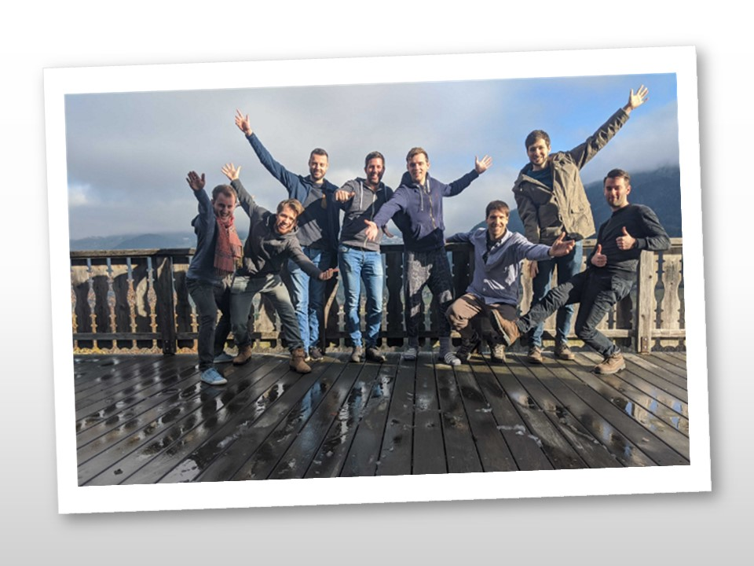
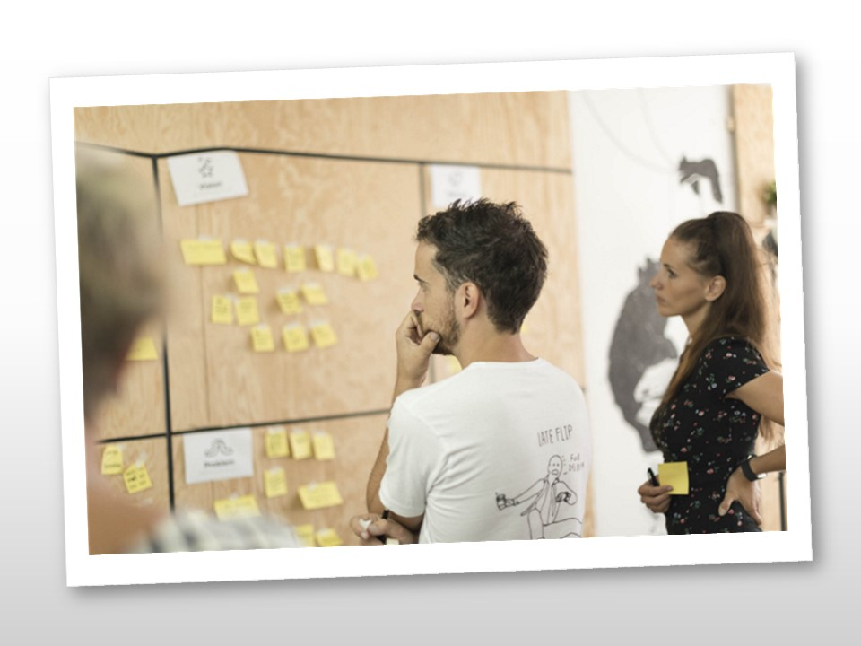
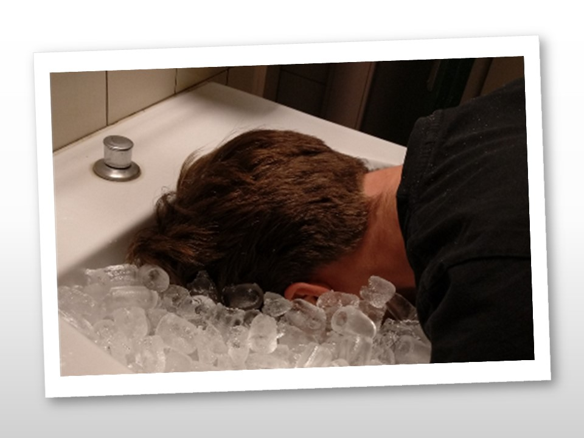
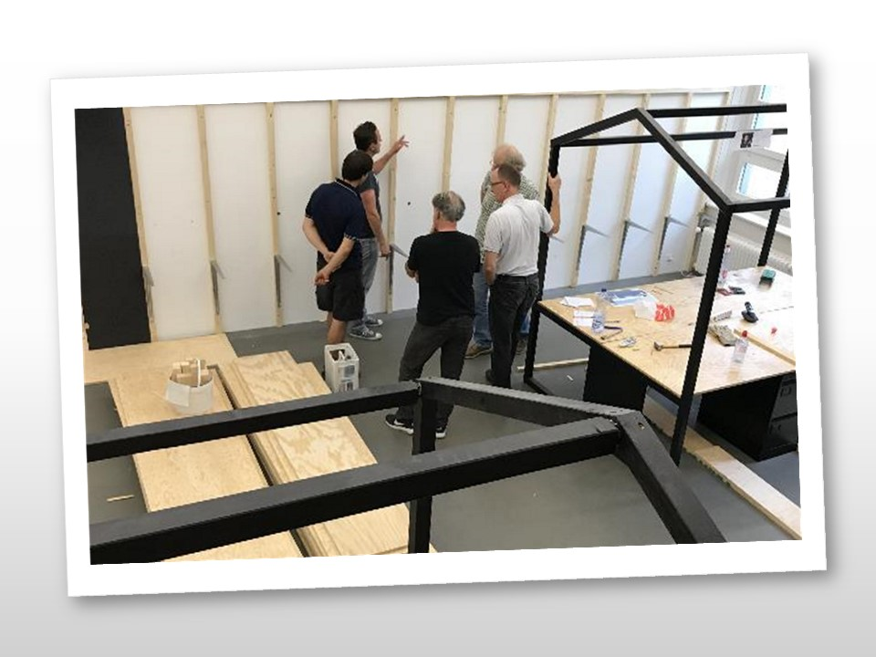
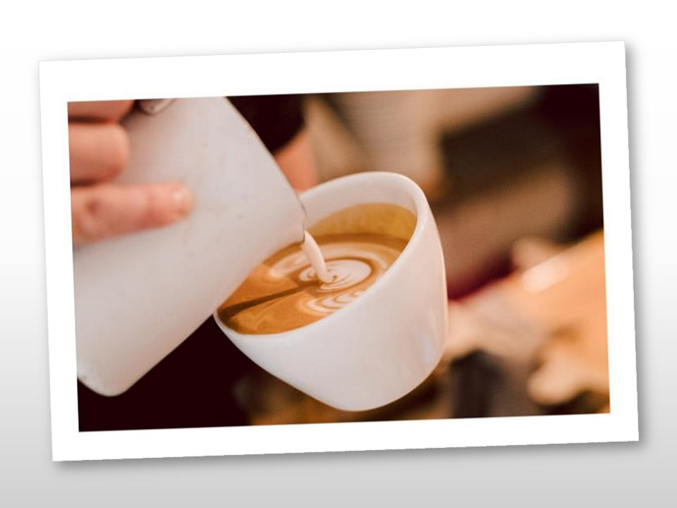
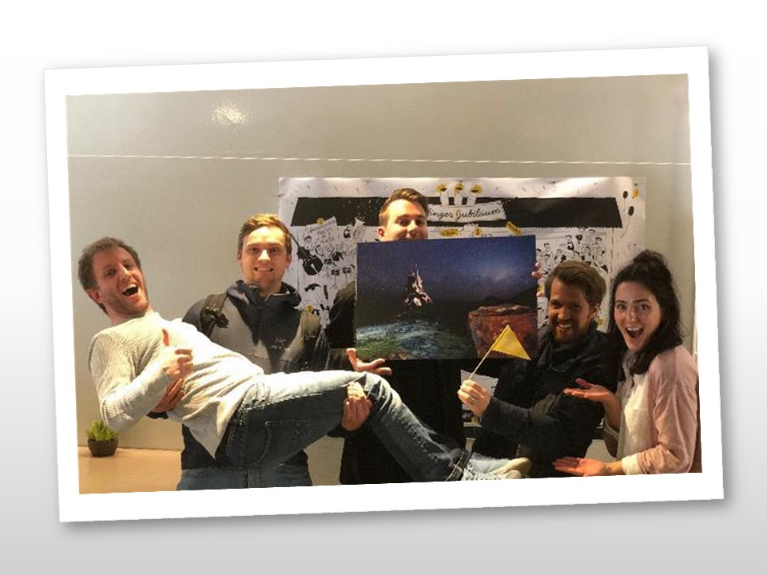
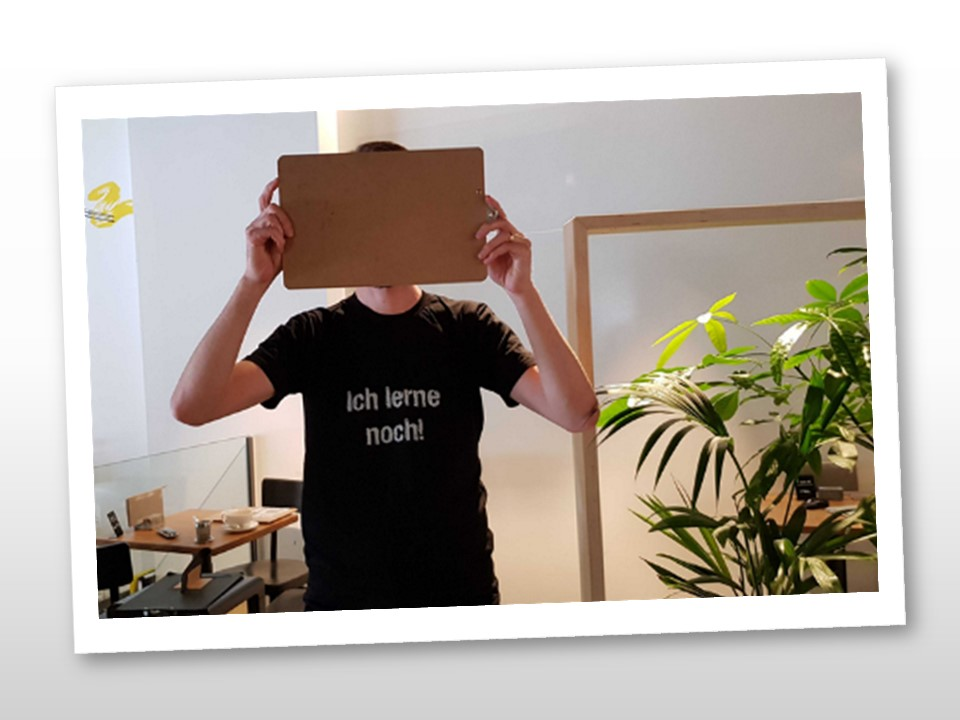
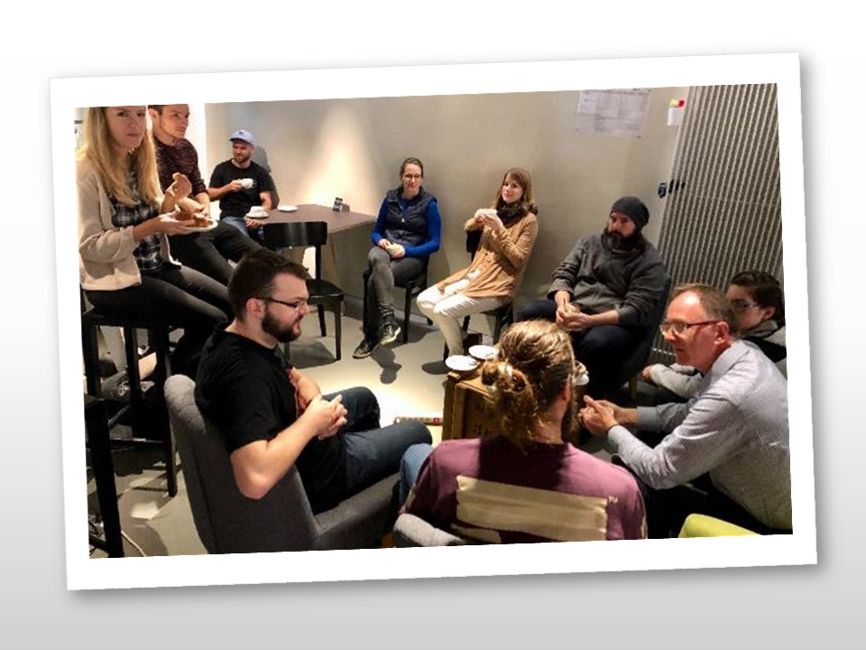
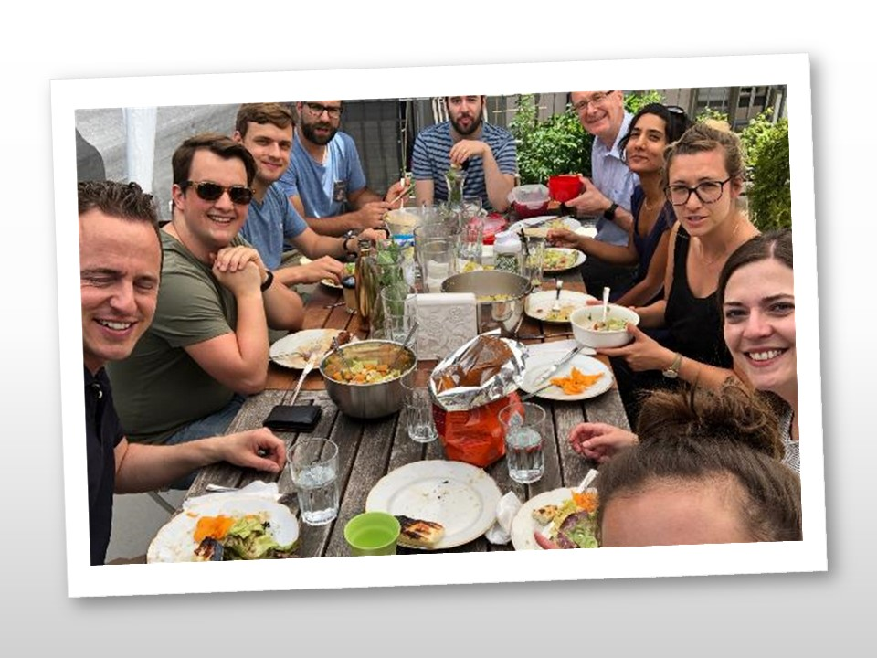
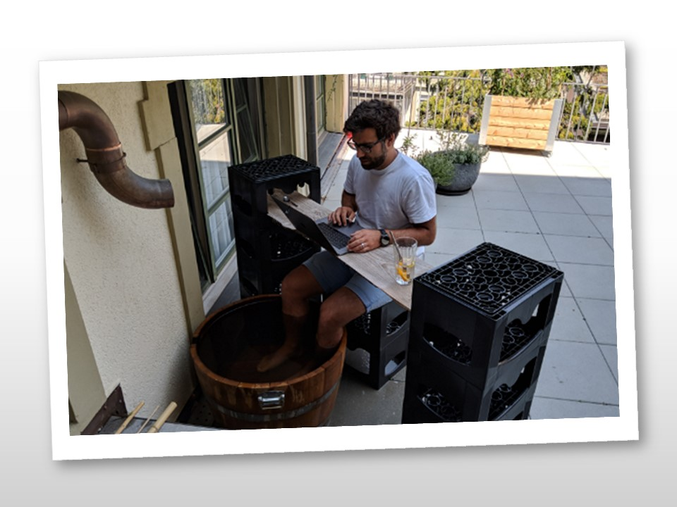

+++
title = "Effinger macht gesund"
date = "2021-02-04"
draft = false
pinned = false
image = "titel-blog-gesund.jpg"
description = "Der Dienstag ist Effingertag: Ich bin als Host für die Community tätig, engagiere mich als Mentor und Gastgeber im Colearning, beschäftige mich im THES mit Bildung-einfach-anders und pflege den Kontakt mit ganz unterschiedlichen Menschen und Geschichten. Ich freue mich jede Woche auf diese Begegnungen und den Austausch.\n"
+++
Vor kurzem habe ich von Markus Roos eine interessante Broschüre zum "Gesund bleiben" erhalten. Es waren 10 Schritte für die psychische Gesundheit, herausgegeben von der Gesundheitsförderung Schweiz. Mit Spannung habe ich den Wegweiser durchgelesen und spontan festgestellt: Der Coworking Space Effinger, die Effinger Community wird diesen Ansprüchen gerecht, er leistet einen wichtigen Beitrag zu meiner Gesundheit.

Zum Vertiefen und zum Verdeutlichen meiner Gedanken habe ich hier die 10 Schritte mit Fotos aus dem Effinger dokumentiert. Alle Bilder habe ich von kurtli-feed <https://effinger.slack.com/archives/C8YRABMR9> heruntergeladen, eine Inspirationsquelle auf Slack.

***Das tut mir im Effinger gut:***

> **Schritt 1: Aktiv bleiben**

Ich kann mich bewegen, kann den Arbeitsort wechseln. Kurze Spaziergänge helfen beim Gedanken sammeln, ein Austausch im Spazieren lockert Festgefahrenes, hilft beim Verdauen. Ich kann in Bewegung arbeiten, mich an einem Stehpult vertiefen, oder einfach da sitzen. Ich bestimme meine Arbeitszeiten und meine Pausen. Ich darf spielen. Im Effinger bin ich auch in geistiger Bewegung. Ich fühle mich gefordert, herausgefordert, das tut mir gut.

> **Schritt 2: Sich selbst annehmen**

Ich kann mich mit anderen über mich und mein Wirken austauschen. Ich kann Gelungenes mit anderen teilen und bekomme Feedbacks zu meinen Arbeiten. Ich lerne mich mit den Augen der anderen auch besser kennen. Ich lerne die anderen besser wahrnehmen und verstehe meine Mitwelt besser. Im Effinger werde ich als lernender Mensch wahrgenommen. Hier wird der Grundsatz "Werde, der du bist" umgesetzt und vorgelebt.

> **Schritt 3: Sich entspannen**

Die Vielfalt der Räume bietet auch viele Rückzugs- und Entspannungsmöglichkeiten. Ich kann in der kleinen Schanze allein sein, kann mich auf der Terrasse zurückziehen. Die gemeinsamen Pausen bringen Unterbrüche in den Arbeitsalltag. Ein gemeinsames Feierabendbier schliesst einen spannenden Tag in Entspannung ab. Ich darf, wenn ich will, die konkreten Angebote zum Relaxen und Entstressen nutzen.

> **Schritt 4: Neues lernen**

Der Effinger ist ein Lernort pur. Wir verstehen uns alle als Lernende. Das Colearning bietet Jugendlichen und Erwachsenen Gelegenheit zu lernen, Neues zu entdecken, neue Talente an sich und an anderen zu sehen und zu nutzen. Der Effinger ist Potenzialentfaltung, ist ein Ort zum Ausprobieren, zum Testen. Ich kann das für mich allein oder mit anderen zusammen machen. Hier nehme ich Vielfalt wahr und erlebe sie sinnvoll umgesetzt.

> **Schritt 5: Darüber reden**

Im Effinger bin ich nie allein. Überall finden sich Gesprächspartner*innen und Austauchgelegenheiten. Ich finde zu jeder Zeit Menschen, die den Kontakt suchen und schätzen. Man ist aneinander interessiert, geht auf andere zu und freut sich an den Lebensgeschichten der anderen. Meine Befindlichkeit interessiert andere, meine Meinung ist gefragt. Ich darf Unstimmigkeiten ansprechen und am Communitytreffen mit anderen teilen.

> **Schritt 6: Sich nicht aufgeben**

Scheitern ist Teil eines Erfolgskonzeptes. Aufstehen, weitermachen, neue, andere Wege suchen und gehen, das alles gehört zum Lernort Effinger. Ich fühle mich getragen, ermutigt und wertgeschätzt. Ich darf fragen, Rat suchen und um Unterstützung und Hilfe bitten. Achtsamkeit gehört zum Credo der Community.

> **Schritt 7: Um Hilfe fragen** 

Hier herrscht eine Kultur des Nehmens und des Gebens. Was gibt mir der Effinger? Was ermöglicht er mir – und was gebe ich der Community? Ich darf mich am Erfolg der anderen freuen. Der Effinger ist für mich Tauschhaus, Tankstelle, Drehscheibe und ein Cokreaktionslabor. So haben wir es auch in den THES-Grundsätzen formuliert. Fragen, Hilfe annehmen und dann gemeinsam weitergehen, das gehört zur Haltung im Coworking Space.

> **Schritt 8: Sich beteiligen** 

Ich darf mitgestalten, darf meine Talente, meine Kompetenzen einbringen. Ich darf das Gefühl "zusammen sind wir stark" jeden Dienstag erleben. Ich fühle mich akzeptiert, aufgenommen und geschätzt. Ich darf Ideen einbringen, vorschlagen, anstossen und umsetzen.

> **Schritt 9: Mit Freunden in Kontakt bleiben**

Erfolge mit anderen teilen und feiern. Bei gemeinsamen Projekten Beziehungen gestalten. Lachen, Humor, fröhlich sein, das alles gehört dazu. Zusammen lustvoll etwas Neues kreieren, ausprobieren, testen und Grenzen ausloten und dann bei einem gemeinsamen Mittagstisch austauschen. Was will ich mehr?

> **Schritt 10: Kreatives tun**

Der Effinger ist für mich ein Ausprobier- und Ermöglichungslabor. Hier kann ich zusammen mit anderen kreativ neue Wege gehen. Meine Fähigkeiten und Erfahrungen kann ich einbringen. Ich gestalte mit. Ich übernehme Verantwortung und lebe meine Kreativität vielseitig aus. Meine Erfahrung, mein schöpferisches Denken und Handeln sind gefragt. Hier werde ich jede Woche ermutigt meinen Weg zusammen mit anderen weiter zu gehen.

**Ein herzliches Dankeschön an die Effinger Community**