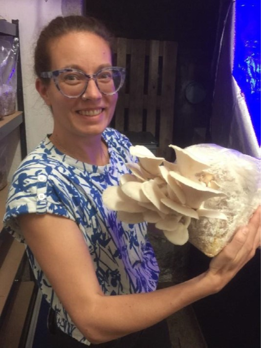
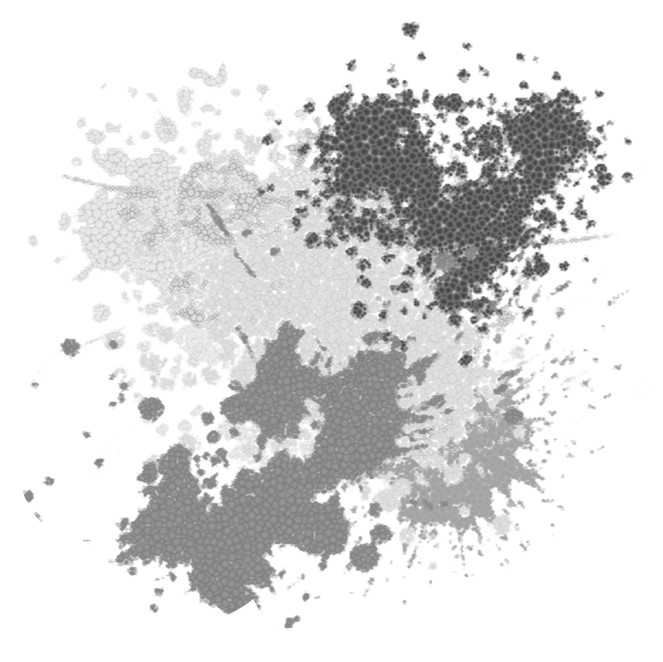
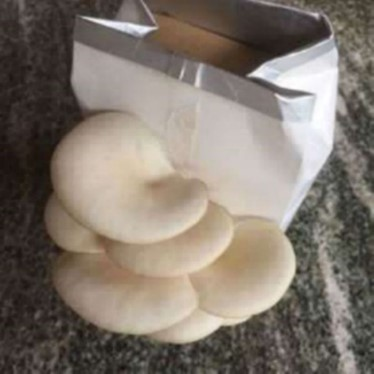

+++
title = "Herausforderung 2: Von guten und bösen Pilzen"
date = "2022-11-06"
draft = false
pinned = false
image = "bild1.jpg"
description = "Schwarzer Schimmel gilt allgemein als giftig. Es ist eine Schimmelart, die zu Allergien, Augenrötungen, Atemnot und anderen Symptomen führen kann."
+++
Colearning Bern betreibt in den Kellerräumen des Effingers eine Pilzfarm. Wir bauen mitten in der Stadt Bern eine Pilzproduktion auf und lassen Edelpilze auf Buchenbriketts und hauseigenem Kaffeesatz wachsen. So wird ein Reststoff zu einem Rohstoff für ein hochwertiges Nahrungsmittel. Das Lernunternehmen ist der Versuch, Lernen als integralen Teil von Arbeit zu erfahren und verbindet auf neue Art Arbeit und Lernen. Nach einer halbjährigen Experimentierphase haben wir im Juni beschlossen richtig ins Pilze züchten einzusteigen. Mit Unterstützung von den Stadtpilzen Basel mit viel Begeisterung und Support aus der Colearning-Community haben wir es geschafft, dass unser selbst gemischtes Pilzsubstrat quantitativ und qualitativ hochstehende Ulmenseitlinge hervorbringt. 

Eine Erfolgsgeschichte.

Wir haben unsere Pilzzucht so optimiert, dass wir aus jedem 3kg-Substratbeutel mindestens 700g bis 1kg qualitativ hochwertige Ulmenseitlinge ernten und verkaufen konnten. Wir haben unseren Arbeitsaufwand so reduziert, dass wir die Farmingstunden zu zweit bewältigten. Es gelang uns, das Wachstum so zu steuern, dass wir eine Woche im Voraus wussten, wie viele Pilze nächste Woche geerntet werden können und haben 3 Gastrounternehmen gefunden, die uns Pilze abkaufen. Es ist uns gelungen mehrere Fruchtungsphasen einzuleiten und zu timen. Wir hatten kaum Ausfälle und Mindertrag wegen schlechtem Farming oder mangelnder Hygiene Die Freude am Züchten ist durch den Erfolg im Effingerkeller mit den nicht optimalen Bedingungen gewachsen. Es haben sich 3 Personen gemeldet, die ihr Interesse an der Pilzfarm haben und uns in Zukunft aktiv unterstützen wollen.

Und da waren noch die schwarzen Flecken an der einen Kellerwand. Wir haben einen Experten eingeladen und wollten vor einer fälligen Erweiterung wissen, was bedeutet eine Pilzproduktion für den Keller im Allgemeinen und welchen Einfluss haben die mutmasslichen Schimmelpilze auf unsere Pilzproduktion. Das Resultat einer ersten kurzen Begehung war ernüchternd: Die schwarzen Flecken sind schwarzer Schimmelpilz und der gilt allgemein als giftig. Es ist eine Schimmelart, die zu Allergien, Augenrötungen, Atemnot und anderen Symptomen führen kann. Eine Minisanierung ohne Garantie auf längeren Erfolg würde Fr. 5000.- und mehr kosten. Für uns Pilzfarmer:innen nicht finanzierbar. 

**Was jetzt? Was nun? Wie weiter?** 

1. **Handeln:** Wir haben unsere Pilzproduktion im Keller heruntergefahren und dann ganz eingestellt. 
2. **Trotzen:** Wir lassen uns unsere Begeisterung und Faszination für Pilze nicht von einem anderen Pilz nehmen. 
3. **Vorwärts blicken:** Wir wollen weiterfahren, weil wir überzeugt sind, dass Pilze in der Zukunft der Menschheit eine wichtige Rolle spielen werden und wir wollen daran teilhaben. 
4. **In Möglichkeiten denken:** Wir suchen alternative Pilzzuchtformen.
5. **Finden und Entscheiden:** Wir produzieren jetzt Pilze in einer Haferdrink-Box

   

Wir sammeln 100 Haferdrinkbeutel, waschen sie, schneiden sie auf, falten einen einfachen Rand, schneiden ein viereckiges Fenster in eine Seite, füllen einen Gefrierbeutel mit unserem bewährten Buchenholz-Effinger-Kaffeesatz-Substrat, stecken den Sack in die Haferdrinkbeutel und ein kleines Fenster erlaubt, dass das Myzel noch genügend Sauerstoff bekommt. Eine Infoetikette auf der Haferdrinkbox informiert über unser Lernunternehmen.

Warten und hoffen 

Nach 2 bis 3 Wochen in der Finsternis und angenehmer Temperatur hat das Myzel das Substrat vollständig durchwachsen und ist bereit für die Fruchtkörperbildung. Jetzt können wir die Pilzboxen verkaufen, denn für das weitere Wachstum braucht es nur Tageslicht, ein bisschen Feuchtigkeit und etwas Geduld. Nach 2 Wochen wachsen die Ulmenseitlinge aus dem Haferdrinkbeutel heraus und können geerntet und genossen werden.

So hat uns der Schimmelbefall herausgefordert und uns zu ganz neuen Ansätzen und Lösungen verholfen. 

* Dank der Pilzbox können wir mit unserer Pilzzucht weiterfahren.
* Unser Lernunternehmen wird sichtbar, zeigt, was wir bisher versteckt im Effingerkeller produziert haben.
* Wir können unsere Begeisterung für Pilze mit anderen teilen.
* Wir können für unser Lernunternehmen werben und weitere Mitarbeiter:innen gewinnen
* Wir können weiter experimentieren, forschen und die Pilze noch besser verstehen.

**Die Krise als Chance. Wie wahr!**