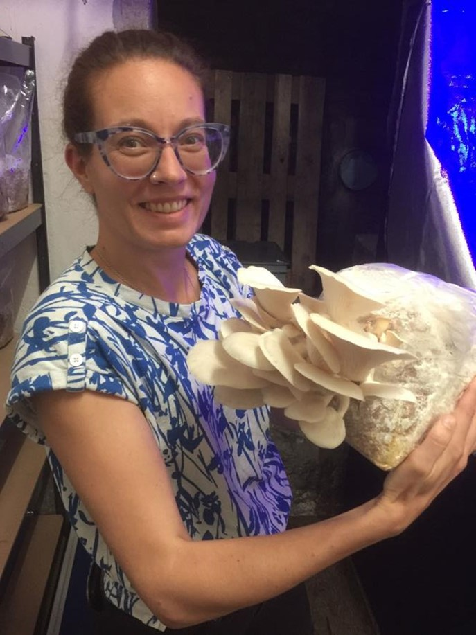
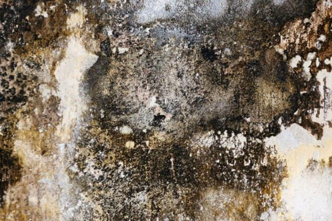
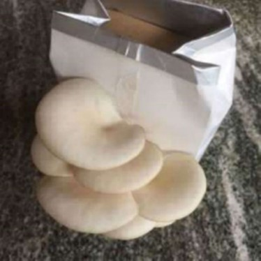

+++
title = "Herausforderung Schimmelpilz"
date = "2022-11-06"
draft = true
pinned = false
image = "bild1.jpg"
description = "Schwarzer Schimmel gilt allgemein als giftig. Es ist eine Schimmelart, die zu Allergien, Augenrötungen, Atemnot und anderen Symptomen führen kann."
+++
Colearning Bern betreibt in den Kellerräumen des Effingers eine Pilzfarm. Wir bauen mitten in der Stadt Bern eine Pilzproduktion auf und lassen Edelpilze auf Buchenbriketts und hauseigenem Kaffee-satz wachsen. So wird ein Reststoff zu einem Rohstoff für ein hochwertiges Nahrungsmittel. Das Lernunternehmen ist der Versuch, Lernen als integralen Teil von Arbeit zu erfahren und verbindet auf neue Art Arbeit und Lernen. Nach einer halbjährigen Experimentierphase haben wir im Juni be-schlossen richtig ins Pilze züchten einzusteigen. Mit Unterstützung von den Stadtpilzen Basel mit viel Begeisterung und Support aus der Colearning-Community haben wir, es geschafft dass unser selbst gemischtes Pilzsubstrat quantitativ und qualitativ hochstehende Ulmenseitlinge hervorbringt. Eine Erfolgsgeschichte

Wir konnten unsere Pilzzucht so optimieren, dass wir aus jedem 3kg-Substratbeutel mindestens 700g bis 1kg qualitativ hochwertige Ulmenseitlinge ernten und verkaufen konnten. Wir konnten unseren Arbeitsaufwand so reduzieren, dass wir die Farmingstunden zu zweit bewältigen. Es gelang uns, das Wachstum so zu steuern, dass wir eine Woche im Voraus wussten, wie viele Pilze nächste Woche geerntet werden können und haben 3 Gastrounternehmen gefunden, die uns Pilze abkaufen und die Qualität schätzen. Es ist uns gelungen, mehrere Fruchtungsphasen einzuleiten und zu timen. Wir haben kaum Ausfälle und Mindertrag wegen schlechtem Farming oder mangelnder Hygiene Die Freude am Züchten ist durch den Erfolg im Effingerkeller mit den nicht optimalen Bedingungen gewachsen. Es haben sich 3 Personen gemeldet, die ihr Interesse an der Pilzfarm haben und uns in Zukunft aktiv unterstützen wollen.

Und da waren noch die schwarzen Flecken an der einen Kellerwand. Wir haben einen Experten eingeladen und wollten vor einer fälligen Erweiterung wissen, was bedeutet eine Pilzproduktion für den Keller im Allgemeinen und welchen Einfluss haben die mutmasslichen Schimmelpilze auf unsere Pilzproduktion. Das Resultat dieser ersten kurzen Begehung war ernüchternd: Die schwarzen Flecken sind schwarzer Schimmelpilz und der gilt allgemein als giftig. Es ist eine Schimmelart, die zu Allergien, Augenrötungen, Atemnot und anderen Symptomen führen kann. Eine Minisanierung ohne Garantie auf längeren Erfolg würde Fr.5000.- und mehr kosten. Für uns Pilzfarmer:innen nicht finanzierbar. 
Was jetzt? 

1. Schritt: Wir haben unsere Pilzproduktion im Keller heruntergefahren und dann ganz eingestellt. 
2. Schritt: Wir lassen uns unsere Begeisterung und Faszination für Pilze nicht von einem anderen Pilz nehmen. 
3. Schritt: Wir wollen weiterfahren, weil wir überzeugt sind, dass Pilze in der Zukunft der Menschheit eine wichtige Rolle spielen werden und wir wollen daran teilhaben. 
4. Schritt: Wir suchen nach alternativen Pilzzuchtmöglichkeiten.
5. Schritt: Wir finden eine andere Pilzzuchtform
6. Schritt Wir produzieren jetzt Pilze in einer Haferdrink-Box

   