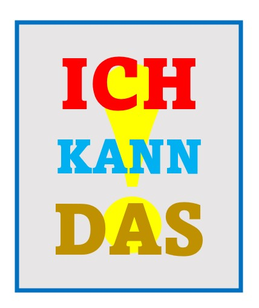

+++
title = "Ich lerne weiter"
date = "2022-04-04"
draft = false
pinned = false
image = "ich-will-ich-kann-ich-mache.jpg"
description = "Seit Januar 22 bin ich Teil des Lernunternehmens pilzfarm.be im Colearning Bern im Coworking Space Effinger\nSeit Januar 22 habe ich sehr viel gelernt. Ich kann heute so vieles so viel besser. \n"
+++
Seit Januar 22 bin ich Teil des Lernunternehmens **pilzfarm.be** im Colearning Bern im Coworking Space Effinger.
Seit Januar 22 habe ich sehr viel gelernt. 
**Ich kann heute so vieles so viel besser.**

> Ich setzte mich hin, nahm mir eine halbe Stunde Zeit und schrieb auf, was mir das Projekt pilzfarm.be ermöglicht hat, was ich dazu gelernt habe:

* Ich kann Pilze züchten
* Ich weiss, welche klimatischen Bedingungen Pilze für eine erfolgreiche Zucht benötigen
* Ich weiss, dass Pilze züchten eine Investition in die Zukunft ist
* Ich lasse mich anstecken und begeistern
* Ich kenne verschiedene Pilzrezepte und kann Pilze zubereiten: Pilzkuchen, Pilzpastetli, Pilze braten …
* Ich kenne die Gefahr der Kontamination der Pilzkulturen durch Schimmelpilze
* Ich kann diese dank sinnvoller Hygienemassnahmen vermeiden
* Ich kann Wissen zur Aufzucht von Pilzen erwerben und weitergeben
* Ich kann Wissen managen
* Ich kann Verantwortung abgeben
* Ich kann Termine einhalten
* Ich kann täglich dazulernen
* Ich kann Sitzungen erfolgreich leiten.
* Ich kann Schritt für Schritt vorgehen
* Ich kann Protokolle schreiben, Ergebnisse von Meetings zusammenfassen
* Ich kann Probleme Lösen
* Ich kann planen
* Ich kann Pilze verkaufen
* Ich kann organisieren, beschaffen, bestellen
* Ich kann nachhaltig produzieren
* Ich kann mit anderen zusammenarbeiten
* Ich kann meine Erfolge, meine Freude mit anderen teilen
* Ich kann meine Aufgaben an andere abgeben, delegieren
* Ich kann meine Anliegen einbringen
* Ich kann mein Lernen sicht- und hörbar machen
* Ich kann konkrete Vorschläge machen
* Ich kann komplexe Arbeitsabläufe mit geeigneten Massnahmen bewältigen
* Ich kann inspirieren
* Ich kann immer besser unternehmerisch denken
* Ich kann günstig einkaufen
* Ich kann Drive-Seiten so mit Slack verlinken, dass andere die Dokumente bearbeiten können
* Ich kann genaue Anweisungen für die Aufzucht von Pilzen schreiben
* Ich kann Fragen klären
* Ich kann experimentieren, forschen, ausprobieren
* Ich kann erklären
* Ich kann erfolgreich ein Substrat aus Buchenbriketts und Kaffeesatz zusammenmischen
* Ich weiss was eine Körnerbrut ist
* Ich kann Erfahrungen dokumentieren
* Ich kann Entscheidungen treffen
* Ich kann einen QR-Code erstellen und publizieren … und er funktioniert
* Ich kann eine Rolle übernehmen
* Ich kann ein Produkt mit hoher Qualität produzieren
* Ich kann ein kurzes Lernvideo gestalten
* Ich kann dankbar sein
* Ich kann Checklisten gestalten und beachten
* Ich kann beraten
* Ich kann bei Fachleuten gezielt Informationen zur Pilzzucht beschaffen und diese erfolgreich anwenden
* Ich kann begründen
* Ich kann abklären
* Ich halte Verpflichtungen ein
* Ich kann andere für unser Pilzfarmprojekt begeistern
* Ich kann viel über unser Lernunternehmen **pilzfarm.be** erzählen

**Ich kann heute so vieles so viel besser.  Und das tut gut.**