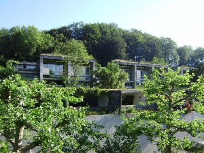
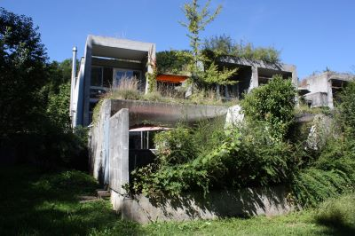
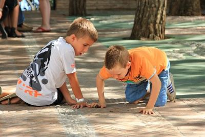

+++
title = "Kinder einfach mal spielen lassen"
date = "2022-11-17"
draft = true
pinned = false
image = "kalkstifte.jpg"
description = "Ein afrikanisches Sprichwort sagt: \"Für die Erziehung eines Kindes braucht es ein ganzes Dorf.\"\nFür die Erziehung meines Enkelkindes ist die Siedlung Halen das afrikanische Dorf."
+++
Mindestens einmal in der Woche darf ich mein Enkelkind hüten. Am schönsten ist dieser Moment , wenn Keanu noch mit seinen Kollegen abmacht. Oft spielen sie im geräumigen mit Legobausteine übersäten Kinderzimmer. Dann wechseln sie wieder nach draussen und treffen sich mit anderen auf dem verkehrsfreien Dorfplatz, liebevoll Dorfi genannt und spielen meistens Fussball. Gross und Klein sind dabei. Auch der nahe Wald ist ein idealer Tum-melplatz zum Hütten bauen, Herumrennen, Verstecken, Raufen, alles was Knaben so gerne im freien Spiel ma-chen. Und im Wald hat es meistens keine Erwachsenen, da kann man auch Dinge ausprobieren, die man nicht unbedingt auf dem Dorfi oder in der Siedlung macht
Keanu hat grosses Glück. Er wohnt in der Siedlung Halen.

Halen - Eine urbane Siedlung mitten im Wald

<https://www.halen.ch/>

*Die Halen ist ein Meilenstein moderner Siedlungsarchitektur. Gebaut zwischen 1957 und 1960 von der damals neuen Architektengemeinschaft Atelier 5 verbindet sie Elemente der klassischen Moderne mit strukturellen Ele-menten der Berner Altstadt. Sie ist ein kleines, mitten in einem Wald gelegenes architektonisches Juwel und für rund 220 Menschen ein Zuhause.
Die rechtlichen und organisatorischen Strukturen der Siedlung Halen sind so einfach und schlank wie ihre Architek-tur. Zuständig für die 83 Wohnhäuser sind allein deren Eigentümer. Über alle Gemeinschaftsanlagen befindet die Eigentümergesellschaft. Ihre Beschlüsse werden von der Verwaltung, einem Milizorgan mit fünf bis sieben Mit-gliedern, umgesetzt. 
Die Eigentümergesellschaft der Siedlung Halen ist ein im Handelsregister eingetragener Verein mit Statuten. Mitglieder sind alle Hauseigentümer. Oberstes Organ des Vereins ist die Eigentümerversammlung, welche jährlich mindestens einmal zusammenkommt und alle wichtigen Entscheide über das Gemeinschaftseigen-tum (Schwimmbad, Sportplatz, Wald, Wege, Laden, Waschküche, Einstellhalle etc.) trifft.*

Meine Tochter ist eine alleinerziehende, berufstätige Mutter und Keanu ein Einzelkind. Aber Keanu ist nie allein. In der Siedlung igilt das afrikanische Sprichwort: "Für die Erziehung eines Kindes braucht es ein ganzes Dorf."

Und wenn sich Keanu mit anderen in der Siedlung bewegt, habe ich viel Zeit für mich. Ich treffe mich mit anderen Erwachsenen auf dem Dorfi, ich kann etwas für mich erledigen oder ich kann einfach beobachten.
Ich höre und sehe, wie die Kinder miteinander umgehen. Ich sehe, wie sie spielen, wie Grosse und Kleine miteinander umgehen, aufeinander Rücksicht nehmen, wie sie gemeinsam etwas aushecken, wie sie abmachen, was sie nun machen wollen, wie sie die Rollen verteilen, wie sie streiten und sich wieder finden, wie sie einander trösten, wie sie lachen, wie sie Pläne schmieden, wie sie Mutproben veranstalten, wie sie herumklettern, mit Stühlen und Tischen Burgen bauen, mit Kalkstiften ganze Geschichten auf den Platz malen, mit Velos und Trottis Rennen organisieren.

**Hier dürfen Kinder spielen.** 

Die Siedlung ist ein kleines Dorf. Sehr durchmischt mit unterschiedlichstem Alter,  Kulturen und Lebensweisen. 
Szenenwechsel:
Im Winter öffnet am Mittwoch das Beizli zu einem gemeinsamen Anlass. Jemand bietet etwas an. Gestern gab es Suppe und Brot. Die Familien treffen und begegnen sich. Als Nicht-Halenbewohner fühlte ich mich sofort will-kommen, werde eingeladen mich zu anderen an einen Tisch zu setzen. Bei solchen Anlässen sind die Kinder immer dabei und finden sich sofort wieder zum Spielen: Sie spielen Verstecken im Beizli, tollen herum. Von Spielgruppen-kind bis zum 5. Klässler sind alle dabei oder werden aufgefordert mitzumachen. Nachher spielen si Fangis auf dem schon finsteren Dorfplatz. Für einige eine kleine Mutprobe, aber sie überwinden ihre Ängste im Spielen.
Wenn jemand mit seinen Kindern etwas unternimmt, dann sind oft auch die anderen eingeladen mitzuwirken. So entstehen gruslige Halloweenkürbisse, die einem überall in der Nacht angrinsen. Jemand organisiert einen Tanz-workshop, einen Flohmarkt, den Besuch des Samichlaus, ein Wichtelen, eine Openair-Disco auf dem Sportplatz, einen Sonntagsbrunch.

**Immer sind die Kinder dabei.**

Die Erwachsenen sind auch da und helfen wenn nötig, mahnen wenn etwas aus dem Ruder läuft, trösten und pflegen wenn sich jemand weh tut. Sie bilden den geschützten Raum, den die Kinder auch brauchen und den El-tern auch die Sicherheit gibt, es ist sicher jemand da. 
Die Kinder wachsen in der Halen in einem sozialen Gefüge auf. Sie haben ganz unterschiedliche Ansprechpart-ner:innen. Die Kindererziehung, wenn ich diesen Begriff noch brauchen darf, ist auf eine ganze Siedlung verteilt. Eltern sind entlastet und sind selber ein wichtiger Teil dieses urbanen Dorfes.
Das war mich am Anfang gewöhnungsbedürftig. Ich musste loslassen. Gelassenheit. Und wenn ich nicht weiss, wo Keanu ist, dann frage ich auf dem Dorfi. Jemand weiss es bestimmt, hilft mir beim Suchen und fragt weiter und der oder die fragt wieder jemand und plötzlich ist Keanu wieder da: «Ich war  auf dem Sportplatz und habe vergessen, dass ich heimkommen sollte, denn wir haben gerade ein coolen Kletterbaum gefunden.»