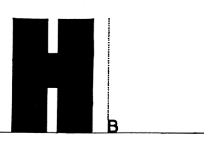
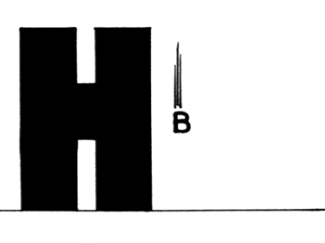
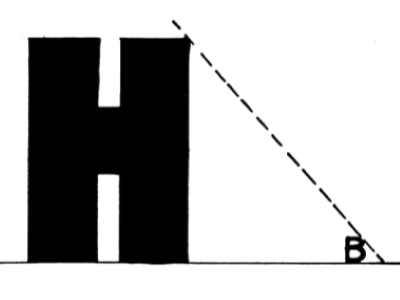
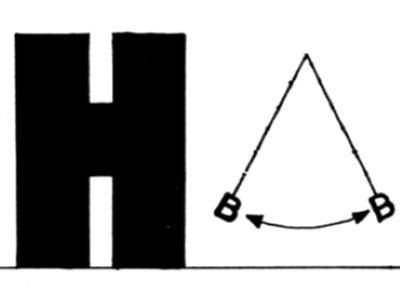
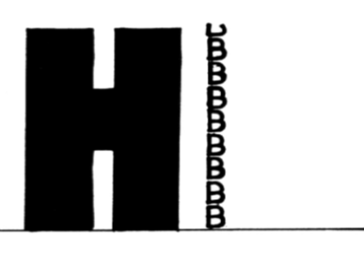

+++
title = "Kreativität und kritisches Denken"
date = "2022-11-20"
draft = false
pinned = false
image = "digitale-kompetenzen.jpg"
description = "Kritisch Denken und kreativ handeln heisst für mich: Herausforderungen annehmen, die Wohlfühlzone verlassen, Bewährtes in Frage stellen und Neues wagen. Am besten gelingt mir das, wenn ich zusammen mit anderen kreative Lösungen suchen und finden darf. "
footnotes = "Auszug aus \"The Barometer Story - A Probleme in Teaching Critical Thinking\" von Dr. A Calandra, veröffentlicht in Current Science, Teacher's Edition Vol. XLIX, No. 14, Section 1, January 6-10,1964, herausgegeben von American Education Publications, 1250 Fairwood Avenue, Columbus, Ohio 43216\nTitelbild: Mit digitalen Kompetenzen vorbereitet in die Schule starten. Devpost."
+++
Kritisches Denken und kreatives Lösungssuchen gehören gemäss meinen Erfahrungen zu den Grundanforderungen oder Schlüsselkompetenzen bei der Bewältigung der heutigen Probleme, beim erfolgreichen Suchen nach Lösungen. Sie sind wichtig für mein **"Ich darf lernen"**.
Kritisch Denken und kreativ handeln heisst für mich Herausforderungen annehmen, die Wohlfühlzone verlassen, Bewährtes in Frage stellen und Neues wagen. Am besten gelingt mir das, wenn ich zusammen mit anderen fantsievolle Lösungen suchen und finden darf. 
Eine solche Kreativgeschichte sind unsere Pilzboxen vom Colearning-Lernunternehmen im Effinger. Ende Oktober waren wir am Boden, ein Schimmelpilz im Keller hat unsere bewährte Pilzzucht verunmöglicht. 

**Und jetzt?**

Wir sassen wir zusammen, vergassen das Lamentieren und suchten nach neuen Möglichkeiten Pilze zu züchten. Andere Räume? Zuhause? Pause bis Keller saniert? 
Wir waren trotzig und liessen uns unsere Begeisterung und Faszination für Pilze nicht von einem anderen Pilz nehmen. Siehe auch Lernblog: von guten und bösen Pilzen.

<https://hermann.netlify.app/herausforderung-2-von-guten-und-bosen-pilzen/>

Und da kam die Idee mit den Pilzboxen: In leeren Haferdrinkbeuteln mit Effinger-Kaffeesatz und Buchenholzspänen aus dem Emmental, Ulmenseitlinge züchten. Ich hatte schon mal zu Hause in diese Richtung mit Erfolg experimentiert und etwas Ähnliches im Coop gesehen. Dort verkaufen sie Natura-Austern-Pilzboxen. Und was die können, das schaffen wir auch. 

**Und wir haben es geschafft.**

* 98 Pilzboxen haben wir zurechtgeschnitten.
* 98 Plastiksäcke mit einem «Atmungsfenster» versehen.
* 98 mal 400g Substrat abgefüllt.
* 98 Boxen mit Infos und Anleitungen beschriftet.
* 98 Säcke im Keller 2 Wochen lang in der Dunkelheit vom Ulmenseitlingmyzel durchwachsen lassen.

Wir haben uns sichtbar gemacht, haben von den Pilzboxen gesprochen, haben Muster gezeigt, haben einen Flyer gestaltet und andere mit dem Pilzfiber angesteckt. Sie gestalteten den Webauftritt neu. Sie organisierten Bestellung und Verkauf auf unserer Webseite. Sie haben auf allen möglichen Kanälen für unser Produkt geworben. Auf meinem Twint-Konto sind schon erste Bezahlungen eingegangen

Es hat funktioniert dank

> **kritischem Mitdenken, Kreativität, Kommunikation und Kollaboration** 

Ab morgen, Montag, 21. November verkaufen wir unsere Boxen an alle, die gerne selber Pilze züchten, die Pilze mögen, die ein passendes Geschenk suchen oder einfach unser Lernunternehmen unterstützen wollen.

Ich möchte euch, liebe Leser:innen zum heutigen Sonntag und zur Thematik **Kreativität und kritisches Denken** eine Geschichte schenken, die ich vor sehr langer Zeit gehört und die ich oft in meinen Weiterbildungsveranstaltungen vorgelesen und mit auf den Heimweg gegeben habe.
Viel Spass beim Lesen. 
Wer die Geschichte schon kennt, kann hier mit dem Lesen des Blogs aufhören und kreativ die "gewonnene" Zeit geniessen.

**Ein Hochhaus, ein Barometer und kritisches Denken** 

Alexander Calandra Ins Deutsche übertragen und mit Zeichnungen versehen von Helge Weinreb

Vor einiger Zeit rief mich ein Kollege an und bat mich, ihm als Sachverständiger bei der Benotung einer Prüfungs-aufgabe zu helfen. Offensichtlich wollte er einem Schüler für die Bearbeitung einer Physikaufgabe keinen Punkt geben. Der Schüler jedoch meinte, er müsste die volle Punktzahl bekommen, wenn es mit rechten Dingen zuginge. Lehrer und Schüler waren übereingekommen, zur Klärung dieser Frage einen Unparteiischen heranzuziehen und hatten mich dazu auserkoren. Ich ging in das Arbeitszimmermeines Kollegen und las mir die Prüfungsaufgabe durch: "Zeigen Sie, wie man mit Hilfe eines Barometers die Höhe eines Hochhauses bestimmen kann." Die Antwort des Studenten: "Man nimmt das Barometer mit aufs Dach, bindet es an eine lange Schnur und lässt es daran auf die Strasse hinunter. Dann holt man es wieder herauf und misst die Länge der Schnur. Diese Länge entspricht der Höhe des Gebäudes."

In der Tat war das eine ausserordentlich interessante Antwort, nur - konnte man dem Schüler dafür die volle Punktzahl geben? Zuerst wies ich einmal darauf hin, dass der Schüler das Recht ohne Zweifel auf seiner Seite habe; denn er hatte die Aufgabe vollständig und richtig gelöst. Andererseits jedoch: Wenn der Schüler die volle Punktzahl erhielt, dann konnte das dazu beitragen, dass er auch eine gute Note in Physik erhielt. Eine gute Note sollte dem Schüler bescheinigen, dass er Kenntnisse in Physik hat, gerade das aber wurde durch diese Art der Beantwortung der Prüfungsaufgabe nicht nachgewiesen. Nachdem ich das überlegt hatte, schlug ich vor, dem Schüler noch einmal die Möglichkeit zur Bearbeitung der Aufgabe zu geben. Nicht überrascht war ich, dass mein Kollege diesem Vorschlag zustimmte. Dass auch der Schüler zustimmte, überraschte mich dann doch. Aufgrund dieser Vereinbarung gab ich dem Schüler sechs Minuten zur Bearbeitung der Aufgabe und wies ihn darauf hin, dass seine Antwort Kenntnisse in Physik zeigen sollte. Nach fünf Minuten hatte er noch kein Wort geschrieben. Ich fragte ihn, ob er aufgeben wolle, weil ich mich noch um eine andere Klasse kümmern musste. Aber er sagte nein, er wolle noch nicht aufgeben. Er habe eine Reihe von Lösungsvorschlägen für dieses Problem und überlege sich gerade, welches der beste Vorschlag sei. Ich bat ihn um Entschuldigung für meine Unterbrechung und forderte ihn auf, weiterzumachen. In kürzester Zeit hatte er folgende Antwort zu Papier gebracht: "Man nimmt das Barometer mit auf das Dach des Gebäudes und lehnt sich über die Dachkante. Dann lässt man es fallen und stoppt die Dauer des Falls mit einer Stoppuhr. Schliesslich ermittelt man die Höhe, indem man folgende Formel benutzt: S= 1/2 gh2"

An dieser Stelle fragte ich meinen Kollegen, ob er aufgeben wolle - er wollte. Als ich das Arbeitszimmer meines Kollegen bereits verlassen wollte, fiel mir ein, dass der Schüler behauptet hatte, er habe noch andere Lösungsvorschläge. Ich fragte ihn danach. "O ja", sagte der Schüler, "es gibt noch eine ganze Reihe von Möglichkeiten, um die Höhe eines Hochhauses mit einem Barometer zu ermitteln. Zum Beispiel können Sie an einem sonnigen Tag das Barometer mit nach draussen nehmen und seine Hohe sowie die Länge seines Schattens abmessen. Dann messen Sie, wie lang der Schatten des Hochhauses ist und bestimmen mit einer einfachen Verhältnisgleichung die Höhe des Gebäudes."

"Prima", sagte ich. "Wissen Sie noch eine andere Möglichkeit?" - "Ja", erwiderte der Schüler. "Da gibt es noch eine sehr grundsätzliche Methode, die Ihnen gefallen wird. Sie nehmen das Barometer und gehen die Treppen hoch. Dabei markieren Sie die Höhe der Wand jeweils in .Barometer-Einheiten'. Dann brauchen Sie nur diese .Barometer-Einheiten' zusammenzuzählen und Sie erhalten die Höhe des Gebäudes in .Barometer-Einheiten'. Es ist allerdings eine sehr handgreifliche Methode."

"Sollten Sie an einer etwas subtileren Methode interessiert sein, dann könnten Sie das Barometer an eine Schnur binden und es als Pendel schwingen lassen. 
Sie bestimmen den Wert von ,g' (Schwerebeschleunigung in der Formel T=2^i/1/g) auf Strassenniveau und auf dem Dach. Aus der Differenz zwischen g1 und g2 können sie prinzipiell die Höhe des Gebäudes errechnen."  

Schliesslich meinte er: "Wenn Sie mich nicht auf eine physikalische Lösung festlegen, dann gibt es noch viele andere Möglichkeiten. Zum Beispiel könnten Sie das Barometer nehmen und beim Hausmeister anklopfen. Wenn er sich meldet, dann sprechen Sie wie folgt: "Lieber Herr Hausmeister, ich habe hier ein wunderbares Barometer. Wenn Sie mir die Höhe dieses Hauses verraten, dann gehört es Ihnen." Hier endlich fragte ich den Schüler, ob er die erwartete Losung wirklich nicht wisse. Er gab zu, dass er sie wusste. Aber, so fügte er hinzu, er sei es leid, dass die Lehrer immer versuchten, ihm beizubringen, wie er denken und seinen kritischen Verstand gebrauchen sollte, statt ihm grundsätzliche Zusammenhänge zu zeigen und zu erklären. Deswegen habe er beschlossen, an einem Beispiel einmal zu zeigen, was für ein Theater das sei.