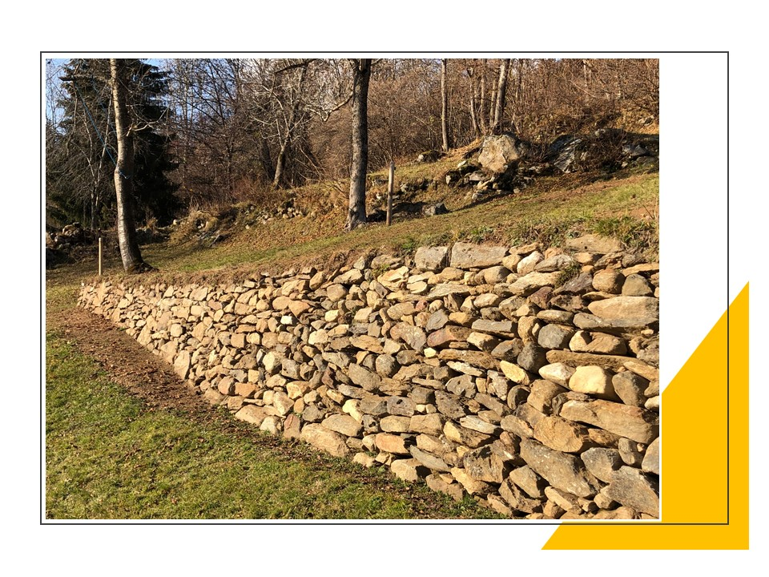
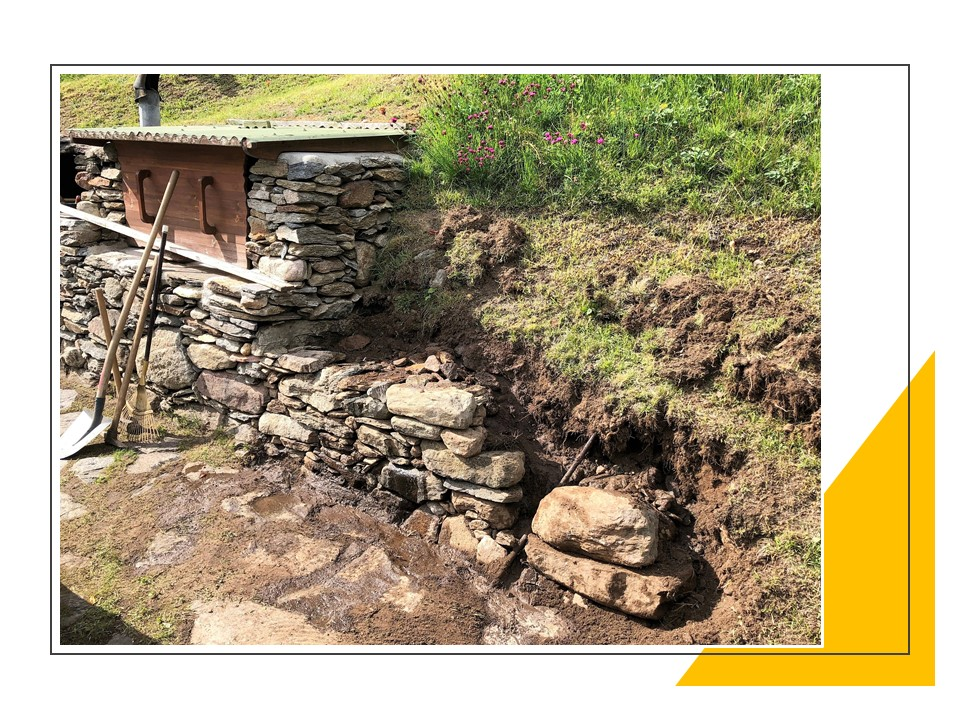
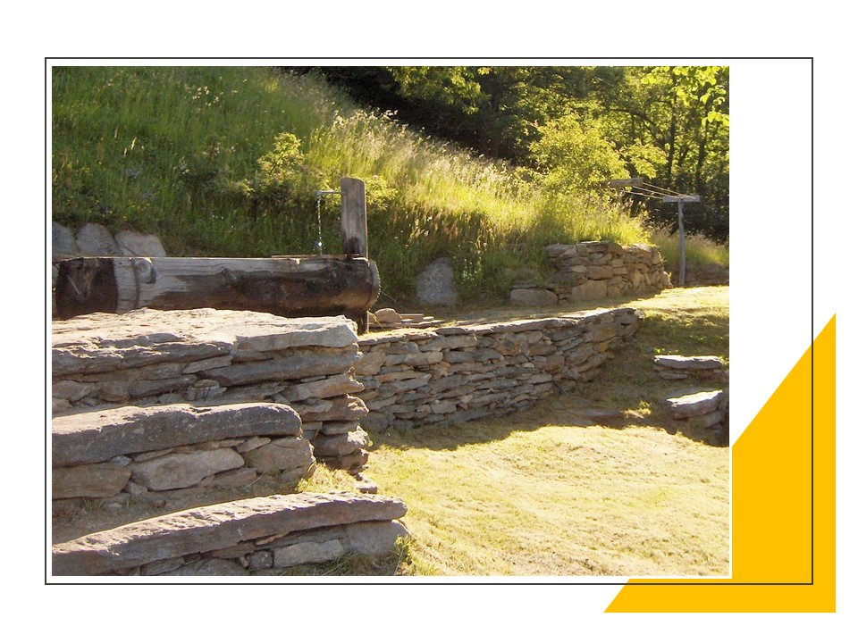
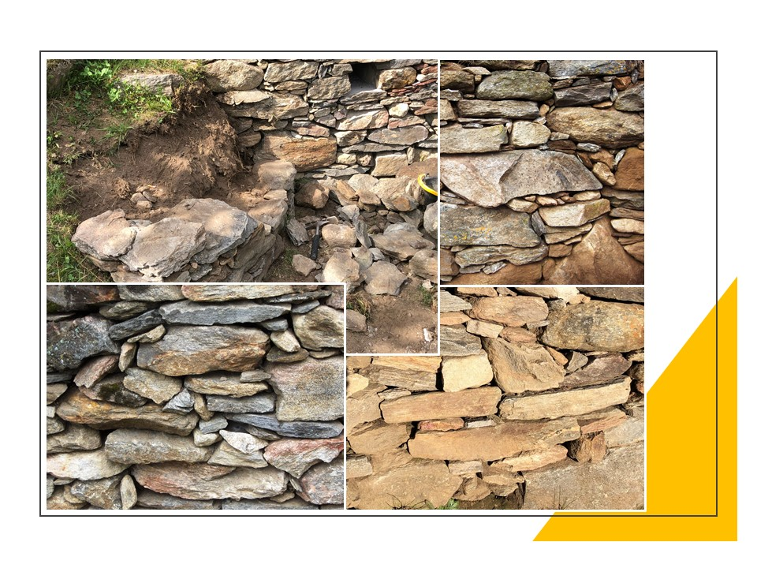
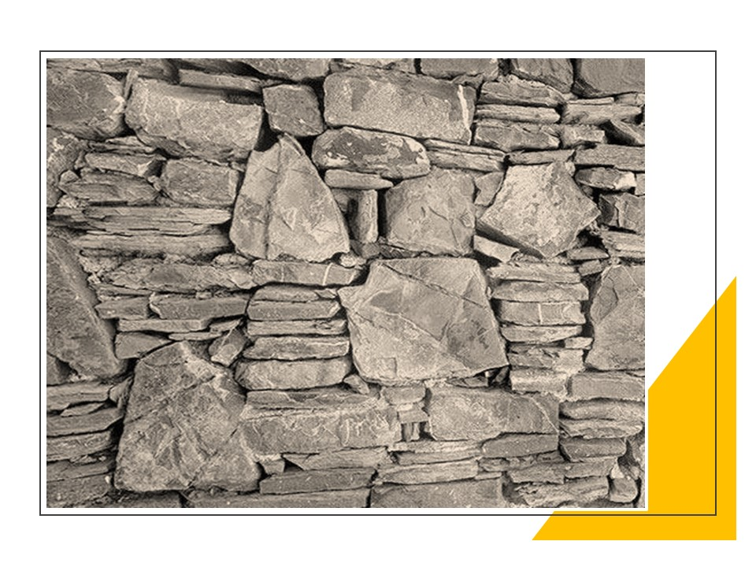
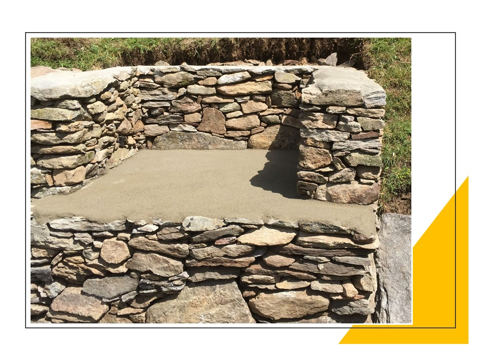
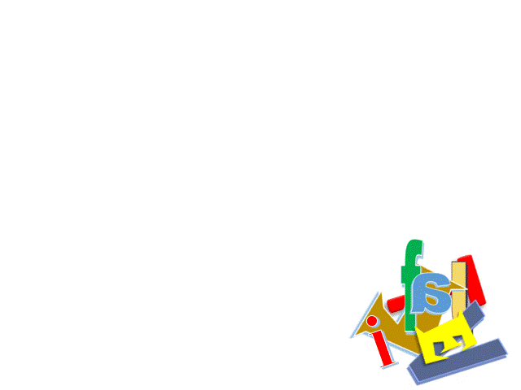

+++
title = "Mein BILD von BILDung"
date = "2021-01-20"
draft = false
pinned = false
image = "titel.jpg"
description = "Gedanken beim Bauen einer Trockensteinmauer\noder\nWas hat eine «stabile Steinmauer ohne Mörtel» mit Bildung im Colearning Bern zu tun?\n"
+++

Trockenmauern werden als Stützmauern an Hängen und für Terrassen vor allem in den alpinen Gebieten errichtet. Der Begriff “Trockenmauer” verrät bereits einiges über die Bauweise: Die Steine liegen «trocken» aufeinander, denn die Fugen werden nicht mit Mörtel verfüllt. Das hat den Vorteil, dass in den Fugen Pflanzen wachsen, in den kleinen Winkeln und Nischen der Mauern finden eine Vielzahl nützlicher Insekten wie Wildbienen und Hummeln Unterschlupf. Auch Eidechsen und Schlangen wählen gerne die warmen, trockenen Mauerritzen als Bleibe.

Der Bau einer Trockenmauer, die über längere Zeit stehen bleiben soll, ist eine faszinierende Arbeit. Es sind eigentlich nur Schnur, Hammer, Meissel, Pickel und Schaufel nötig und es braucht auch kein Material aus weiter Entfernung. Ich kann praktisch alle Steine verwenden, die herumliegen, welche dann von Hand aufgeschichtet werden. Alpwiesen wurden früher von Steinen "gesäubert" und diese wurden zu Trockenmauern aufgeschichtet, die als Zäune und Schutz dienten.

Trockenmauern fügen sich harmonisch in die Landschaft und werden so Teil der Lebenswelt. Es ist ein direkter, praktischer Umgang mit Vielfalt. Beim Bauen gilt es die Unterschiedlichkeiten geschickt zu nutzen. Es braucht die Kleinen, die Mittleren, die Kleinen, die Runden, die Eckigen, die Flachen, die Quadratischen, die Ovalen, die Langen, die Kurzen, die Schweren und die Leichten. Nur wenige müssen mit Hammer und Meissel bearbeitet werden.

Damit ich einen grossen Stein richtig setzen kann muss ich mit den kleineren ein gutes Fundament legen. Die grossen Steine sitzen dauerhaft fest, wenn sie sich mit den kleinen verkeilen und von ihnen gestützt werden. Ich muss immer wieder ausprobieren, ob die richtigen Steine am richtigen Ort sitzen. Ich wende und drehe sie, lege sie hin, teste, probiere, versuche, entscheide, verwerfe. Ich richte und verkeile, bis sie richtig sitzen und ihre Aufgabe als Mauer erfüllen können.
Es braucht viel Geduld.
Mit der Zeit erkenne ich im Steinhaufen immer mehr die Steine, die auf den ersten Blick passen. Allmählich beginne ich die Steine zu verstehen. Ich bekomme ein Gefühl für das Passende, weiss intuitiv, das könnte stimmen.

Eine Mauer wirkt durch Abwechslung, Stabilität ergibt sich aus dem Zusammenspiel von unterschiedlichen Steinen. Schönheit und Beständigkeit. Schutz im umfassendsten Sinne: Naturschutz und Menschenschutz.
Stark in der Vielfalt.

Folgen wir diesem Bild, so gibt es mir ein Gefühl für die Grundhaltung meines Wirkens im Colearning, meines BILDes von BILDung, das im Wesentlichen von meiner Haltung zur Vielfalt geprägt ist.

Ich bin überzeugt, dass es Vielfalt braucht um etwas Grosses, Stabiles zu schaffen. Ich werde auch immer geschickter im Umgang mit der Verschiedenheit. Ich kann jetzt die Unterschiede nutzen, sie zu einem grossen Gemeinsamen zusammenfügen. Ich bin überzeugt, dass es Lücken und Nischen braucht, damit sich Lebendiges entwickelt. Ich habe gelernt Unterschiede zu sehen und diese kreativ zu nutzen. Es braucht in der Bildung das Unterschiedliche, das Verschiedene. Es braucht die Erfahrung des Älteren und den Mut, die Fragen und die Unbekümmertheit der Heranwachsenden. Zum Lösen von Problemen sind unterschiedliche Herangehensweisen nötig, grosse Herausforderungen können nur gemeinsam von ganz unterschiedlichen Menschen bewältigt werden. Alle sind wichtig.
Wir profitieren voneinander, stützen uns gegenseitig, sind froh auch um die kleinsten Beiträge. Erst die kleinen Dinge ermöglichen, dass sich Grosses entfalten und nachhaltig wirken kann.

Alle sind mit einbezogen und wichtig, die Starken und die Schwachen. Bei unserem täglichen Umgang mit Kindern bekommen wir auch jeden Tag ein umfassenderes Verständnis über ihre und unsere Welt. Wir beginnen immer mehr zu verstehen. Die Kleinen stützen die Grossen – die Grossen schützen die Kleinen.
Es braucht den Blick auf das Ganze und die Liebe zu den Details. Es gilt die kleinen Schätze zu sehen, die Perlen zu finden, die unser Leben bereichern. 
An jedem Tag sollten wir auch unsere Vielfalt, unsere Möglichkeiten, unsere kleinen und grossen Chancen in uns entdecken und uns freuen, dass wir im Dialog mit anderen Vielfaltern Grosses bewirken können.

