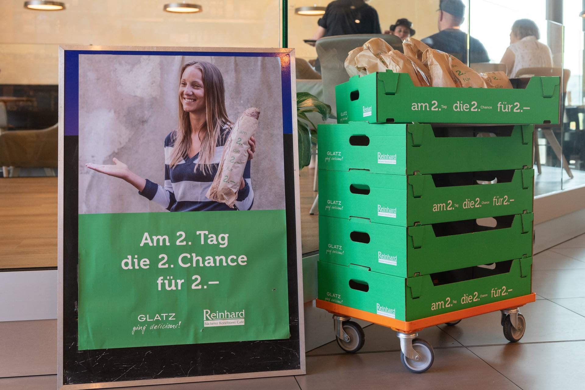

+++
title = "Ein EffingerDienstTag"
date = "2021-06-05"
draft = true
pinned = false
image = "meine-geschichten.jpg"
description = "Der Dienstag ist mein Effingertag: Ich bin als Host für die Community tätig, engagiere mich als Mentor und Gastgeber im Colearning, beschäftige mich im THES mit Bildung-einfach-anders und pflege den Kontakt mit ganz unterschiedlichen Menschen und Geschichten. Ich freue mich jede Woche auf diese Begegnungen und den Austausch. Und hier ist die Geschichte vom 25. Mai."
+++
Früh aufstehen

im Zug nach Bern: letzte Slack-Nachrichten lesen, Plan für unseren THES-Dienst-Tag zusammenstellen, Themen zum Diskutieren, das muss ich heute unbedingt noch erledigen
Einkaufen bei Glatz: 2 - 2 - 2 Köstlichkeiten, die 2 Tage alt sind werden für Fr. 2.- verkauft.

07.45 Uhr im Effinger. Heute hat Jonathan das Hosting für den VorMittag übernommen. Der Stehtisch in der Lounge ist mein Lieblingsplatz. Hier hat man eine gute Übersicht über das Geschehen im Effinger. Hier spürst du die Stimmung. Hier kann die Willkommenskultur gelebt und gepflegt werden.
Ich unterstütze Jonathan beim Hosten. Heute muss auch noch der Container an die Effingerstrasse gemusst werden. Warum sind die  Container so schwer zu manövrieren?

Zeit, Texte von Fredi und Marco zu einem Video über Michael Hüter zu lesen. Denkt denn keiner an die Kinder?
Maria Montessori, ihres Zeichens Reformpädagogin, Philosophin und Ärztin, würde sich wohl im Grabe umdrehen, könnte sie sehen, wie wir als Gesellschaft in dieser Krise mit unseren Kindern umgehen. Ebenso fassungslos ist Kindheitsforscher Michael Hüter. Er zieht ein sorgenvolles Resümee: "Ich hätte nicht gedacht, dass meine kühns-ten Befürchtungen wahr werden würden. Wir fügen den wenigen Kindern, die wir noch haben, grundlos historisch einmaliges Leid zu."   Im Interview mit mir spricht Hüter über den kollektiv anerzogenen Gehorsam, die Schule als Ort der Gewalt, den geheimen Lehrplan, ein nicht reformierbares Bildungssystem und eine kranke Gesellschaft, die gerade eine gesamte Generation misshandelt. Er erzählt mir jedoch auch von gelingenden Beziehungen, von Vertrauen, Liebe und Geborgenheit, und davon, wie eine glückliche Kindheit eigentlich aussehen sollte.  

Bild THES

Austauschen, Sich bilden mit Markus und Fredi. Im Zentrum steht der Artikel von Michael Hüter. Seine Wutrede gegen das heutige Bildungssystem hat mich erschüttert. Meine Fragen an die THES-Gruppe: Wie gehe ich mit Wut und Ärger um? Was mache ich, wenn ich merke, dass meine Gedanken und Ideen von anderen Formen der Bildung, von neuen Erkenntnisse aus der Lernforschung nur von ganz wenigen geteilt werden? Wie komme ich zu konstruktivem Handeln, wenn so viel Widerstand spürbar wird? Wie komme ich mit meinen eigenen und den fremden Widersprüchen klar? Lösungsorientiert arbeiten, heitere Gelassenheit gewinnen und mich an einen Satz eines ehemaligen Kollegen erinnern: *Weisst du, die Sklaverei wurde auch nicht in ein paar Jahren abgeschafft. Manchmal brauchen Entwicklungen Jahrzehnte, vielleicht Jahrhunderte, Sei du ein Teil dieser schrittweisen Veränderung und übe dich auch in Demut.* Du kannst nicht alles. 
Da passt doch auch der Satz vom Spielpädagogen Hans Fluri bestens: *Sei locker und lass nicht locker.* 

Zum Beispiel diese Dinge ganz am Schluss vom Talk finde ich sehr toll:
Wir müssen die Möglichkeit wieder schaffen, das Kind im wirklichen Leben mit zu bilden oder daran teilhaben zu lassen. Also aufhören zu glauben, dass wenn wir 22 Jahre lang Menschen aus der Öffentlichkeit wegsperren, dass die dann etwas fürs Leben gelernt haben. Das hat nie funktioniert und wird nie funktionieren.Und es muss jeder "unterrichten". Lehren kann der, der fähig ist dazu. Und das sind oft Menschen - viel besser als Pädagogen. \[...] Ein Kind will wissen. Bis zum vierten Lebensjahr stellt ein Kind 400 Fragen am Tag. Wir müssen einfach diesen Wis-sensdurst lassen und dann kann jeder Mensch einem Kind etwas beibringen, indem er ihm die Fragen beantwortet.
Dann sagt er noch über "unterstützende Begleiter", ein Begriff von Alice Miller:
Unterstützende Begleiter sind das, was jedes Kind im Heranwachsen braucht. Das kann jeder sein im Umfeld des Kindes. Es sind immer die Menschen. Durch solche unterstützenden Beglei-ter hat der Mensch über Jahrtausende gelernt. So kann einem Kind Wissen und Erfahrung wei-tergegeben werden. Dahin müssen wir wieder kommen; dass die Menschen, die wirklich kompe-tent sind und etwas können, die sollten Kindern etwas weitergeben.

10.00 Uhr Pause

Heute hat Joni einen selbstgebackenen Geburtstagkuchen mitgebracht. Austauschen. Pausen sind so wertvoll. Die Diskussionen drehen sich heute vor allem um unseren Kommunikationskanal Slack. Neben viel Wissenswertem zum Umgang mit den vielen Infos erfahre ich, dass ich mit dem Lesezeichen Nachricht markieren kann, damit ich diese später vertiefter lesen und bearbeiten kann.

Colearning Bern

Mit Tom besprechen wir einen möglichen Lernweg seiner Tochter, die sich aufs Gymnasium vorbereiten will und keinen Weg in der öffentlichen Schule gefunden hat, der ihr erlaubt einen individuellen Lernweg zu gehen. Wir diskutieren die Möglichkeiten dies im Colearning zu machen. Wir können ihr eine unterstützende Begleitung anbieten. 

<https://www.effinger.ch/blog/gemeinsamstaendigkeit/>