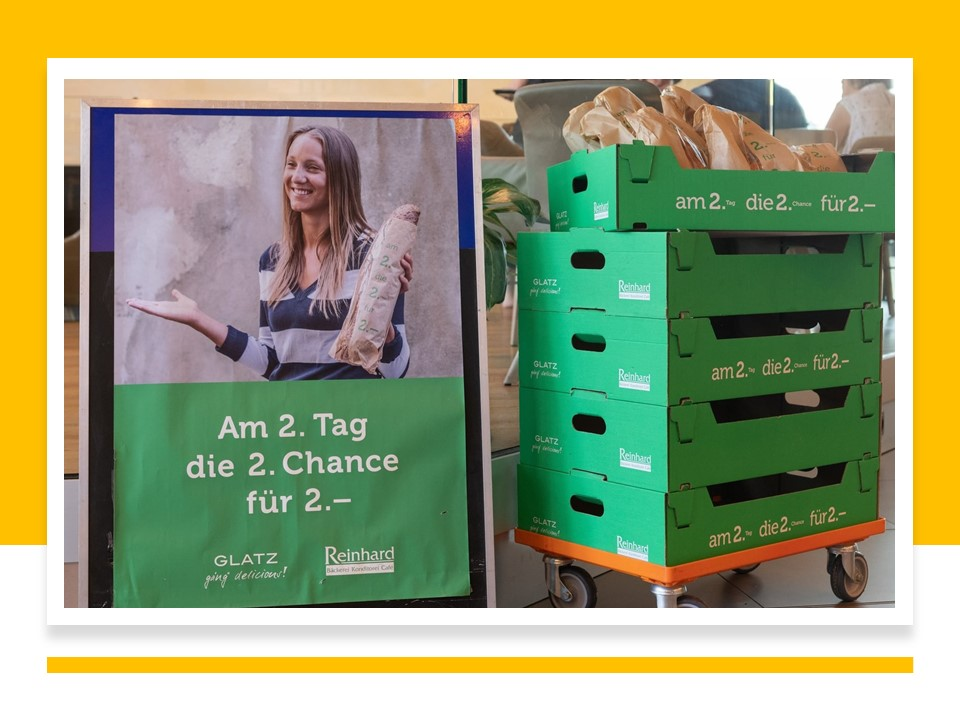
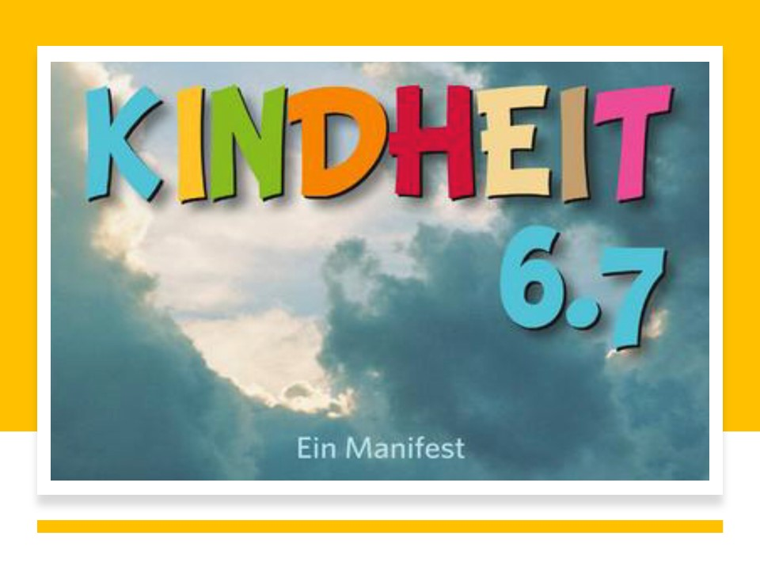
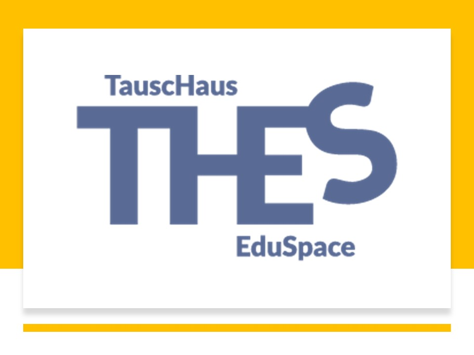
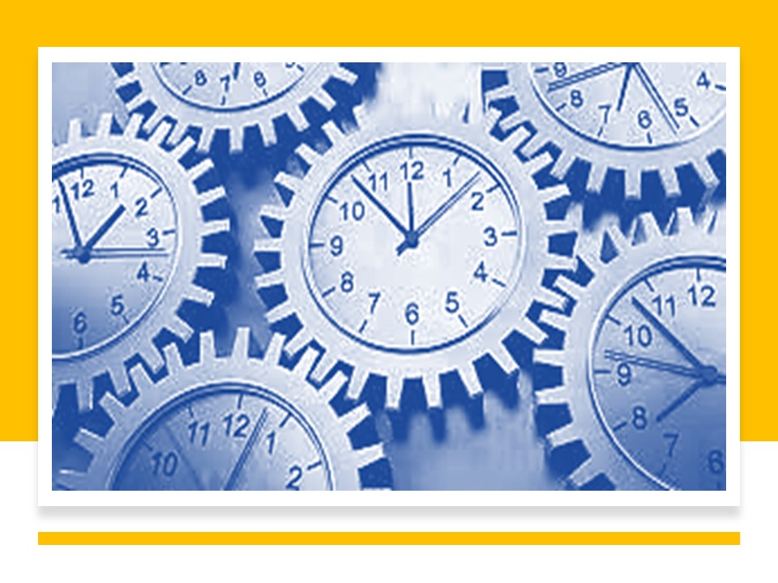
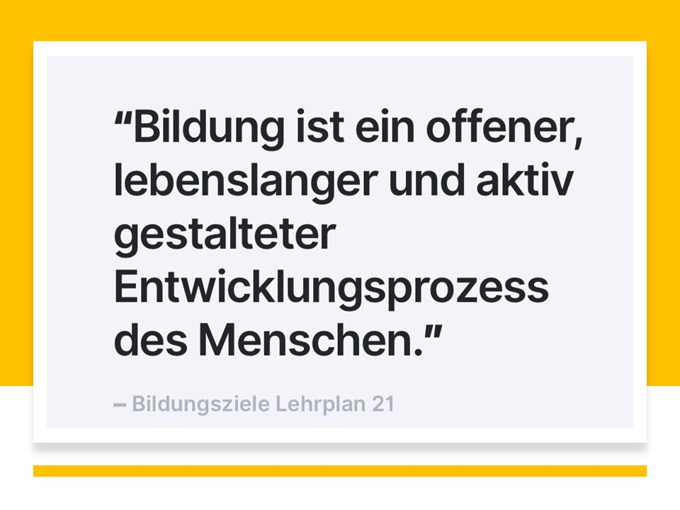
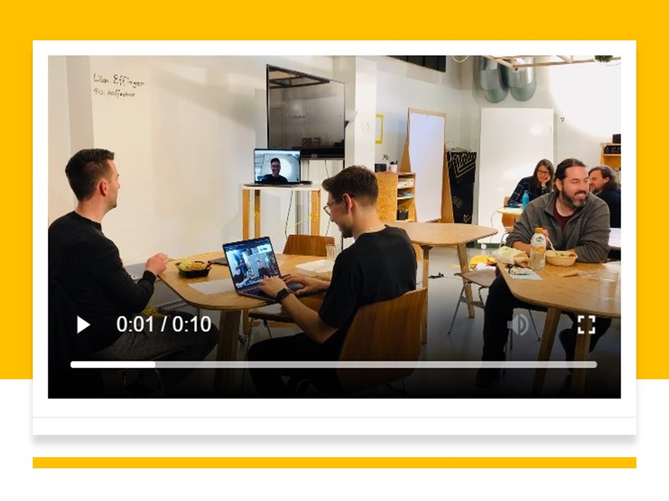
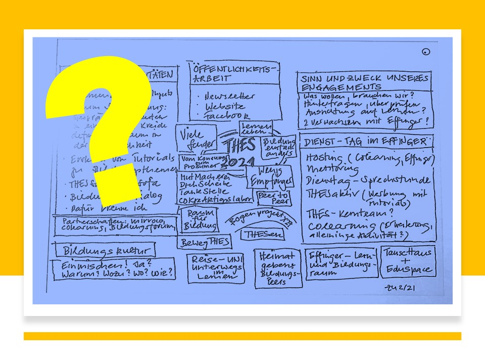
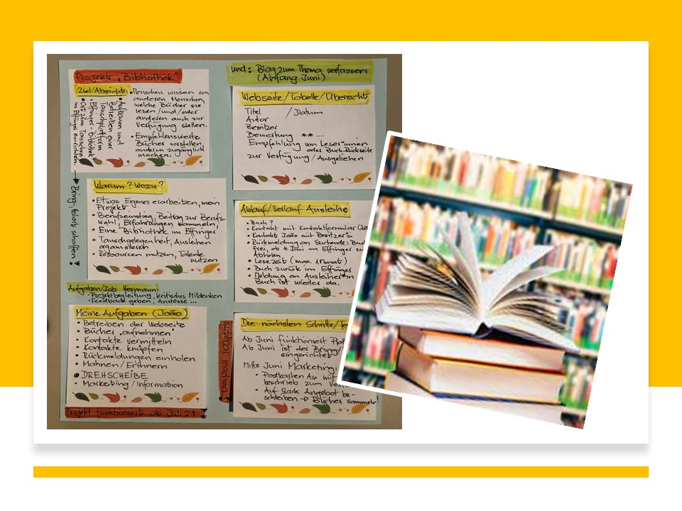
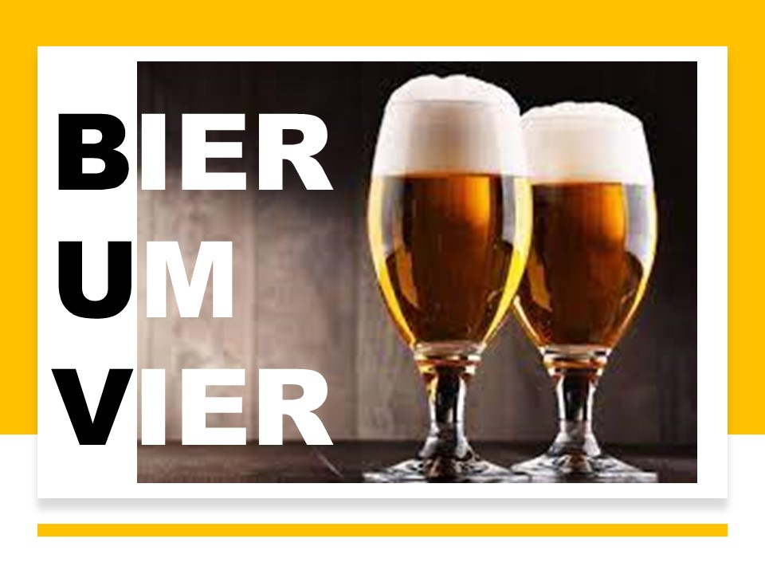

+++
title = "Ein EffingerDienstTag"
date = "2021-06-13"
draft = true
pinned = false
image = "meine-geschichten.jpg"
description = "Der Dienstag ist mein Effingertag: Ich bin als Host für die Community tätig, engagiere mich als Mentor und Gastgeber im Colearning, beschäftige mich im THES mit Bildung-einfach-anders und pflege den Kontakt mit ganz unterschiedlichen Menschen und Geschichten. Ich freue mich jede Woche auf diese Begegnungen und den Austausch. Und hier ist die Geschichte vom 25. Mai."
+++
**06.15 Uhr**
Früh aufstehen, frühstücken, im Zug nach Bern letzte Slack-Nachrichten lesen, Plan für unseren THES-Dienst-Tag zusammenstellen, Themen zum Diskutieren notieren, überlegen, was heute unbedingt besprochen, erledigt und beschlossen werden soll. Auf dem Weg an die Effingerstrasse mache ich einen kleinen Abstecher in die Bäckerei Glatz.

**07.45 Uhr** 
Ankommen im Effinger. Heute hat Jonathan das Hosting für den Vormittag übernommen. Der Stehtisch in der Lounge ist mein Lieblingsplatz. Hier hat man eine gute Übersicht über das Geschehen im Effinger. Hier spürst du die Stimmung. Hier kann die Effinger-Willkommenskultur gelebt und gepflegt werden.
Ich unterstütze Jonathan beim Hosten. Heute muss ich noch den Container an die Effingerstrasse verschieben. Warum sind diese Container so schwer zu manövrieren?

**08.15 Uhr**
Texte und Kommentare von Fredi und Marco zu einem Gespräch mit Michael Hüter zu lesen. Denkt denn keiner an die Kinder? Hüter ist fassungslos, wie wir als Gesellschaft in dieser Krise mit unseren Kindern umgehen. Er zieht ein sorgenvolles Resümee: *Ich hätte nicht gedacht, dass meine kühnsten Befürchtungen wahr werden würden. Wir fügen den wenigen Kindern, die wir noch haben, grundlos historisch einmaliges Leid zu*. Im Interview spricht Hüter über den kollektiv anerzogenen Gehorsam, die Schule als Ort der Gewalt, den geheimen Lehrplan, ein nicht reformierbares Bildungssystem und eine kranke Gesellschaft, die gerade eine gesamte Generation misshandelt. Zu meinem Glück erzählt er am Schluss, nach meinem Empfinden zu kurz, auch von gelingenden Beziehungen, von Vertrauen, Liebe und Geborgenheit, und davon, wie eine glückliche Kindheit eigentlich aussehen sollte.\
Hier der Link zum Interview auf Kaiser TV: <https://youtu.be/Bw4IHTvgHHY>

**09.00 Uhr**
Austauschen, sich bilden mit Markus und Fredi. Im Zentrum steht das Interview mit Michael Hüter. Seine Wutrede gegen das heutige Bildungssystem hat mich erschüttert. Meine Fragen an die THES-Gruppe: Wie gehe ich mit Wut und Ärger um? Was mache ich, wenn ich merke, dass meine Gedanken und Ideen von anderen Formen der Bildung, von neuen Erkenntnisse aus der Lernforschung nur von ganz wenigen geteilt werden? Wie komme ich zu konstruktivem Handeln, wenn so viel Widerstand spürbar wird? Wie komme ich mit meinen eigenen und den fremden Widersprüchen klar?
Mögliche Antworten?
Lösungsorientiert arbeiten, heitere Gelassenheit gewinnen und mich an einen Satz eines ehemaligen Kollegen erinnern: *Weisst du, die Sklaverei wurde auch nicht in ein paar Jahren abgeschafft. Manchmal brauchen Entwicklungen Jahrzehnte, vielleicht Jahrhunderte, Sei du ein Teil dieser schrittweisen Veränderung und übe dich auch in Demut.* *Du kannst nicht alles.* 
Da passt doch auch der Satz vom Spielpädagogen Hans Fluri bestens: *Sei locker und lass nicht locker.* 
Unterstützende Begleiter sind das, was jedes Kind im Heranwachsen braucht. Das kann jeder sein im Umfeld des Kindes. Es sind immer die Menschen. Durch solche unterstützenden Begleiter hat der Mensch über Jahrtausende gelernt. So kann einem Kind Wissen und Erfahrung weitergegeben werden. Dahin müssen wir wieder kommen; dass die Menschen, die wirklich kompetent sind und etwas können, die sollten Kindern etwas weitergeben.

> Sei locker und lass nicht locker. 

Vor der Pause muss noch der Container zurückgebracht, die Post geholt und verteilt werden.

**10.00 Uhr** 

Joni hat einen selbstgebackenen Geburtstagkuchen mitgebracht. Austauschen. Pausen sind so wertvoll. Die Diskussionen drehen sich heute vor allem um unseren Kommunikationskanal Slack. Neben viel Wissenswertem zum Umgang mit den vielen Infos erfahre ich, dass ich mit dem Lesezeichen Nachrichten markieren kann, damit ich diese später wieder finde, vertiefter lesen und bearbeiten kann.

**10.30 Uhr**

Mit einem Mitglied der Effinger-Community besprechen wir einen möglichen Lernweg seiner Tochter, die sich aufs Gymnasium vorbereiten will und keinen Weg in der öffentlichen Schule gefunden hat, der ihr erlaubt hätte einen individuelleren Lernweg zu gehen. Wir diskutieren die Möglichkeiten diesen Bildungsweg im Colearning zu machen. Wir können eine unterstützende Begleitung anbieten. Ich kann mir vorstellen, dass ich eine Rolle als Drehscheibe für dieses Projekt übernehmen kann: Übersicht haben, vernetzen, Unterstützung und Reflexion anbieten, Lernende in Kontakt bringen, Mentor und/oder Coach sein.

> Chancen nutzen. Colearning weiterentwickeln. Den Bedürfnissen der Lernenden Rechnung tragen. Wir sind in Bewegung, in Fahrt, bilden uns weiter, kommen voran.

**11.30 Uhr**

Ich mache eine Desinfektionstour im Effinger. Es ist eine Hostaufgabe. Es ist auch Zeit für einen Rundgang, Zeit zu sehen, was alles im Coworking läuft, dreht, filmt, spricht, schweigt, austauscht, sitzt, steht, telefoniert, an Konferenzen teilnimmt, Kaffee trinkt ... die ganze Vielfalt im Coworking Effinger wird sichtbar.
Ich beginne mit meinem Blog zu meinem EffingerTag. Mir fällt das Aufschreiben und Notieren leicht, die grosse Herausforderung wird nachher das Niederschreiben und das Veröffentlichen sein. Auch ein paar private Mails kann ich noch beantworten.

**12.00 Uhr**

Es ist Mittag. Ich löse Jonathan als Effinger-Tageshost ab, die Colearnenden verabschieden sich. Sie berichten kurz von ihren Lernerfahrungen. Ab heute gibt es ein neues Mittagsangebot der Kaffeebar: Bärner Pie mit Fleisch und Salat. Schmeckt fein.

Ich esse im Aquarium und nehme so auch am Stammtisch der Gruppe Gemeinsamständigkeit teil. Es ist ein
wertvoller Austausch, der Einblicke in ganz unterschiedliche Arbeitsvorhaben und Projekte der Effinger Community gibt. Der Stammtisch ist Vernetzung, Bereicherung, Anteilnahme und aktives Mitgestalten in Form des Ideenkorbes: Jemand hat ein Anliegen, stellt etwas vor, die anderen geben Feedbacks, bringen eigene Erfahrungen ein, bereichern die Gemeinschaft und deren Projekt.
<https://www.effinger.ch/blog/gemeinsamstaendigkeit/>

**13.30 Uhr**

Nach einer kurzen Kaffeepause treffe ich wieder mit Markus und Fredi. Wir bilden das Kernteam *THES im Effinger* und bilden eine DrehScheibe, eine TankStelle, eine MutMacherei und ein CoKreAktionsLabor für Bildungsanliegen.

Fredi hat zum Verfassen des Thes-Newsletters Fragen zusammengestellt. In der Diskussion machen wir uns dann grundsätzliche Gedanken zum Wozu? und Wohin? Und die Erkenntnisse? THES (**T**ausch**H**aus/**E**du **S**pace ist zu einem wichtigen Player im Effinger geworden. Mit dem Colearning begleiten wir unterstützend ein Projekt, das sich von anderen Bildungsangeboten abhebt, das neue, andere Wege geht. Aus den monatlichen **THES**aktiv-Treffen sind viele andere Bildungsprojekte angestossen und angereichert werden. Markus schafft mit seinem aktiven Mitwirken im Bildungsforum ein nationales Netzwerk für Bildungstransformation. In unzähligen DienstTag-Treffen haben wir uns mit Bildungsinteressierten getroffen und ausgetauscht, haben Bildungsvorhaben inspiriert und Menschen Mut gemacht ihre Projekte umzusetzen. Wir sind unterwegs, bilden uns und machen den Effinger zu einem Lernort. Wir sind einfach da, hören zu, geben Raum und Zeit und mischen uns ein Wir wirken mit Wirkung mit. Wir sind das *Auge* im Bildungstornado.
Unser nächster **THESDienstTAG** ist der 15. Juni.

> Bildung ist die Fähigkeit, sich in der Welt zurechtzufinden und sich selbst zu helfen.

**15.00 Uhr**

Ich stelle Fredi heute noch das Projekt von João vor. Dieser plant im Effinger eine neue Form von Bibliothek. Wer will, darf seine privaten, empfehlungswerten Bücher anderen zur Verfügung stellen. João sammelt die Titel, macht diese auf einer Webseite sichtbar und organisiert den Austausch. Wer ein Buch ausgeliehen hat, der schreibt eine kurze Rückmeldung, was ihm das Buch gebracht hat.

**15.30 Uhr**

Stühle flicken. Markus hat neue Gleiter/Schoner organisiert. Wie können die alten entfernt werden? Wie werden die neuen montiert? Passen diese überhaupt? Ich liebe diese Arbeiten. Etwas ausprobieren, Flicken, das macht Spass. Und die neuen Gleiter passen. Aufgabe gelöst.

**15.45 Uhr**

Nächste Desinfektionstour mit kurzen Gesprächen und wieder etwas Zeit für mich, Notizen für den Blog ergänzen

**16.00 Uhr**

Bier um Vier bis Fünf. Geselliges Zusammensitzen und Austausch über Gott und die Welt und den Anteil des gesunden Menschenverstandes in diesen nicht ganz einfachen Zeiten. 

**17.00 Uhr**

**Check-Out:** Lichter löschen, Fenster und Türen schliessen, Beamer ausschalten, Hostingtisch aufräumen, Teeküche putzen, Geschirr zum Abwaschen bringen und dann wieder einräumen, Kehricht entsorgen, Anschriften entfernen, Tische und Stühle ordentlich hinstellen. Noch sind einige Coworker anwesend. Markus übernimmt den letzten Kontrollgang, er geht etwas später nach Hause. Danke.

**19.15 Uhr** 

Ich bin wieder zu Hause. Was für ein erfolgreicher Tag. Er hat mich gefordert, inspiriert und erfüllt. Ich durfte **MIT**arbeiten, **MIT**denken und **MIT**wirken. Ich freue ich auf die nächsten Treffen, auf das nächste Hosting im Effinger.