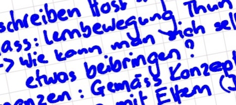

+++
title = "Das Lernen lernen"
date = "2020-09-14"
draft = true
pinned = false
image = "lernen-lernen-leben-lernen.jpg"
footnotes = "Verwendete Literatur\\\nStangl, W. (2020). Stichwort: '*Mathetik'.* Online Lexikon für Psychologie und Pädagogik.\\\nWWW: <https://lexikon.stangl.eu/859/mathetik/> (2020-08-25)"
+++

Dank der aufmerksamen und hilfreichen Einführung von Marco bin ich ab heute auch in der Blogger-Gemeinschaft zu finden.

**Mathetik ist eine notwendige Korrektur des gedankenlos verabsolutierten Prinzips der Didaktik: dass Lernen auf Belehrung geschähe.** Hartmut von Hentig