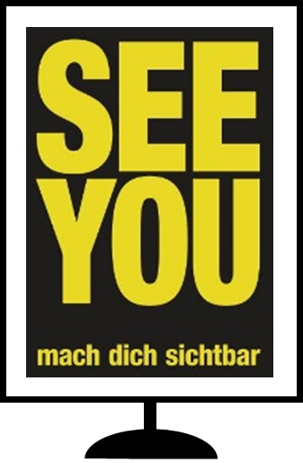
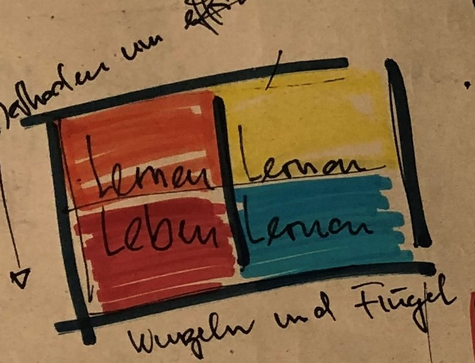
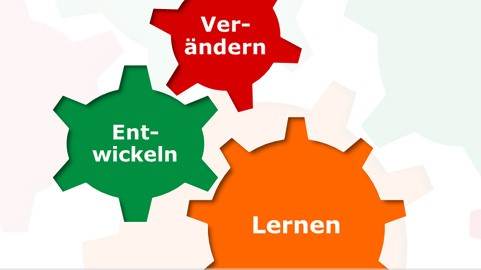
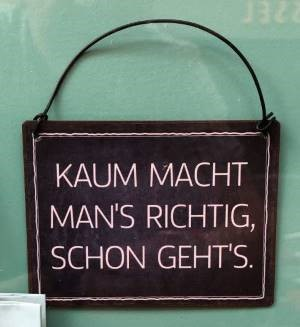

+++
title = "Mein LOGBUCH-Schatzhebungstreffen"
date = "2021-11-10"
draft = true
pinned = false
image = "logbuch.jpg"
description = "Ein Logbuch ist in der Seefahrt ein vorgeschriebenes wichtiges Dokument. Hier werden die täglichen Ereignisse während der Fahrt lückenlos und nachvollziehbar erfasst und protokolliert. Es ist jedoch in erster Linie ein privates Protokoll und nicht zur Veröffentlichung bestimmt."
footnotes = "Quellen und Inspirationen, so weit ich mich noch erinnern kann: Afrika, Kerschensteiner, Christoph Schmitt, Joachim Bauer, Michael Hüter, Kinder, Jugendliche, Effinger Grundsätze, Stangl und viele andere anregende Menschen im Coworking Effinger und Colearning Bern"
+++
Ich liebe Bücher und meine Lieblingsbücher sind Leerbücher. Sie begleiten mich an Tagungen, Sitzungen, Treffen und an meinen Effinger Dienstagen. Sie sind meine Logbücher, aber an Stelle von Wetter, Navigation und wichtigen Ereignissen an Bord schreibe ich hier meist farbig und fantasievoll meine Gedanken, meine Erfahrungen, meine Abmachungen, Termine, Gehörtes, Gelesenes, Aufgefallenes und Erlebtes auf. Aus den Leerbüchern werden meine Lernbücher. 
Jetzt ist das letzte Buch voll. Ich blättere durch und entdecke Lieblingssätze, viele kleine Schätze und Perlen. Ich habe Lust einige zu präsentieren, sie mit euch zu teilen.

**21. November 19**

* Bildung ist das was übrig bleibt, wenn man alles was man in der Schule gelernt hat, wieder vergessen hat.
* Menschen sehnen sich nach Verbundenheit, wollen etwas bewirken, wollen mitgestalten. 
* Meine Einstellung bestimmt mein Denken. Meine inneren Bilder, mein Herz bestimmen, wie wir denken.

**11. Januar 20**

* Kinder wollen sich zu eigenständigen Wesen entwickeln, voller eigener Ideen, Absichten, Meinungen, Wünsche, Werte und Vorlieben. Da-Sein ist der Sinn des Erwachsenen-Seins.

**14. Januar 20**

**3. Februar 20**

* Um ein Kind zu erziehen braucht es ein ganzes Dorf, eine Gemeinschaft.

**24. Februar 20**

* Nur Menschen, die in ihrer Individualität wahrgenommen werden, sind auch zu einer gemeinschaftlichen Verbundenheit fähig
* Ich bestimme, was mich ärgert
* Lernen ist Dialog und ich vertraue in die Wandlungsfähigkeit des Menschen

**23. Juni 20**

* Colearning ist ein CoKreAktionsraum: Gestalten, unterwegs sein, in Bewegung sein, offen sein, sich zeigen, miteinander und gemeinsam, Begegnungen, kennenlernen, Neues entdecken, Anteilnahme, Vernetzen, Entwickeln 

**5. Oktober 20**

* Was ist Lernen? Menschen befähigen die komplexe Welt zu bewältigen, lustvoll mit anderen eine eigene Zukunft gestalten. Wir müssen das Lernen befreien von Zeugnissen, Curriculums, Absichten, Zwängen und den Systemen von Belehrenden. 
* Colearning? Wir machen keine Vorgaben, wir schaffen Gelegenheiten zusammen mit anderen die Welt zu entdecken

**15. Oktober 20**

* Es bringt nichts, das Falsche immer besser zu machen. Wir müssen es an-ders machen.

**24. November 20**

* Nicht alles liegt bei mir, auch DU bist Teil der Lösung

**2. Dezember 20**

* Gespräch unter Kindern: Meine Eltern sind schon länger geschieden als deine Eltern. Ich kann nur mit meinem Namen unterschreiben ich habe noch keine Unterschrift.

**8. Dezember 20**

* Beziehungen machen klug. 
* Ich bin in das Gelingen verliebt. 
* Wir brauchen mehr Ambiguitätstoleranz, das heisst die Fähigkeit widersprüchliche Bedürfnisse auszuhalten, denn nur durch die Rollendistanz und Empathie lernt das Individuum neue und auch widersprüchliche Erwartungen der anderen, die den eigenen entgegengesetzt sind, zu ertragen.
* Was tue ich eigentlich, wenn ich tue, was ich tue?
* Lernen ist mich kennenzulernen, besser mit anderen umgehen zu können und ein vertiefteres Verständnis für diese Welt zu gewinnen.

**2. Februar 21**

* Lernen ermöglichen
* Menschen lernen ein Leben lang, nachhaltige Organisationen entwickeln sich ständig weiter.
* Konkurrenz erzeugt Druck, Angst und Misstrauen. Also ein Klima, in dem bewahrt, verhindert und egoistisch auf den eigenen Vorteil geschaut wird.
* Wissen teilen, Lösungen gemeinsam erarbeiten, übergreifend kommunizieren und Routinen kritisch hinterfragen sind Zutaten für Lernen.
* Das funktioniert nur in respekt- und vertrauensvollen Organisationskulturen. Kooperation schafft ein Treibhausklima für Lernen.

**23. Februar 21**

* Bin ich Teil der Lösung – oder bin ich Teil des Problems?

**8. März 21**

* Storytelling: Menschen lieben Geschichten. Sie helfen uns zu lernen und zu verstehen.

**9. März 21**

* Wir brauchen weniger BesserWisser - wir brauchen mehr BesserMacher

**16. März 21**

* Nichts ist klar … aber alles ist gut.

**6. April 21**

* *Fragen:* Wie kann das "Hier im Effinger-sein" als Lernen im Colearning bezeichnet werden? Was heisst für mich Lernen in der Effinger-Community? Wie kann mein "Hier im Effinger sein" als Lernen im Colearning verstanden werden?
* *Antworten:* Colearning heisst auch: hier kann ich eigene Projekte realisieren, hier bekomme ich Unterstützung, hier wird nachgefragt, konfrontiert, gespiegelt. Hier bin ich auch Teil einer Community und ich leiste auch einen Beitrag zum "Wohl" der Effinger-Gemeinschaft.

**11. Mai 21**

* Bildung einfach anders. Wir machen das einfach.

**18. Mai 21**

* Kinder sind heute oft Waisen mit Eltern 
* Erwachsene sind unterstützende Begleiter: Sie lassen Kinder Fragen stellen. Sie sind kompetent und geben ihre Erfahrungen und ihr Wissen weiter. Alle sind Lehrer und Lehrerinnen. Sie bauen Beziehungen auf und lassen die Kinder teilhaben.
* Aus den Effinger-Grundsätzen: Gemeinsam wollen wir eine neue, sinnstiftende und lebensbejahende Form der (Zusammen-) Arbeit entdecken, in der es sich wie „Heimat“ anfühlt.. 

**7. September 21**

* Wir Erwachsenen müssen nur da sein und präsent sein, wenn die Jugendlichen uns brauchen und ihnen die Möglichkeit geben zusammen mit anderen ihren eigenen Fragen nachzugehen

**14. September 21**

* Colearning ist auch: TankStelle, DrehScheibe, MutMacherei, KokreAktionslabor

**12. Oktober 21**

Mein persönliches Fazit als 1-Satz-Botschaft:

> **Ich bin in heiterer Gelassenheit selbstwirksam unterwegs, denn ...**\
> **Ich will, ich kann, ich mache**