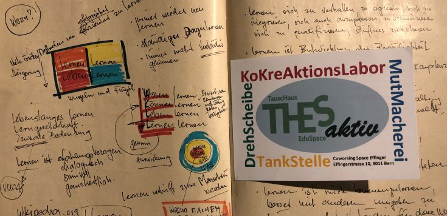

+++
title = "Mein LOGBUCH-Schatzhebungstreffen"
date = "2021-11-09"
draft = true
pinned = false
image = "logbuch.jpg"
description = "Wikipedia meint zum Logbuch: Es ist eine in der Seefahrt übliche Form der Aufzeichnung und Archivierung der mithilfe des Logs gemessenen Fahrgeschwindigkeit, der Fahrt durchs Wasser, der mithilfe des Kurses und der Koppelnavigation daraus errechneten täglich zurückgelegten Fahrstrecke sowie von täglichen Ereignissen und Vorgängen ähnlich einem Tagebuch oder Protokoll. "
footnotes = "Weitere Quellen (so weit noch in Erinnerung): Kerschensteiner, Effinger Grundsätze"
+++
Ich liebe Bücher und meine Lieblingsbücher sind Leerbücher. Sie begleiten mich an Tagungen, Sitzungen, Treffen und an meinen Effinger Dienstagen. Sie sind meine Logbücher, aber an Stelle von Wetter, Navigation und wichtigen Ereignissen an Bord schreibe ich hier meist farbig und fantasievoll meine Gedanken, meine Erfahrungen, meine Abmachungen, Termine, Gehörtes, Gelesenes, Aufgefallenes und Erlebtes auf. Aus den Leerbüchern werden meine Lernbücher. 
Jetzt ist wieder ein Buch voll. Ich blättere durch und entdecke Lieblingssätze, kleine Schätze und Perlen. Ich habe Lust einige zu präsentieren und mit euch zu teilen.

**21. November 19**

* Bildung ist das was übrig bleibt, wenn man alles was man in der Schule gelernt hat, wieder vergessen hat.
* Menschen sehnen sich nach Verbundenheit, wollen etwas bewirken, wollen mitgestalten. 
* Meine Einstellung bestimmt mein Denken. Meine inneren Bilder, mein Herz bestimmen, wie wir denken.

**11. Januar 20**

* Kinder wollen sich zu eigenständigen Wesen entwickeln, voller eigener Ideen, Absichten, Meinungen, Wünsche, Werte und Vorlieben. Da-Sein ist der Sinn des Erwachsenen-Seins.

14. Januar 20

Mach dich sichtbar

3. Februar 20

24. Februar 20

Nur Menschen, die in ihrer Individualität wahrgenommen werden, sind auch zu einer gemeinschaftlichen Verbundenheit fähig

Ich bestimme, was mich ärgert

Lernen ist Dialog und ich vertraue in die Wandlungsfähigkeit des Menschen

23. Juni 20

Colearning ist ein CoKreAktionsraum: Gestalten, unterwegs sein, in Bewe-gung sein, offen sein, sich zeigen, miteinander und gemeinsam, Begegnun-gen, kennenlernen, Neues entdecken, Anteilnahme, Vernetzen, Entwickeln
 

5. Oktober 20

Was ist Lernen? Menschen befähigen die komplexe Welt zu bewältigen, lustvoll mit anderen eine eigene Zukunft gestalten. Wir müssen das Lernen befreien von Zeugnissen, Curriculums, Absichten, Zwängen und den Syste-men von Belehrenden. Christoph Schmitt

Colearning? Wir machen keine Vorgaben, wir schaffen Gelegenheiten zu-sammen mit anderen die Welt zu entdecken

15. Oktober 20

Es bringt nichts, das Falsche immer besser zu machen. Wir müssen es an-ders machen.

24. November 20

Nicht alles liegt bei mir, auch DU bist Teil der Lösung

2. Dezember 20

Gespräch unter Kindern: Meine Eltern sind schon länger geschieden als dei-ne Eltern. Ich kann nur mit meinem Namen unterschreiben ich habe noch keine Unterschrift.

8. Dezember 20

Beziehungen machen klug. Ich bin in das Gelingen verliebt. Lernen lernen Leben lernen. nach Joachim Bauer

Ambiguitätstoleranz: Die Fähigkeit von Heranwachsenden, widersprüchliche Be-dürfnisse auszuhalten, denn nur durch die Rollendistanz und Empathie lernt das Individuum neue und auch widersprüchliche Erwartungen der anderen, die den eigenen entgegengesetzt sind, zu ertragen.
(Stangl, 2021).

Verwendete Literatur
Stangl, W. (2021). Stichwort: 'Ambiguitätstoleranz – Online Lexikon für Psychologie und Pädago-gik'. Online Lexikon für Psychologie und Pädagogik.
WWW: https://lexikon.stangl.eu/12220/ambiguitaetstoleranz (2021-09-14)

Was tue ich eigentlich, wenn ich tue, was ich tue?

Lernen ist mich kennenzulernen, besser mit anderen umgehen zu können und ein vertiefteres Verständnis für diese Welt zu gewinnen.

2. Februar 21

Ermöglichen

Lernen ermöglichen
Menschen lernen ein Leben lang, Organisationen entwickeln sich ständig weiter.
Diesen Prozessen gezielt Richtung und Impuls zu geben, ist eine der wichtigsten
Aufgaben des Managements für nachhaltigen Erfolg.
Konkurrenz erzeugt Druck, Angst und Misstrauen. Also ein Klima, in dem bewahrt,
verhindert und egoistisch auf den eigenen Vorteil geschaut wird.
Wissen teilen, Lösungen gemeinsam erarbeiten, abteilungsübergreifend kommunizieren
und Routinen kritisch hinterfragen sind Zutaten für Lernen.
Das funktioniert nur in respekt- und vertrauensvollen Organisationskulturen.
Kooperation schafft ein Treibhausklima für Lernen.

Recherche: Kooperationsexperten: Lernen ermöglichen

23. Februar 21

8. März 21

Storytelling: Menschen lieben Geschichten. Sie helfen uns zu lernen und zu verstehen.

9. März 21

Wir brauchen weniger BesserWisser wir brauchen mehr BesserMacher

16. März 21

Nichts ist klar … aber alles ist gut.

6. April 21

Frage: Wie kann das «Hier im Effinger-sein» als Lernen im Colearning be-zeichnet werden? Was heisst für mich Lernen in der Effinger-Community? Wie kann mein «Hier im Effinger sein» als Lernen im Colearning verstanden werden.
Antwort:
Colearning heisst auch: hier kann ich eigene Projekte realisieren, hier be-komme ich Unterstützung, hier wird nachgefragt, konfrontiert, gespiegelt. Hier bin ich auch Teil einer Community und ich leiste auch einen Beitrag zum «Wohl» der Effinger-Gemeinschaft. 

11. Mai 21

18. Mai 21

Kinder sind heute oft Waisen mit Eltern (Michael Hüter)
Erwachsene sind unterstützende Begleiter
Sie lassen Kinder Fragen stellen
Sie sind kompetent und geben ihre Erfahrungen und ihr Wissen weiter
Alle sind Lehrer und Lehrerinnen
Sie bauen Beziehungen auf
Sie lassen die Kinder teilhaben

Aus den Effinger-Grundsätzen:

Gemeinsam wollen wir eine neue, sinnstiftende und lebensbejahende Form der (Zusammen-) Arbeit entdecken, in der es sich wie „Heimat“ anfühlt.

7. September 21

Kernsätze von Christoph Schmitt
Wir Erwachsenen müssen nur da sein und präsent sein, wenn die Jugendli-chen uns brauchen und ihnen die Möglichkeit geben zusammen mit ande-ren ihren eigenen Fragen nachzugehen

14. September 21

Kek – kurz – einfach – klar -> 1-Satz-Botschaften

Ich bin selbstwirksam in heiterer Gelassenheit unterwegs

Ich will, ich kann, ich mache

