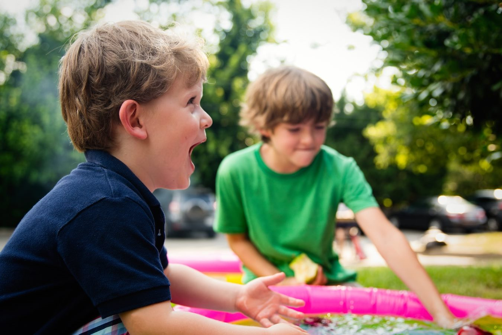

+++
title = "Peter Gray: Schule raubt den Kindern Zeit und Freiheit"
date = "2022-11-07"
draft = true
pinned = false
image = "keien-schule.jpg"
description = "Wie sind wir bloss zu dem Schluss gekommen, dass Bildung unserer Kinder am besten gelingt, wenn wir ihnen eine Umgebung aufzwingen, in der sie sich langweilen, unglücklich sin und Angst haben?"
footnotes = "Bilder: Mount Athos experience, "
+++
Ich bin wieder ins Buch von Peter Gray «befreit Lernen» eingetaucht und habe mir vorgenommen nicht mehr über die jetzigen Schulsysteme zu lästern. Aber die beiden Kapitel *Der Anstieg psychischer Störungen im Kinder- und Jugendalter* und *Die Freiheit der Kinder nimmt ab – psychische Störungen nehmen zu* haben mich noch einmal richtig in Rage gebracht. 
Gray zitiert Studien, die zeigen und meine Beobachtungen bestätigen, dass Ängste und Depressionen in den letzten Jahren dramatisch zugenommen haben. Er zeigt auf, dass diese Zunahmen in den Volks- und Sekundarschulen genauso stark sind wie bei den Studierenden. Ein ebenso ernüchternder Gradmesser für das Sinken der psychischen Gesundheit ist der Anstieg der Selbstmordrate. Sie ist heute vier bis fünf Mal höher als vor 50 Jahren.
Die Gründe sind vielfältig und hängen sicher auch mit den Unsicherheiten unserer Zeit (Pandemie, Klimaerwärmung, Kriege) zusammen. 

> Gray schreibt: 
> **Viel mehr als damit, wie die Welt wirklich ist, scheinen die Veränderungen mit der Art und Weise zu tun zu haben, wie junge Menschen die Welt betrachten.**

Er schreibt, dass Menschen, die ihr Leben aktiv gestalten können, ihr Schicksal selbst in die Hand nehmen, selber bestimmen, die beeinflussen können, die sich nicht ausgeliefert fühlen, die sich selber kontrollieren sich besser fühlen, psychisch gesünder sind.

**Kontrollverlust.** 

Wenn Menschen glauben, keine oder nur wenig Kontrolle über das eigene Schicksal zu haben, werden sie ängstlich. Menschen mit einer hohen Selbstwirksamkeitsüberzeugung übernehmen Verantwortung für ihre Gesundheit, für ihre Zukunft und für Gemeinschaften. 
Gray findet überzeugende Gründe, dass Ängste, Depressionen, Gefühle von Ausgeliefertsein und die Zunahme  verschiedener anderer Störungen auch mit Rückgang des freien Spielens zu tun hat. Er ruft auf, dass Menschen, die das erkannt haben, aufstehen und den Kindern wieder mehr Freiheit geben.

> **Kinder brauchen nicht noch mehr Schulbildung, Sie brauchen Umfelder, die sicher genug sind, darin zu spielen, und zu erkunden, sie brauchen Zugang zu Werkzeugen, Ideen und Menschen, einschliesslich der Spielkameraden, die ihnen auf ihren selbstgewählten Pfaden weiterhelfen können.**

Meine eigene Lebensgeschichte, meine Erfahrungen als Vater und Oberstufenlehrer stützen diese These vom "freien Spielen": 
•	Kinder wollen selber tun, eigene Projekt verwirklichen
•	Kinder wollen eigene Entscheidungen treffen
•	Kinder stellen eigene Regeln auf und halten sich daran
•	Kinder wollen ohne Erwachsene lernen
•	Kinder wollen anderen auf Augenhöhe begegnen
•	Kinder wollen keine Untergebenen sein
•	Kinder wollen etwas wagen, wollen mutig sein, ihre Körper kontrollieren, sich ihren Ängsten stellen
•	Kinder wollen herausfinden, was zu ihnen passt
•	Kinder entdecken beim freien Spielen ihre Talente, Stärken und Vorlieben 
•	Kinder sind interessiert
•	Kinder fordern sich heraus
•	Kinder üben
•	Kinder sind neugierig
•	Kinder wollen wissen
•	Kinder sind begeisterungsfähig
•	Kinder wollen eigene Wege gehen
•	… 

Schaffen wir endlich Bedingungen und Umgebungen, die es unseren Kindern ermöglicht ihr Lernen selber zu bestimmen. 
Kinder können viel mehr, als wir ihnen zutrauen. 
Geben wir ihnen das Lernen zurück.

Fortsetzung folgt.