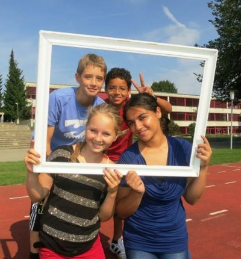
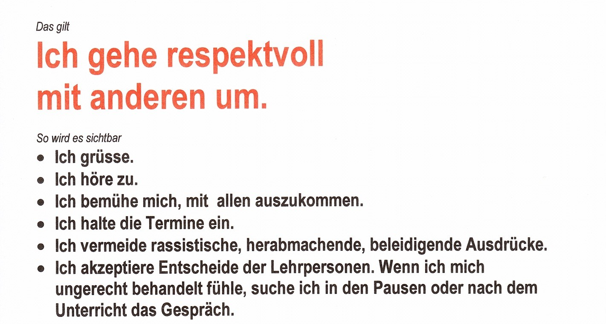
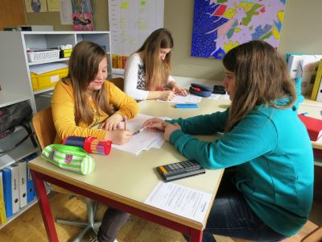

+++
title = "Raum für Vielfalt"
date = "2022-11-12"
draft = true
pinned = false
image = "beziehungen-machen-klug.jpg"
description = "Wir sind alle verschieden: Verschiedene Sprachen, Religionen, Charaktere, Alter, Grösse, Gewicht, Hautfarbe ... Wir sind unterschiedlich weit in der Mathematik, im Französisch, im Deutsch, beim Sprechen und Schreiben ... Das macht das Ganze spannend."
footnotes = "\"Gute Beziehungen machen klug\" stammt von Joachim Bauer"
+++
*Ich bin ein bisschen unter Druck. Ich will heute noch einen Blog-Eintrag schreiben. 
Was könnte sich eignen? 
Es sollte wieder einmal eine positive Botschaft sein. 
Da habe ich in meinem Archiv eine Perle gefunden, die ich euch gern zeigen möchte. Unter dem Motto **"Gute Beziehungen machen klug"** stellte sich meine ehemalige Klasse, die 7.–9. Real c aus Aarwangen regelmässig an Weiterbildungsveranstaltungen, an der PH an Workshops oder an Schilftagen vor. Die Schüler und die Schülerinnen haben mit ihren Bildern und eigenen Texten ihren Schulalltag präsentiert und gezeigt, wie sie ihr Lernen zusammen mit mir organisiert hatten. Ein paar Bilder und ein paar Textausschnitte möchte ich hier unbedingt zeigen:*

**Wir sind alle verschieden**
Verschiedene Sprachen, Religionen, Charaktere, Alter, Grössen, Gewicht, Hautfarben... Wir sind unterschiedlich weit in der Mathematik, im Französisch, im Deutsch, beim Sprechen und Schreiben ... Das macht das Ganze spannend.

**Wir lernen in einer altersgemischten Klasse**
Herr Flükiger sagt immer, dass wir, um überzeugend zu wirken, 10 Punkte zusammentragen sollen. Das sind unsere 10 Argumente für das altersgemischte Lernen:

1. Die Älteren können die Jüngeren in das Schulsystem einführen.
2. Sie können und dürfen ihnen helfen.
3. Selbstständiges Arbeiten ist eine Selbstverständlichkeit. Die Teamarbeit wird gefördert. 
4. Es machen nicht alle dasselbe.
5. Wir lernen Verantwortung zu übernehmen.
6. Man wird grösser und cooler. 
7. In der Mathematik repetieren wird ständig die früher bearbeiteten Kapitel.
8. Die Älteren können das Coaching übernehmen. 
9. Wir machen einen Rollenwechsel in den 3 Jahren: Vom Lehrling zum Chef – Eine gute Vorbereitung für das Berufsleben. 
10. Und die 7. Klässler sehen schon früh, was man tun muss, um eine Lehrstelle zu bekommen.

**Die Lernumgebung hilft uns beim Lernen**
Die Einrichtung des Klassenzimmers ist uns wichtig. Eine gute Lernumgebung hilft uns beim Lernen. Wir haben Tische statt Pulte, sie brauchen weniger Platz und können besser verschoben werden. Die Gestelle, die wir im Werken selber gebaut haben, unterteilen den Raum in Lernecken und Nischen. Jedes hat seinen Arbeitsplatz mit seinem Material. Wichtig ist auch eine gute Ordnung. Wir finden unsere Sachen rascher. Sorgfalt und Ordnung, Achtsamkeit mit Materialien sind auch wichtige Schlüsselkompetenzen im späteren Berufsleben. Der Kreis ist unser Treffpunkt. Hier erhalten wir wichtige Informationen. Hier stellen wir unsere Arbeiten vor, diskutieren und planen miteinander.

**Der Anfang**
Eine der grössten Herausforderungen ist das Anfangen. Das gelingt uns besser, wenn wir uns Ziele setzen, wenn wir motiviert sind, einen guten Arbeitsplatz haben, selber bestimmen dürfen und wenn wir Erfolg haben. Zu Beginn des Schuljahres bestimmen wir in einem längeren Verfahren unsere Klassenabmachungen. Wir beschränken uns auf 3 wichtige Regeln, die unsere Zusammenarbeit leiten. Hier ein Beispiel:

**Die Lerngruppen**
Die Tischgruppen sind auch Lerngruppen: Am Anfang des Schuljahres sitzen die neuen 7. Klässler neben 8./9. Klässlern. Mit dem Götti-Gotte-System werden die Neuen mit unserer Schule vertraut. Das entlastet auch die Lehrpersonen. Bis die Tischgruppen zusammenpassen braucht es manchmal Wochen. Beziehungen müssen geklärt werden. Wer kann mich wirklich unterstützen? Wer lenkt mich ab?
Im Zentrum der Lerngruppen steht das Lernen und wir üben, dass Privatgespräche in die Pausen gehören. Wir setzen viel Zeit für das Planen ein. Von Dienstag bis Donnerstag haben wir SOL (Selbstsorganisiertes Lernen). Im Wochenblatt stehen die Aufträge. Herr Flükiger gibt uns am Dienstag einen Überblick zu den Aufgaben. Wir wissen, was wir wie erledigen müssen. Die Termine sind bekannt. Wir wissen auch, wann Förderangebote stattfinden, wann wir uns im Kreis treffen und austauschen. Wir lernen die Zeit gut einzuteilen, damit wir möglichst viel in der Schule lösen und wenig zuhause machen müssen.

**Selbst und ständig - selbstständig**
Wir lösen die meisten Aufträge selber. Wir sind für das, was wir machen, selber verantwortlich. Es ist interessanter, etwas selber herauszufinden. Das selber Tun macht mehr Spass. Es kommt auf mich drauf an, ich bin gefragt. Man lernt es so auch besser. Das „Selbstständige Arbeiten“ ist auch eine wichtige Schlüsselkompetenz bei der Berufswahl, beim Suchen und Finden einer Lehrstelle. Wir dürfen zusammenarbeiten. Wir haben Lernpartnerschaften, die sich gegenseitig unterstützen. Am liebsten lernen wir mit einem Partner oder einer Partnerin zusammen. Gemeinsam lernen ist cool, den Erfolg teilen, mitdenken, mitfühlen.
Wenn wir gar nicht mehr weiter wissen, oder Hilfe brauchen, dann schreiben wir unser Anliegen auf einen Zettel und heften es an die Hilfeliste. Das machen wir erst, wenn der Lernpartner oder die Lernpartnerin nicht weiter wissen, wenn es mit eigenen Mittel nicht zu schaffen war. Wir lösen, korrigieren und verbessern unsere Mathematikaufgaben meist selber. Abschreiben bringt nicht so viel – später weiss ich es dann nicht. Es ist ein gutes Gefühl, wenn ich etwas selber entdeckt habe, wenn ich Erfolg habe. Wenn ich Erfolg habe, dann bin ich motiviert zum Weiterlernen. Wenn ich Erfolg habe, finde ich Beachtung, bekomme Komplimente und das tut gut. Lernen ist sinnvoll, ich bin stolz. Dass wir hier auftreten dürfen macht mich selbstbewusster und hilft mir auf meinem späteren Lebensweg.

**Wir üben das Miteinander**
Zum Beispiel bei Gruppenarbeiten. Wir lernen meistens in 3 Phasen: Zuerst löst jedes die Aufgabe für sich alleine. Nachher tauschen wir unsere Erkenntnisse aus und versuchen gemeinsam die Aufgabe zu lösen, einen Text zu verstehen, eine Zusammenfassung zu schreiben. Der dritte Schritt ist das Präsentieren der Ergebnisse im Kreis vor der ganzen Klasse. Bei den Gruppenarbeiten teilen wir unsere Aufgaben auf: Jemand leitet die Diskussion, ein anderes schreibt auf und ein Drittes ist Zeitwächter. Das klappt nicht beim ersten Mal: Wir üben es immer wieder und es kommt auch mit jeder Arbeit besser. So werden die Gruppenarbeiten zu Routinen und gelingen besser.

**Wir haben verschiedene Arbeitsgruppen**
Hier dürfen wir selber organisieren, eigene Ideen einbringen und Verantwortung übernehmen. Viele Projekte planen und bestimmen wir im Klassenrat. Hier ist Teamarbeit gefragt und jedes arbeitet nach seinen Möglichkeiten. Hier können wir Aussergewöhnliches unternehmen und kreativ sein. Für diese Projekte dürfen wir NMM-Stunden einsetzen, aber vieles erarbeiten wir in unserer Freizeit. Es ist klar, dass dieser Einsatz auch in der Beurteilung Ende Semester eine wichtige Rolle spielt. Herr Flükiger hat uns aufgezeigt, dass diese Projekte sehr viel mit Lernen lernen und Leben lernen zu tun haben. Im Moment haben wir folgende Arbeits- oder Projektgruppen:

* Wir sind die Gruppe „Schule vorstellen“. Wir betreuen Unterrichtsbesuche, nehmen an Tagungen teil und sind auch 2mal im Jahr an der PH und stellen dort den Studenten und Studentinnen unseren Unterricht vor. Wir fotografieren, schreiben Texte und stellen Präsentationen zusammen.
* Es gibt eine Gruppe, die führt in der grossen Pause einen Pausenkiosk.
* Ein Team organisiert eine 3tägige Schulreise. 
* Die ICT-Gruppe betreut unsere Computer und hilft bei Problemen mit dem PC oder dem Beamer.
* Die 9. Klasse organisiert ein Weihnachtsessen, das jedes Jahr zusammen mit den ehemaligen 9. Klässler und 9. Klässlerinnen stattfindet.
* Eine Gruppe hilft beim Organisieren des Suppentages Ende November. Ein Projekt, mit dem wir einen Mahlzeitendienst in Haiti unterstützen.
* Eine Gruppe hat nach der Erdbebenkatastrophe in Haiti spontan eine Standaktion organisiert und 1600 Franken gesammelt. 
* Eine andere Gruppe organisiert zusammen mit dem Elternrat und dem Kulturkreis der Kirchgemeinde, im Mai einen Begegnungstag mit den verschiedensten Kulturen, die in Aarwangen leben. Wir bieten 25 verschiedene Speisen aus den unterschiedlichsten Ländern an.
* Die Knaben haben die Werkstatt Real c gegründet. Lehrerinnen und Lehrer können dann Sachen bei uns zum Flicken bringen oder kleinere Möbel für die Schulzimmergestaltung in Auftrag geben. Wir dürfen dafür die Werkstunden einsetzen.

**Der Klassenrat**
In der wöchentlichen Sitzung besprechen wir regelmässig Probleme und Anliegen im Zusammenhang mit der Schule, erhalten Informationen, tauschen positive und negative Erlebnisse aus, geben Rückmeldungen und planen gemeinsam. Am Donnerstag von 8 bis 9 Uhr haben wir Zeit zum Äussern von Anliegen, zum Formulieren von Unbehagen, zum Dampfablassen, zum Klären und Diskutieren. Hier können wir über alles reden. Die Leitung hat die 9. Klasse. Die 7. oder 8. Klasse schreibt das Protokoll. Wichtig ist: Die Beschlüsse sind verbindlich, sie gelten.

**Unser Logbuch**
Am Anfang eines Schuljahres gestalten wir unser Schulreisebuch. Es ist eine Art Lerntagebuch und darin sind die Wochenblätter, die Lernverträge, wichtige Zusammenfassungen von Lerninhalten, Hausaufgabenpläne und vieles mehr. Wir beschreiben im Buch unsere Arbeit und denken über unser Lernen nach. Wir gewinnen neue Einsichten. Wir machen uns Gedanken über den Sinn des Lernens, wir suchen nach Verbesse-rungen und finden Lösungswege. Wir entdecken, dass wir unser Lernen beeinflussen können. Ein wichtiger Punkt beim Nachdenken über das Lernen ist auch der Umgang mit Niederlagen, mit Enttäuschungen. Das Leben ist nicht nur schön, Lernen macht nicht immer Spass. Erfolg ist auch ein Teil von Anstrengung. Üben braucht viel Geduld und viel Ausdauer.

**Die Rolle des Herrn Flükiger**
Es ist Zeit etwas über die Rolle des Lehrers zu sagen. Er informiert uns über die Wochenaufträge Er schafft Klar-heit, sorgt auch dafür, dass die Abmachungen eingehalten werden. Er gibt die Termine vor. Er stellt die Lernpässe zusammen. Er bietet Förderangebote an. Er stellt die Lernziele auf und beGUTachtet die Lernkontrollen und Arbeiten. Er setzt diese auch durch. Er schliesst mit uns Lernverträge ab. Am besten lernen wir, wenn wir selber Verantwortung für unser Lernen übernehmen: Wir machen das mit einem einfachen Lernvertrag. Der Vertrag wird regelmässig im Schulreisebuch überprüft und mit der Lehrperson besprochen. Der Lehrer ist Coach und führt viele Gespräche. Er gibt uns regelmässig Rückmeldungen zu den Einträgen im Schulreisebuch. Streit lösen wir im Gespräch. Im Gespräch suchen wir gemeinsam nach Lösungen. Wir lernen zu argumentieren, zu begründen.
Regelmässig finden auch Gespräche zwischen Lehrperson – Eltern – Jugendlichen statt. In den Gesprächen müssen wir Auskunft geben. In den Gesprächen wird uns auch ein Spiegel vorgehalten. Die Gespräche führen zum Nachdenken.  Mit dem Lehrer kann ich auch persönliche Gespräche führen, ich kann ihm vertrauen. In den Gesprächen erfahre ich auch, wo ich stehe.

**Barometergespräche** 
Eine spezielle Form des Gesprächs ist das wöchentliche Barometergespräch. Einmal in der Woche trifft sich Herr Flükiger mit einer Schüler- oder Schülerinnengruppe, in der Regel sind es 2, zu einen 20minütigen Barometer-Gespräch. Die Fragen sind immer die gleichen: Wie ist eure Befindlichkeit in der Klasse? Wie findet ihr das Klassenklima? Wenn ihr auf die Woche zurückschaut … was fällt euch auf? Habt ihr persönliche Anliegen? Wünsche an den Lehrer? Die wichtigsten Erkenntnisse werden, wenn nötig, im Klassenrat mitgeteilt.
Das Klassenklima Und über eines reden wir sehr viel. Über das Klassenklima. Wenn das gut ist, dann können wir besser lernen. Wer sich in einer Klasse nicht wohlfühlt, kann nicht gut lernen. Es ist uns wichtig, dass Jugendliche mit einer anderen Muttersprache, und das ist oft mehr als die Hälfte der Klasse, gut mit uns auskommt. In unserer Klasse dürfen Gefühle gezeigt werden. Wir sind nicht immer glücklich, manchmal sind wir sauer und wütend oder traurig. Auch das ist Teil der Schule, des Lebens. Es hilft, wenn wir darüber reden dürfen. Wir dürfen nach Niederlagen und Frust immer wieder neu beginnen. Wir dürfen uns in den Pausen mit Kollegen und Kolleginnen treffen, dürfen uns auch mal austoben, bewegen. Wir dürfen einander helfen und unterstützen. Niemand ist allein. Wir dürfen voneinander lernen. Wir dürfen lachen, Freude und Spass haben. Und Humor ist ein wichtiger Teil eines guten Klimas in der Klasse. Das wirkt entlastend, hemmt die Angst und motiviert. 

**"Am besten lernen wir, wenn wir selbständig sind."**
Und Dominik Pokrivac (ein Schüler) schreibt: "Fragen Sie doch ab und zu mal Ihre Schülerinnen und Schüler, wenn Sie nicht mehr weiter wissen, wie sie sich fühlen, wie sie Ihren Unterricht finden, dann haben Sie, liebe Lehrerinnen und Lehrer, mehr Freude am Lehren und sie, die Schülerinnen und Schüler, bestimmt mehr Freude am Lernen."