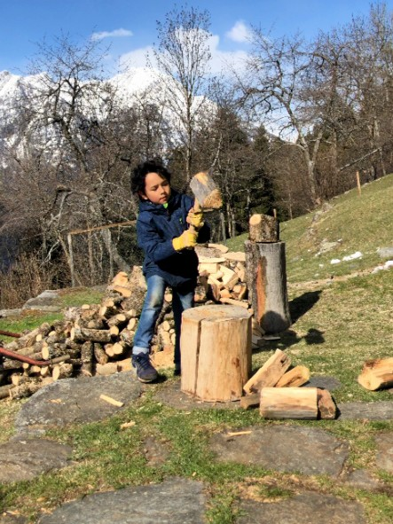

+++
title = "Selber"
date = "2022-11-04"
draft = false
pinned = false
image = "selber.jpg"
description = "Selber - allein, aus eigener Kraft, eigenhändig, eigenständig, im Alleingang, ohne fremde Hilfe, ohne Unter-stützung, selbstständig, von sich aus, in eigener Regie\n"
footnotes = "Synonyme und Foto mit der Knetmasse stammen aus dem Netz."
+++
Heute war ein voller Tag und ich kam nicht mehr zu meiner täglichen Lektüre "befreit Lernen". Ich habe etwas anderes gefunden. Ein Schlüsselerlebnis zum Thema Lernen. Es passt ausgezeichnet zu meinen bisherigen Erkenntnissen mit dem Buch von Peter Gray.

Ich hatte ein eindrücklichen Erlebnis mit meinem Enkelkind. Die Geschichte ist schon vor ein paar Jahren passiert und hat meine Haltung zum Lernen nachhaltig geprägt. Keanu war damals 3-jährig. Wir werkten und bastelten zusammen mit Holz und ich wollte ihm zeigen, wie er die Säge in die Hand nehmen solle, damit er besser ein Stück Holz abtrennen könnte. Er hörte mir aber nicht zu, nahm mir die Säge aus der Hand, setzte sie auf die Holzlatte und sagte kurz: "**Selber!**"