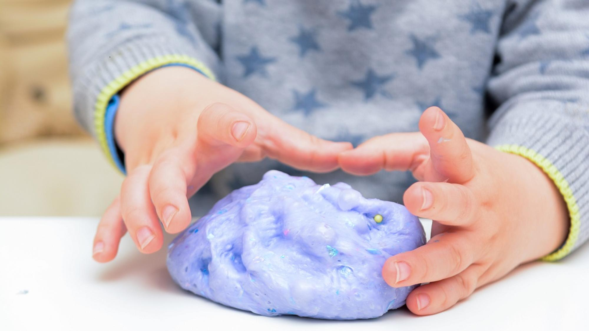

+++
title = "Selber"
date = "2022-11-04"
draft = true
pinned = false
image = "bild4.png"
description = "Selber - allein, aus eigener Kraft, eigenhändig, eigenständig, im Alleingang, ohne fremde Hilfe, ohne Unter-stützung, selbstständig, von sich aus, in eigener Regie\n"
+++
Heute war ein voller Tag und ich kam nicht mehr zu meiner täglichen Lektüre von Peters Gray "befreit Lernen" 
Ich habe etwas anderes gefunden. Ein Schlüsselerlebnis zum Thema Lernen und ich denke es passt ausgezeichnet zu meinen bisherigen Erfahrungen mit Peter Gray.

Ich erzähle von einem meinem Enkelkind. Die Geschichte ist schon vor ein paar Jahren passiert ist und hat meine Haltung zum Lernen nachhaltiger als alles Bisherige geprägt. Keanu war damals 3-jährig. Wir werkten und bastelten zusammen mit Holz und ich wollte ihm zeigen, wie er die Säge in die Hand nehmen solle, damit er besser ein Stück Holz abtrennen könnte. Erhört mir aber nicht sondern nahm mir die Säge aus der Hand, setzte sie auf die Holzlatte und sagte ganz einfach: «Selber!»