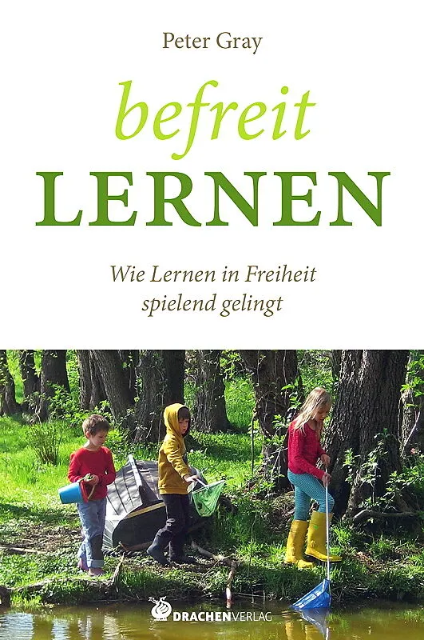
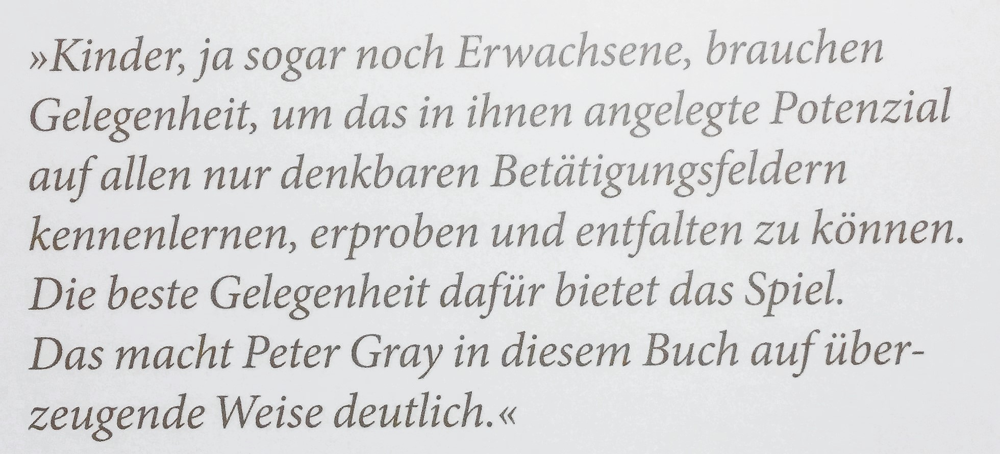

+++
title = "befreit Lernen – das Lernen befreien "
date = "2022-11-02"
draft = true
pinned = false
image = "bild4.png"
description = "Ich stelle mich der Colearning-Herausforderung, im Monat November jeden Tag einen kurzen Blogeintrag zu verfassen, frei nach meinem schon früher bearbeiteten Motto: kek -> kurz, einfach, klar.\nIch will mich befreie von den Zwängen perfekt, viel und tiefgründig zu schreiben befreien.\n"
+++
Seit dem letzten April habe ich keine Blogeinträge mehr verfasst. Die Gründe sind vielfältig. Auf der einen Seite denke ich seit meinem Pensioniert-Sein häufig, dass ich das ja auch morgen machen könnte, ich hätte dann auch noch Zeit. Und irgendeinmal lässt man es sein. Einen anderen Effekt habe ich auch erlebt: Je weniger Blogeinträge, desto wichtiger muss er dann sein. Ich setzte mich selber unter Druck, wollte Perfektes schreiben, Eindrucksvolles gestalten, Zeichen setzen, grosse Spuren hinterlassen. Schreibstau! Das war gestern! Und heute? Und das Thema? Und wie anfangen? Ich schreibe eine Fortsetzungsreihe, lose Gedanken, die unter einem übergeordneten Thema stehen. Ich wurde rasch fündig und lese im November das Buch von Peter Gray:

Ich will das Gelesene mit meinem Wirken im Colearning Bern und mit meiner neuen Tätigkeit als Pilzfarmer verknüpfen. Vielleicht finden sich Parallelen, ich hoffe auf Bestätigung, entdecke Inspi-rierendes und kann das Gelesene auch als Reflexionshilfe für meine jetzigen Tätigkeiten im Colearning Bern nutzen. Peter Gray schreibt «befreit Lernen», Fredi Zumbrunn spricht vom «Wir wollen das Lernen befreien». Und Gerald Hüter schreibt auf der Buchrückseite:

Zufall? Ich bin gespannt, wo mich meine Entdeckungsreise hinführt. Was mir in den nächsten 30 Tagen passiert. Los! 
Ich schlage die ersten Seiten auf. Prolog. Und schon ist er da, der Satz:

> **Wenn wir nur wollten, könnten wir Kinder aus der Zwangsbeschulung befreien und ihnen Lernorte zur Verfügung stellen, an denen sie ihre Fähigkeiten zur Selbstbildung voll ausschöpfen können, ohne sie ihres Rechts auf eine glückliche Kindheit zu berauben.**

Um das geht es in diesem Buch. Und genau das wollen wir im Colearning Bern.
Morgen mehr davon.