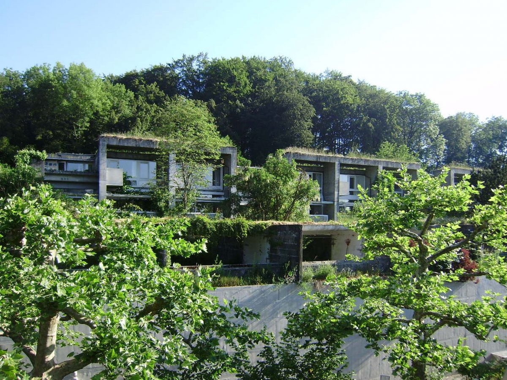

+++
title = "Kinder brauchen Freiheit um sich zu entwickeln"
date = "2022-11-02"
draft = false
pinned = false
image = "spielende-kinder.jpg"
description = "Peter Gray: Wenn Kindern die Freiheit und die Mittel gegeben werden, ihre eigenen Interessen in einer sicheren Umgebung zu verfolgen, dann blühen sie auf, entwickeln sich entlang vielfältiger und unvorhersehbarer Pfade und erwerben sich die nötigen Fähigkeiten und das nötige Selbstvertrauen, um die Heraus-forderungen des Lebens zu meistern."
+++
Ich bin in die Lektüre "befreit Lernen" eingetaucht: 
Kapitel 1: ***Was haben wir der Kindheit angetan?*** 

Das Buch beginnt mit einer Rückblende auf eigene Kindheiten und einer massiven Kritik an unserer heutigen Einstellung zur Bildung bei Kindern. 
Heute war ich auch im Altersheim und besuchte meine 95-jährige Mutter. Sie weiss oft nicht, was sie zum Mittag gegessen hat, aber sie erinnert sich im Gespräch seht gut an ihre und unsere Kindheit. Ich liebe diesen Austausch. Er tut mir und meiner Mutter gut. Meine Eltern waren streng und forderten viel Gehorsam. Das war die eine Seite. Die andere war, dass wir auch sehr viele Freiheiten genossen. Die meiste freie Zeit verbrachten wir draussen auf der Strasse, im Garten, auf den Baumstämmen hinter dem Haus und in unserem Lieblingsort dem nahen Wald. Hier trafen wir uns zum Spiel, zum Baumhausbau, zum Verstecken und Herumtoben weit weg von den Erwachsenen. Hier bestimmten wir die Regeln, auch wenn sie manchmal sehr grob waren. Hier schlossen wir Freundschaften, überwanden unsere Ängste, wurden mutig und lernten uns durchzusetzen. Wir forderten uns gegenseitig heraus und stärkten sicher so auch unser Selbstvertrauen. Die Eltern vertrauten uns, wussten eigentlich nur, dass wir mit anderen Kindern unterwegs waren und dass wir pünktlich wieder nach Hause zurückkehrten. Ohne Tadel ging das nicht immer. Zerrissene Hosen, kaputte Schuhe, Beulen und Schürfungen trugen wenig Lob ein. Diese unbeschwerte Spielzeit hat mich sicher stark geprägt. Noch heute ist der Wald einer meiner Lieblingsorte, noch heute bin ich gerne mit anderen zusammen, spiele mit anderen, lasse mich herausfordern, weiss, dass nicht alles auf Anhieb gelingt, will selber tun und machen, bin handwerklich geschickt, bin neugierig, will mehr erfahren und wage Schritte ins Unbekannte.

Und noch ein Bezug zu heute: Mein Enkelkind Keanu, das ich mindestens einmal in der Woche "hüten" darf, wohnt in der Siedlung Halen. Es war äusserlich eine "Betonwüste", die jetzt mehr und mehr von der Natur zurückerobert wird. Im Inneren ist es ein grosses Dorf mit einem Dorfplatz, liebevoll "Dorfi" genannt, mit einer Spielwiese, einem Schwimmbad, einem Dorfladen. Die ganze Siedlung ist verkehrsfrei und steht mitten im Wald. Man kennt sich, man trifft sich, macht vieles gemeinsam. Fast seine ganze freie Zeit verbringt Keanu mit seinen Freunden draussen beim Spielen, beim Aushecken von Plänen, beim Bauen von Verstecken, beim Herumrennen. Die Siedlung ist für die Kinder ein grosses Abenteuer und Lernfeld. 
Peter Gray: ***Wir waren so unabhängig; wir hatten so viele Freiheiten. Heute hingegen scheint allein schon die Vorstellung, einem Kind diese Freiheit zu geben, unmöglich. Es ist nicht nur ein grosser, es ist ein tragischer und grausamer Verlust. Kinder sind von Natur aus dafür gemacht, selbständig und unabhängig von Erwachsenen zu spielen und zu erkunden. Sie brauchen Freiheit, um sich zu entwickeln – ohne Freiheit leiden sie.***

Morgen schreibe ich mit Peter Grays Unterstützung welche gravierenden Folgen der Niedergang des freien Spielens und der "karrierefokussierte" Blick auf Kindheit haben.