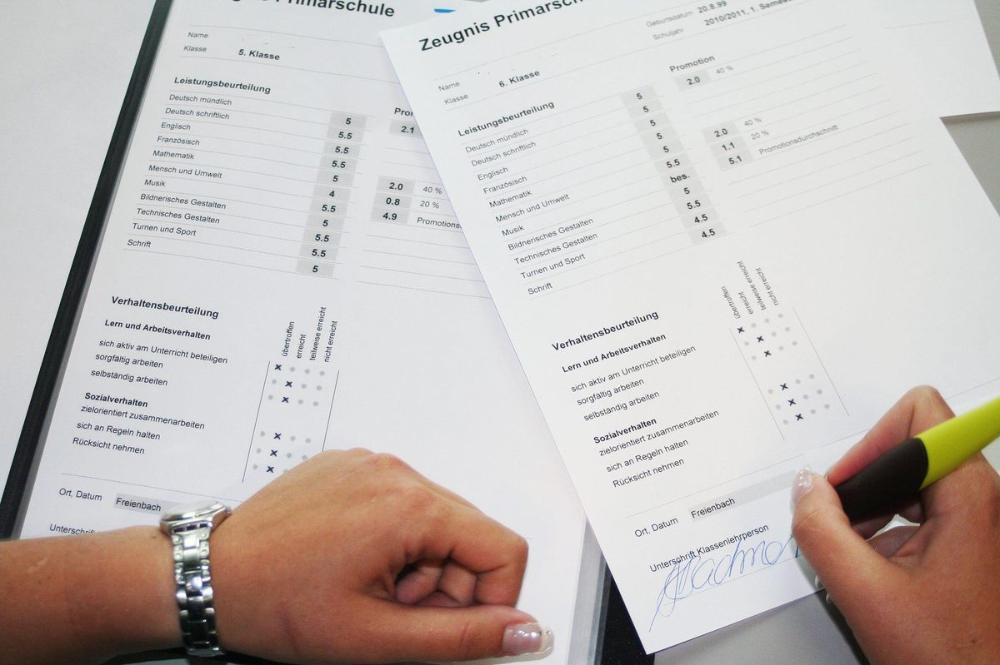

+++
title = "Und sie bewegt sich doch"
date = "2022-11-11"
draft = true
pinned = false
image = "zerknulltes_zeugnis.jpg"
description = "Bald wieder Schulen ohne Noten in Bern? Im Rahmen eines Versuchs sollen Kinder an Berner Schulen notenfrei beurteilt werden dürfen. Der Stadtrat hat einer entsprechenden Motion zugestimmt."
+++
Galileo Galilei musste im Jahre 1633 seiner Lehre von der Erdbewegung abschwören. Man erzählt sich, dass er nach dem Widerruf gesagt haben soll: "Und sie bewegt sich doch!"
Dieser Satz ging mir durch den Kopf als ich vorgestern die folgende Pressemitteilung lesen konnte:

Endlich passiert etwas. Es kommt etwas Bewegung in unser selektives Schulsystem. 

An die Adresse der 12 Gegenstimmen, das heisst an die SVP: **Vergesst** endlich, dass Noten Orientierung schaffen, dass Noten geben einfach nachvollziehbar ist, dass Noten ein klare Rückmeldung zu den Leistungen der Schüler:innen ist. **Vergesst**, dass Noten Anreize schaffen, motovieren. Das gilt vielleicht für eine kleine Elite. **Vergesst**, dass Noten helfen mit Misserfolgen umzugehen. Schüler:innen denken nach 3 bis 4 solchen Misserfolgsjahren, dass sie wahrscheinlich der Misserfolg sind. Und das "aus Fehlern lernen" wird zur Herkulesaufgabe, wenn der Berg der Misserfolge jeden Tag höher wird. **Gebt endlich zu**, dass aus eurer Sichtweise die Hauptaufgabe der Schule und der Bildung das Zuliefern von angepassten Jugendlichen für die Wirtschaft ist. **Vergesst**,dass Noten Vergleiche ermöglichen. Wir vergleichen meistens Birnen mit Äpfeln und mit Melonen und mit Zitronen und mit Zahnbürsten ..

**Denn wir wissen heute mit grosser Sicherheit:**

Noten erzeugen Druck bei Schüler:innen, bei Lehrer:innen und den Eltern. Man macht sich gegenseitig verantwortlich für "schlechte" Leistungen. 

Die Notengebung hängt stark von der einzelnen Lehrperson ab, vom subjektiven Empfinden der jeweiligen Lehrperson, von Sympathie, von der Art sich zu kleiden, vom Geschlecht, vom Beruf der Eltern, von der sozialen Situation der Familie und von Anpassungsfähigkeit.

Schlechte Noten demotivieren, geben das Gefühl versagt zu haben, weniger wertvoll zu sein sind kränkend und beschämend.

Noten lähmen kritisches Denken, führen zu einer Fehlervermeidungsstrategie und zu ausgeklügelten Betrugssystemen.

Noten täuschen eine Genauigkeit vor und sagen wenig über das tatsächliche Leistungsvermögen der Schüler:innen aus. Eine Note sagt kaum, warum ein Schüler, eine Schülerin Ziele erreicht oder nicht erreicht hat.
Viele Fragen werden nicht beantwortet: Warum ist die Note schlecht? War es mangelnde Lernbereitschaft, Desinteresse, lag es an einer komplizierten Beziehung zum Lehrer, hat der Schüler den Stoff einfach nicht verstanden, obwohl er es versuchte?

Es gibt viele Schulen, Unterrichtsmodelle und ganze Bildungssysteme (Bsp. Finnland), die ohne Noten funktionieren. Diese motivieren ihre Schüler:innen positiv.

Prüfungen und Noten geben sind kaum geeignet Aussagen zu wirklichen Leistungen und Potenzialen der Schüler:innen zu geben: Sie testen vor allem eines: Wie gut können Schüler:innen unter Zeit- und Leistungsdruck handeln, wie gut sind sie den Erwartungshaltungen der Erwachsenen gewachsen? Wie gut können sie auswendig lernen.

Noten sind von gestern, fördern vor allem das fächerbezogene Denken und vergessen, dass wir in einer komplexen Welt mit vielen Fragen leben und gemeinsam Antworten zum Bewältigen dieser Aufgaben suchen sollten. 

> **Wer weiss und nicht handelt, hat nicht begriffen.**

Kinder und Jugendliche werden mit Noten kaum gefördert. Im Gegenteil. Wissbegierde, Entwicklung und Neugierde werden gebremst und verhindert.

Weil man es immer so gemacht hat, ist einfach kein Argument mehr gegen die Abschaffung der Noten. Die Mehrheit des Stadtparlamentes von Bern will einen anderen Weg ermöglichen. 

**Ein wenig Freude herrscht.**

Den umgekehrten Weg geht der Kanton Zürich: Hier will das bürgerlich-dominierte Parlament die Schulnotenpflicht im Gesetz verankern: Genug Gutmenschentum, Sozialexperimenten und linken Wissenschaftskram!

Die Notengebung wird zum politischen Spielball. Zürcher:innen dürfen weiter unter den Ungerechtigkeiten von Noten schimpfen. Berner:innen dürfen auf einen kleinen Schritt Richtung kindergerechtere Bildung hoffen.