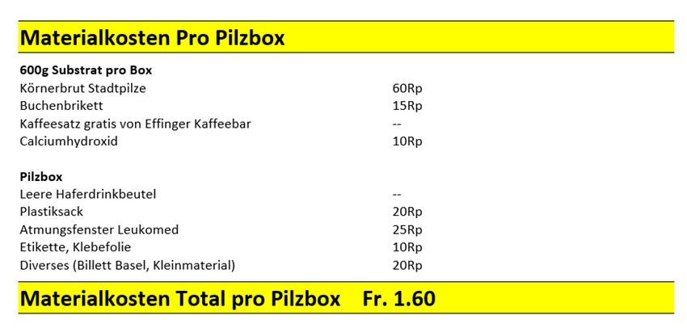
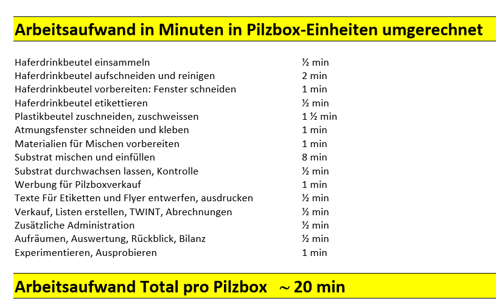

+++
title = "Vom Wert der Arbeit"
date = "2023-02-13"
draft = true
pinned = false
image = "bild-pilzbox.jpg"
description = "Was kostet eigentlich eine Pilzbox? Wie viel verdienen wir wirklich beim Verkauf einer Pilzbox zum Preis von Fr. 12.50? Lohnt sich das Ganze? In diesem Blog versuche ich eine Annäherung an die Kostenwahrheit."
+++
Nach der erfolgreichen Weihnachtsaktion, wir haben 100 Pilzboxen verkauft, war die Freude gross. Im Januar haben wir nun eine Standortbestimmung gemacht und überlegt, wie es mit der pilzfarm.be weitergehen soll. Ein neuer erweiterter Businessplan wurde erstellt, ein Aktionsplan soll die Arbeit auf drei wesentliche beschränkt und wir haben 3 interessierte Personen gewonnen, die bei pilzfarm.be mitwirken wollen.

Eine Frage von Joscha, unserem Colearner in der Pilzfarmgruppe, hat mich motiviert, mal auszurechen, was eine Pilzbox wirklich kostet.
Dann lass uns mal rechnen:
Kosten zur Herstellung einer Pilzbox (gerundete Berechnungen), wenn wir 100 Pilzboxen auf einmal herstellen und jede Box mit 600g Substrat füllen.

Das hat mich mal überrascht. Das hiesse, dass wir pro verkaufte Box fast Fr. 11.00 verdienen. Und ein Blick in unsere Kasse bestätigt diesen Eindruck. Wir haben mit dem Verkauf der Boxen gut verdient, wir haben uns auch schon Gedanken gemacht, dass wir für den Ausbau des Effinger-Kellers, 2. Gewächszelt, zusätzliche Belüftungsanlage mit Filteranlage Geld auf die Seite legen können. Wir könnten uns auch ein kleines Labor für die Herstellung von Körnerbrut leisten. Wir könnten mit unseren Pilzboxen richtig gut Geld verdienen.
Irgendwas stimmt bei dieser Berechnung und bei diesen Gedanken nicht, denn …
Jetzt habe ich mal gerechnet welchen Arbeitsaufwand wir leisten

Wenn ich jetzt rechne und einen recht niedrigen Stundenlohn von Fr. 30.00 einsetze, dann kostet der Arbeitsaufwand für eine Pilzbox mindestens Fr. 10.00
Und wenn ich jetzt noch die Materialkosten dazurechne, dann kostet uns eine Box Fr. 11.60 und es bleibt uns ein Gewinn von 90 Rp.

Das ist ernüchternd. Denn ich habe die Kellermiete, die Investitionen in die Geräte fürs Mischen, das 10er-Abo für die Tätigkeit im CoWorking space und die Präsenzzeiten beim Verkauf im Effinger noch gar nicht mitgerechnet. Das würde den Verdienst sicher auf ein paar Rappen herunterdrücken.

Wir müssten hunderte, ja tausende von Pilzboxen herstellen, um Geld für weitere Investitionen zu gewinnen. 
Oder wir müssen anders rechnen.
Wir müssen den Preis erhöhen und mindestens Fr. 20.- für eine Box verlangen. 
Frage? Nehmen uns die Kunden diese Preiserhöhung ab? Würden wir dann noch so erfolgreich verkaufen? Suchen wir Kunden ganz woanders, wo der Preis für ein solches Produkt nicht so eine wichtige Rolle spielt? 
Müssen wir den Wert des Produktes noch genauer beschreiben: lokal, ideal, original, sozial und phänomenal.

Oder müssen wir die Löhne anders sehen, den Gewinn anders verteilen?

Wir könnten zum Beispiel 4 Kategorien von Beteiligungen machen
1.	Jugendliche bekommen für ihr Mitwirken ein Taschengeld, einen kleinen symbolischen Beitrag für das Ausliefern der Ware, für die Gestaltung von Flyern und Videos oder das Mithelfen beim Mischen.
2.	Senioren haben ein altersbedingtes garantiertes Grundeinkommen und schenken ihre Zeit für den Aufbau des Lernunternehmens pilzfarm.be. Sie erhalten Entschädigungen in Form einer Pilzbox oder erhaltene frische geerntete Ulmenseitlinge, wenn wir wieder im grösseren Umfang im Keller Pilze züchten.
3.	Erwerbstätige, die «voll im Berufsleben» stehen oder Student:innen erhalten für ihre Arbeit bei pilzfarm.be eine Entschädigung, die zwischen Fr. 20.- und Fr. 30.- pro Stunde beträgt.
4.	Wir organisieren Workshops zum Thema «Selber Pilze züchten». Die Teilnehmenden helfen uns beim Mischen und Vorbereiten, der aufwändigsten Arbeit beim Pilze züchten, erhalten dabei grundlegende Infos und praktische Tipps und entlasten uns. Sie kaufen uns dann Pilzboxen und Säcke mit Substrat zum Marktpreis ab: eine Box für Fr. 12.50, ein Zuchtsack (je nach Grösse) für Fr. 20.- bis Fr. 30.- ab.

