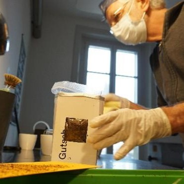
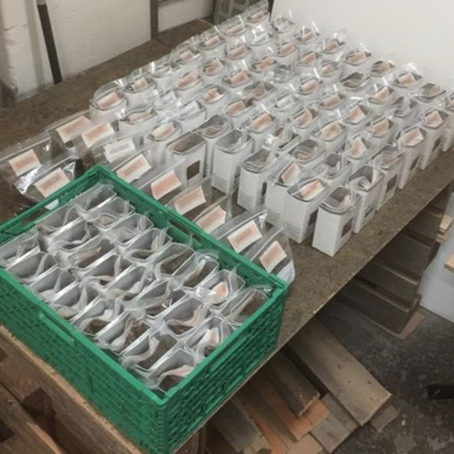
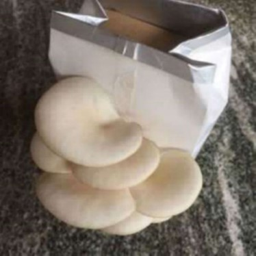

+++
title = "Von Geld und anderen Werten"
date = "2022-11-08"
draft = false
pinned = false
image = "geld.jpg"
description = "Wir haben es geschafft. Wir haben 98 Haferdrinkbeutel mit Pilzsubstrat gefüllt. Jetzt warten die Boxen im Keller darauf, dass in der Dunkelheit und angenehmen Temperaturen das Pilzmyzel das Substrat vollständig durchwachsen kann. Das dauert etwa 2 bis 3 Wochen. Und es stellen sich viele Fragen.\n"
+++
Letzten Samstag haben wir Pilzfarmer:innen 98 Haferdrinkbeutel mit unserem bewährten Buchenholz-Effinger-Kaffeesatz-Substrat abgefüllt. Eine tolle Gemeinschaftsarbeit. Generationenübergreifend mit kluger Arbeitsteilung und tiefgründigen Gesprächen über Gott, die Welt und die Schule.

**Wir haben es geschafft.**
Jetzt warten die Boxen im Keller darauf, dass in der Dunkelheit und angenehmen Temperaturen das Pilzmyzel das Substrat vollständig durchwachsen kann. Das dauert etwa 2 bis 3 Wochen. 

Zeit zu überlegen, wie wir die Pilzboxen verkaufen, weitergeben oder verschenken wollen. Es stellen sich viele Fragen:

* Wie kommen wir jetzt zu Kunden? 
  Wer sind unsere Kunden? 
  Welche Zielgruppe möchten wir mit unserer Geschäftsidee bedienen?
  Wie werben wir für unser Produkt?
  Welche Kundenbedürfnisse erfüllt unsere Pilzbox?
  Wer sind unsere Kunden?
  Wie erreichen wir unsere möglichen Kunden?
  Welche Kanäle stehen schon zur Verfügung? Welche sind zu öffnen?
  Wer kann uns unterstützen? Helfen?
  Wer kann wie viel Zeit für die Werbung einsetzen? 
  Wie gewinnen wir die Aufmerksamkeit?
  Welche Werte verkaufen wir mit unserer Idee?
  Welche Geschichte erzählen wir weiter?
  Wie können wir mögliche Kunden begeistern?

Und 

**Zu welchen Preis verkaufen wir unsere Effinger-Pilzbox?**

Für mich war eigentlich sofort klar, dass wir mit unserer ersten Produktion mit einem günstigen Preis einsteigen sollten. Wir wollen die Boxen allen verkaufen. Jeder und jede kann diese erwerben. 
Mein Vorschlag: Fr. 5.- sind angemessen. 
Allgemeines Nicken in der Runde.
Heute Vormittag habe ich in der Effinger-10Uhr-Pause kurz mit einer abgefüllten Box unser Projekt vorgestellt und wurde auch nach dem Preis gefragt.
Was? Nur 5 Fr.? Das ist viel zu wenig. Ein solch gut durchdachtes Produkt müsst ihr für mindesten Fr. 20.- verkaufen. Das wäre doch ein ideales Geschenk und für das würde ich sicher so viel investieren. Wie viel habt ihr für das Herstellen ausgegeben? Habt ihr die Arbeit miteingerechnet? Welchen Mehrwert schafft ihr mit diesem Produkt? Welchen Nutzen? Ein Produkt, das aus Reststoffen (Buchenspäne und Kaffeesatz) ein neues edles Produkt (Ulmenseitlinge) schafft, verdient auch eine hohe Beachtung in Form eines guten Preises.
Ich bin erfreut und gleichzeitig verwirrt.
Das ist zu viel.
Wie wäre es mit Fr. 10.- ? Die Arbeit für das Herstellen hat vile Spass gemacht. Für mich war es Abwechslung und Sinnstiftung.

Die Einwände sind sofort da: 
Ihr seid einzigartig, seid Pioniere. Ihr verkauft nicht nur eine Pilzbox, ihr verkauft auch einen anderen Umgang mit unserer Umwelt. Ihr arbeitet pionierhaft an einem generationenübergreifenden Projekt. Ihr schafft etwas Neues, Wertvolles und das muss sich auch im Preis niederschlagen. Ihr müsst auch den Unternehmergeist einbeziehen. Ihr stellt Edelpilze mitten in der Stadt Bern her, das ist einzigartig, das hat seinen Preis. Euer Produkt zeigt auch, dass Pilze unsere Zukunft sind, dass sie, wie ihr immer wieder betont, auch unsere Ernährungsprobleme lösen könnten. Ihr müsst jetzt die Boxen geschickt bewerben, eine gute Geschichte erzählen, mögliche Kunden begeistern, auf die Einzigartigkeit hinweisen. 

Die Kunden kaufen die Pilzbox nicht nur weil sie Pilze lieben, sondern weil sich es auch ein cooles Projekt finden, das unterstützen wir. Das Ziel sollte nicht nur persönliche Zufriedenheit sein, sondern auch einen finanziellen Ertrag bringen und mit diesem könnte ihr euer Projekt weiterdenken und weiterentwickeln.

Ich bin froh, dass mir die Effinger-Community als Echokammer dient und meinen Horizont erweitert, mich mit neuen Überlegungen konfrontiert, mich ermutigt, die richtigen Fragen stellt und unser Vorhaben mitträgt.

Jetzt verkaufen wir die  Box für Fr. 12.- 

Und wer eine kleine Sprühflasche dazu bestellt zahlt Fr. 13.50