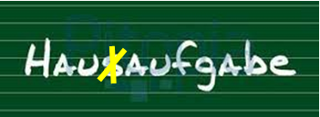

+++
title = "Von Struktur und Freiheit - vom Kontrollwahn und von Ängsten"
date = "2022-11-03"
draft = true
pinned = false
image = "gleichmacherei.jpg"
description = "Heute beschreibt Peter Gray, wie die Schule, so wie sie heute in den meisten Fällen funktioniert nichts mit dem freien Lernen zu tun hat. Im Gegenteil sie fördert und fordert das angepasste, leistungsorientierte Lernen und die überprüfbare Wissensanhäufung als Einstieg in die angepasste, leistungsorientierte Erwachsenenwelt. "
footnotes = "Bild: Andreas Lange, Die Gleichmacherei unseres Schulsystems – eine Gefahr für die Gesellschaft"
+++
Er beschreibt im Kapitel "Vom Niedergang des Spiels" unter anderem, wie die Schulpflicht immer mehr ausgeweitet wurde, dass Kinder immer früher eingeschult werden. In einigen Ländern gibt es die Vorschulen und jetzt folgen schon die Vor-Vorschulen. Das freie Spiel im Kindergarten wird immer mehr durch strukturierte, festgelegt Aufgaben von Erwachsenen verdrängt. Die Schultage werden immer länger und dringen mit den Hausaufgaben tief ins Elternhaus ein. Die Eltern werden zu Erfüllungshilfen der Lehrer:innen und sollen ihre Kinder so lange drängen, nerven und bestechen bis diese ihre Aufgaben erledigt haben.

Eltern bekommen ein schlechtes Gewissen, wenn die Hausaufgaben schlecht oder nur schlampig gemacht werden. Sie schicken ihre Kinder sogar krank in die Schule aus Sorge, sie könnten etwas verpassen. Die Schule hat, so schreibt Peter Gray wortwörtlich weiter, auf hinterhältige Weise Besitz vom Leben der Kinder ergriffen und hat eine Einstellung gefördert, demzufolge kindliche Entwicklung hauptsächlich durch die Erledigung von Aufgaben, die die Erwachsenen vorgeben und überprüfen, erfolgt und demzufolge die eigenen Aktivitäten der Kinder als Zeitverschwendung gelten.
Ein weiters Übel ist unsere Mess- und Vergleichskultur. Gut ist, was gemessen und evaluiert werden kann. Was zählt ist Leistung, die beziffert wird und mit denen dann verglichen werden kann. Schüler:innen, Schulen, Kantone, ja ganze Nationen, um festzustellen, wer besser und wer schlechter ist. Kinder sind, nach Peter Gray Spielbälle in einem Wettbewerb, in dem Erwachsene um sie herum versuchen bei Tests und Prüfungen die höchstmögliche Punktzahl aus ihnen herauszupressen. 
Was die Leistung verbessert, wird als Bildung verstanden so auch das Üben, das die Aufnahme prüfungsrelevanter Informationen ins Gedächtnis verbessern soll. Auch wenn diese Aufgaben überhaupt keinen Beitrag zum wirklichen Verständnis der Sachverhalte leistet. Und dann meint Gray noch, dass in den Augen vieler Eltern und Pädagogen die Kindheit weniger dem Lernen als dem Optimieren des Lebenslaufs dient. 
Die meisten Freizeitangebote sind meistens von Erwachsenen geleitete Aktivitäten. Mit dieser Überbetreuung, mit diesen vermeintlich hilfreichen Angeboten, mit diesen organisierten Freizeiten vermischt mit der Angst, dass wenn die Kinder nicht betreut, beobachtet oder begleitet werden, etwas Schlimmes passieren könnte, nehmen wir den Kindern etwas weg, das sie besser auf das Leben vorbreitet: Das freie Spielen.
Unser Schulsystem hat sich verrannt, ist am Anschlag, ist teuer und produziert jede Menge Probleme, die wir nicht hätten, wenn wir befreit Lernen würden, wenn wir das Lernen aus den Fängen der Schule befreien würden.
Für heute ist genug gelästert und geschimpft. 

Zum Schluss noch ein Zitat aus einer unserer Colearning-Präsentationen:

