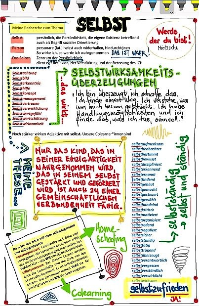

+++
title = "Werde, der du bist!  Wie man wird, was man ist."
date = "2020-10-20"
draft = false
pinned = false
image = "71d2c7d9-4cb1-47d7-9abf-e158361e7921.jpeg"
description = "Ich bin überzeugt, dass ich es schaffe, dass ich einen Weg finde, dass ich Lösungen entdecke. Ich verstehe, was um mich herum und mit mir passiert. Ich habe Handlungsmöglichkeiten, ich bin überzeugt, dass ich selbst und mit anderen zusammen den Herausforderungen gewachsen bin. Und ich finde das, was ich tue, sinnvoll und zukunftsweisend ist."
footnotes = "Titel: Zitat von Friedrich Nietzsche"
+++
